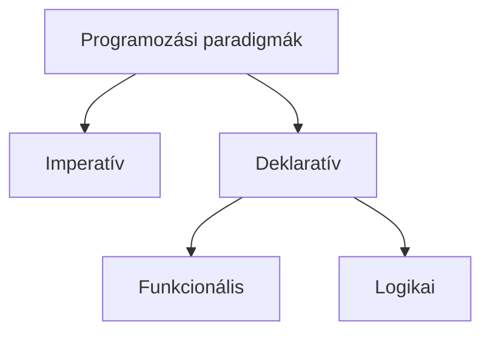

# The mdBook: layout, Markdown, math, diagrams

The book uses stock mdBook (0.5 or newer) with two preprocessors, `mdbook-katex` for math and `mdbook-mermaid` for diagrams, and a small theme addition that `new_book.py` installs. Do not hand-edit files in `book/theme/`, `book/src/_katex/` or `book/mermaid*.js`; `new_book.py C --refresh` rewrites them.

## Files

```text
book/
  book.toml
  src/
    SUMMARY.md           the table of contents; defines order and numbering
    intro.md             unnumbered introduction
    types.md             a chapter
    types/lists.md       its sub-chapters
    img/                 figures, named <source-slug>-<what>.png
  theme/                 highlight.js, jegyzet.css, jegyzet.js, head.hbs, jegyzet-weights.js
```

- File names are short lowercase ASCII slugs of the topic (`mintaillesztes.md`, `types/lists.md`), without numbers: order lives in `SUMMARY.md`, so inserting a chapter never renames files.
- One `# Title` per file, on the first line. Sections use `##` and `###`.
- Every `.md` file under `src/` must be listed in `SUMMARY.md`.

## SUMMARY.md

```markdown
# Summary

[Bevezetés](intro.md)

# Funkcionális programozás

- [Típusok](types.md)
  - [Listák](types/lists.md)
  - [Ennesek](types/tuples.md)
- [Rekurzió](rekurzio.md)

# Logikai programozás

- [Prolog alapok](prolog.md)
```

Lines without a bullet before the first list are unnumbered prefix chapters. `# Heading` lines between list items are part titles in the sidebar. Bulleted items are numbered automatically; indentation makes sub-chapters. Use at most two levels.

## Markdown that is available

- CommonMark with tables, footnotes (`[^1]`), strikethrough, task lists.
- Callouts, for the few things that must not be missed (a definition the rest builds on, a common trap):

  ```markdown
  > [!NOTE]
  > Text.
  ```

  Kinds: `NOTE`, `TIP`, `IMPORTANT`, `WARNING`, `CAUTION`. More than one or two per page defeats them.
- Collapsed blocks for solutions. Leave a blank line after `<summary>` and before `</details>` so Markdown inside is rendered:

  ```markdown
  <details>
  <summary>Megoldás</summary>

  (content)

  </details>
  ```

- Links between chapters are relative paths to the `.md` file: `[Listák](types/lists.md#fej-es-farok)`.

## Code blocks

Always give the language. Names the highlighter knows include: `elixir` (also `iex`, `ex`, `exs`), `erlang`, `prolog`, `haskell`, `ocaml`, `fsharp`, `lisp`, `scheme`, `clojure`, `python` (`py`), `python-repl`, `c`, `cpp`, `csharp`, `java`, `kotlin`, `scala`, `go`, `rust`, `swift`, `javascript` (`js`), `typescript` (`ts`), `r`, `julia`, `matlab`, `mathematica`, `fortran`, `sql`, `pgsql`, `bash` (`sh`, `zsh`), `shell` (`console`), `powershell`, `dos`, `json`, `yaml`, `toml`/`ini`, `xml`/`html`, `css`, `markdown`, `latex` (`tex`), `makefile`, `cmake`, `dockerfile`, `diff`, `x86asm`, `armasm`, `llvm`, `verilog`, `vhdl`, `protobuf`, `http`, `nginx`, `awk`, `lua`, `perl`, `ruby`, `php`, and `text` for output and anything else. The full list is in the skill's `assets/theme/highlight-languages.json`; `check.py` warns about a name that is not in it.

Line numbers, the copy button and ligature-free rendering are added by the theme; write nothing for them.

Backslash escapes inside code (`"\u00ea"`, `"\n"`, `\\`) can be decoded on the way into a file by the tool that writes it. After writing a chapter, look at every code line with a backslash in the file itself.

## Math (KaTeX)

`mdbook-katex` renders formulas when the book is built. A formula KaTeX cannot parse shows in red, and `check.py` reports it as a failure with the parser's message.

- Inline: `$a^2 + b^2$`. Displayed: `$$` on its own line, the formula, `$$` on its own line, with blank lines around.
- A literal dollar sign in text is `\$`. Inside code blocks and inline code, dollars are left alone.
- Multi-line: `\begin{aligned} a &= b \\ &= c \end{aligned}` inside `$$`. Cases: `\begin{cases}`. Matrices: `pmatrix`, `bmatrix`, `vmatrix`. `align`, `equation` and `eqnarray` environments do not exist in KaTeX; use `aligned`.
- Dirac notation: `\ket{\psi}`, `\bra{\phi}`, `\braket{\phi|\psi}`, or spelled out with `\langle`, `\rangle`, `|`.
- Sets and operators: `\mathbb{R}`, `\mathcal{H}`, `\operatorname{Tr}`, `\otimes`, `\oplus`, `\dagger`.
- Text inside math: `\text{ha } x > 0`. Accented letters work inside `\text{}`.
- Equation numbers: `\tag{3}`. `\label` and `\ref` do not work; refer to the number in words.
- In a Markdown table a formula may not contain `|`. Use `\vert`, `\mid`, `\lvert ... \rvert` or `\ket{}` there.
- Not available: `\newcommand` across formulas (define per formula with `\def` if really needed), TikZ, `\includegraphics`, most packages. If a formula needs something KaTeX lacks, restructure it with supported commands; do not fall back to an image.

Supported commands: <https://katex.org/docs/supported.html>. The KaTeX stylesheet and fonts are in `src/_katex/`, so math renders without internet.

## Diagrams (Mermaid)

A fenced block with the language `mermaid` becomes a diagram. If `mdbook-mermaid` was not installed when the book was created, `book.toml` has no `[preprocessor.mermaid]` section; then use images only.

````markdown

````

- Quote labels (`["..."]`) whenever they contain accents, spaces, brackets or punctuation.
- Good fits: `graph TD`/`LR` for trees and flowcharts, `stateDiagram-v2`, `sequenceDiagram`, `classDiagram`.
- Poor fits, use the image: anything where positions carry meaning (memory layouts, geometric figures, circuits, plots, timelines with scale), anything with formulas in the labels.
- Mermaid errors appear only in the browser, as an error box in place of the diagram. After adding or changing a diagram, build (`check.py`) and take a screenshot of the page, then read the PNG:

  ```bash
  google-chrome --headless --disable-gpu --hide-scrollbars --window-size=1000,1800 \
    --virtual-time-budget=5000 --screenshot=/tmp/page.png "file://$PWD/C/book/book/<chapter>.html"
  ```

  (`chromium` takes the same options. Make the window taller if the diagram is further down the page.)

## Images

Copy the crop from `_work/sources/<slug>/figures/` to `book/src/img/<slug>-<what>.png` (the `_work` figure folders are not in git; the book's `img/` is). Reference it relative to the chapter file:

```markdown

```

From a sub-chapter in a folder the path is `../img/...`. With a caption:

```html
<figure>
  
  <figcaption>A Bloch-gömb: θ a z tengellyel, φ az x tengellyel bezárt szög.</figcaption>
</figure>
```

Alt text says what the figure shows. Images are centred and limited to the text width by the theme.

## Building and reading

```bash
python3 <skill>/scripts/check.py C      # builds as its last step and reports problems
```

The user reads the books through the hub (`http://127.0.0.1:3000/C/`, the `jegyzet` systemd user service running `hub.py`), which rebuilds a book by itself after every change. `mdbook serve C/book --open` previews a single book. The hub serves each book under `/C/`, which is why `book.toml` sets `site-url = "/C/"`; keep it.

`check.py` also regenerates `theme/jegyzet-weights.js` (words per chapter), which the progress bar uses to show the position in the whole book. Search is built in (`s` or the magnifier), and the print icon opens the whole book as one page.
