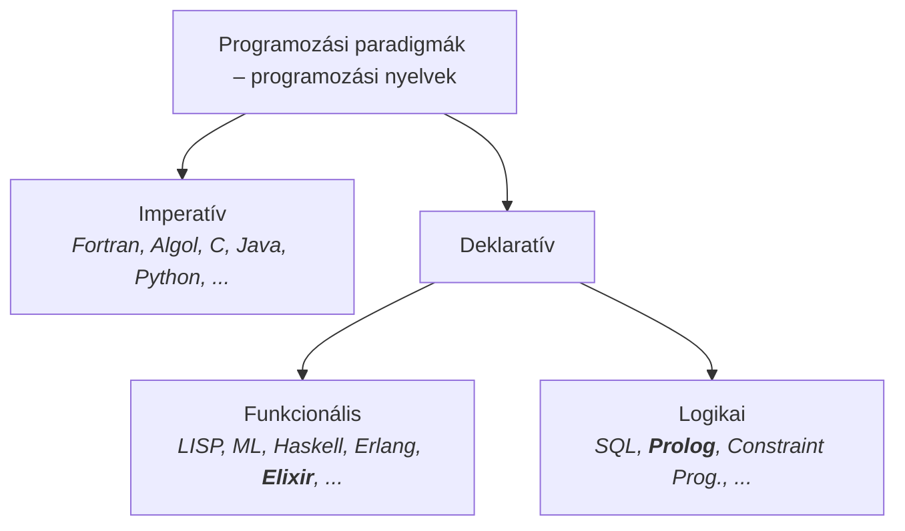

# Deklaratív programozás

## Kijelentő és felszólító nyelvek

A Wikipédia meghatározása szerint a deklaratív programozás olyan programozási paradigma, amely kifejezi a számítás logikáját anélkül, hogy leírná a vezérlési folyamatát (*declarative programming is a programming paradigm that expresses the logic of a computation without describing its control flow*).

A „deklaratív” jelző a nyelvészetből származik: jelentése *kijelentő*, kinyilatkoztató, ellentmondást nem tűrő, mint a „kijelentő mondat”. A mondatfajták között van kérdő és *felszólító* (imperatív) is. A számítógépek belső nyelve, a gépi kód alapvetően felszólító jellegű: add hozzá, szorozd meg, ugorj. A magas szintű programozási nyelvek többsége is *imperatív*: `while ... do ...`, `goto ...`, értékadás (írd felül a változó értékét).

C-ben is lehet deklaratívan programozni, például ciklus helyett rekurzióval:

```c
int fact(int n) {if (n > 0) return n * fact(n-1);
                  else return 1;
                 }
```

Ez a változat lassú, mert minden hívás a verembe kerül. Az ún. **jobbrekurzív** (farokrekurzív, *tail recursive*) változata azonban a ciklussal azonos hatékonyságú kóddá fordul (lásd [Rekurzió](rekurzio.md)).

A deklaratív szemlélet előnye, hogy a programkód sokkal közelebb áll a specifikációhoz, ezért a helyességéről sokkal könnyebb meggyőződni. A megközelítés jelmondata:

> *MIT* és nem *HOGYAN*

vagy kicsit enyhítve: inkább *MIT*, mint *HOGYAN* (*WHAT rather than HOW*).

A deklaratív nyelvekben a **változó** a matematika változófogalmának felel meg: *egyetlen*, esetleg még ismeretlen értéket jelöl, és nem írható felül.

## Funkcionális és logikai programozás

A deklaratív programozás két fő ága egy-egy alapvető matematikai fogalomhoz kapcsolódik:

- a **funkcionális programozás** (FP) a *függvényekhez*,
- a **logikai programozás** (LP) a *relációkhoz*.



A kurzus tárgya az *Elixir* funkcionális és a *Prolog* logikai programozási nyelv.

## Példa: listák összefűzése Elixirben és Prologban

Az Elixir és a Prolog közös szintaxist használ a láncolt listák jelölésére:

- `[]` az üres lista,
- `[Head|Tail]` olyan lista, amelynek feje (első eleme) `Head`, farka (a fej utáni része) pedig a `Tail` lista.

Az `1`, `2`, `3` számokból álló lista így `[1|[2|[3|[]]]]`, vagy tömörebben `[1,2,3]`.

Írjunk egy `app` nevű kétargumentumú Elixir-függvényt (`app/2`), amely két listát összefűz! Két esetet kell megkülönböztetni: ha az első lista üres, az eredmény a második lista; ha nem üres, akkor a feje lesz az eredmény feje, a farka pedig a farok és a második lista összefűzöttje:

```elixir
#   app(l1,   l2): l1 és l2 listák összefűzöttje (l1⊕l2)
def app([],    b) do            b end       # [] ⊕b = b
def app([x|a], b) do [x|app(a,b)] end       # [x|a] ⊕b = [x|a⊕b]
```

Az `app` függvénynek egy háromargumentumú Prolog-*eljárás* (másnéven *predikátum*) felel meg (`app/3`); a harmadik argumentum az Elixir-függvény eredménye:

```prolog
%   app(L1, L2, L12): L1 és L2 listák összefűzöttje L12 (L1⊕L2 = L12)
    app([],    B,               B).         % [] ⊕B = B
    app([X|A], B,    [X|       C]) :-       % [X|A] ⊕B = [X|C] ha
           app(A, B, C).                    %      A ⊕B = C
```

Az eljáráshívások a függvényhívásokkal ellentétben nem ágyazhatók egymásba, ezért kell a `C` segédváltozó. **De** ennek köszönhetően az `app/3` Prolog-eljárás jobbrekurzív, azaz ciklussá fordul.

Prologban az is megengedett, hogy egy *adatstruktúrában* *behelyettesítetlen* változó szerepeljen. Az eljárás így is írható:

```prolog
app([],    B, B).
app([X|A], B, L) :- L = [X|C], app(A, B, C).
```

A Prolog-változó pointerként is felfogható: `app` először felépíti az eredménylista első láncszemét (`[X|C]`), majd a jobbrekurzív hívással kitölti az eredménylista `C` által mutatott farkát, például:

```text
app([1], [2], L) ⇒ L = [1|C], app([], [2], C) ⇒ L = [1|[2]] = [1,2]
```

Az `app/3` eljárás nemcsak összefűzésre használható. Mivel relációt ír le, bármelyik argumentuma lehet ismeretlen. Bal oldalt a kérdések, a `⟹` után a Prolog válaszai (a `;` újabb megoldást kér, a `no` jelzi, hogy nincs több):

```text
| ?- app([1,2], [3,4], L).        ⟹   L = [1,2,3,4] ? ; no
| ?- app([1,2], B, [1,2,3,4]).    ⟹   B = [3,4] ? ; no
| ?- app([1,2], B, [1,3,4,5]).    ⟹   no
| ?- app(A, B, [1,2]).            ⟹   A = [], B = [1,2] ? ;
                                       A = [1],  B = [2] ? ;
                                       A = [1,2], B = [] ? ; no
```

Az utolsó kérdés az `[1,2]` lista összes lehetséges kettévágását sorolja fel.

<p class="sources">Forrás: dp26a-fp1ea.pdf (14–18. dia)</p>
