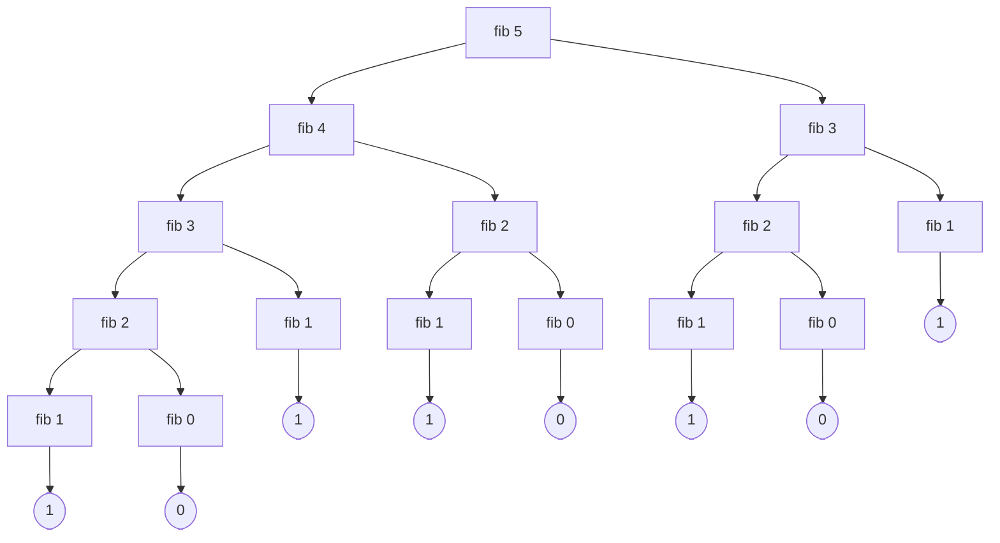

# Dinamikus programozás: Fibonacci-számok

## Dinamikus programozás

A **dinamikus programozás** optimalizálási feladatok megoldására használható módszer, Richard Bellman fejlesztette ki 1950 környékén. Lényege:

- Az eredetihez hasonló részfeladatokat tűzünk ki, amelyek akár általánosabbak is lehetnek az eredeti feladatnál.
- A részfeladatokat általában kisebb inputra oldjuk meg először.
- A részfeladatok eredményét eltároljuk.
- A feladatokat úgy rendezzük sorba, hogy a későbbi feladatok megoldásánál fel tudjuk használni a korábbiak eredményét.
- Az első néhány részfeladat legyen önmagában is könnyen megoldható.
- A későbbi feladatok eredményét a korábbiak eredményét felhasználva kapjuk. A részfeladatokat úgy határozzuk meg, hogy ez könnyen menjen.
- Az összes részfeladat megoldásából már könnyen megkapható az eredeti feladat megoldása.

## A Fibonacci-számok

A Fibonacci-számok jól ismert matematikai definíciója:

$$
F_0 = 0, \qquad F_1 = 1, \qquad F_i = F_{i-2} + F_{i-1}, \text{ ha } i > 1
$$

A kiszámításukra hat változatot nézünk meg:

- elágazó rekurzióval;
- memoizálással (dinamikus programozás felülről lefelé haladva), Elixir `Map`-pel;
- táblázattal (dinamikus programozás alulról felfelé haladva), Elixir `Map`-pel;
- táblázattal, Erlang `:array`-jel;
- táblázattal, Elixir `List`-tel;
- az (n-2)-edik (`prev`) és az (n-1)-edik (`curr`) Fibonacci-szám nyilvántartásával.

### Elágazó rekurzióval

A naiv rekurzív megoldás a matematikai definíciót követi:

```elixir
defmodule Fib do

  # Tree recursion
  # O(2^n) futási idő, O(n) tárhely
  @spec fib(i :: integer()) :: n :: integer()
  # n az i-edik Fibonacci-szám
  def fib(0), do: 0
  def fib(1), do: 1
  def fib(i), do: fib(i-1) + fib(i-2)

end
Fib.fib(23) #|> IO.inspect()
```

```text
28657
```

Az $i$-edik Fibonacci-szám meghatározása elágazó rekurzióval nagyon rossz hatékonyságú, mert a két elágazó ágat minden egyes rekurzív lépésben újra meg újra teljesen be kell járni, azaz az $i$-ediknél kisebb Fibonacci-számokat újra és újra ki kell számolni. A `fib 5` hívási fája:



A `fib 3` kétszer, a `fib 2` háromszor számolódik ki. A kiértékelés a fát mélységben, balról jobbra járja be: a gyökértől a bal szélen indul lefelé, és a jobb szélen tér vissza a gyökérhez. A levelek értéke balról jobbra 1, 0, 1, 1, 0, 1, 0, 1, összegük 5. A futási idő $i$-ben exponenciális, a részeredményeket viszont csak az éppen bejárt ág mentén, az egyre mélyülő veremben kell tárolni, ezért a tárigény a fa mélységével, $i$-vel arányos.

### Memoizálással (felülről lefelé)

A memoizálás a már kiszámított Fibonacci-számokat egy szótárban (`mem`) tárolja, és mielőtt kiszámítana egy értéket, megnézi, nincs-e már meg. A `fib_m/2` a kért szám mellett a bővített szótárt is visszaadja, hogy a következő hívás felhasználhassa:

```elixir
defmodule FibM do

  # Memoization (top down) – dinamikus programozás
  # O(n) futási idő, O(n) tárhely
  @spec fib_mem(i :: integer()) :: n :: integer()
  # n az i-edik Fibonacci-szám
  def fib_mem(i), do: fib_m(i, %{0 => 0, 1 => 1}) |> elem(0)

  @type mem() :: %{index :: integer() => value :: integer()}
  @spec fib_m(i :: integer(), mem :: mem()) :: {n :: integer(), uj_mem :: mem()}
  # n az i-edik Fibonacci-szám

  def fib_m(i, mem) do
    case mem[i] do # case nem váltható ki mintaillesztéssel
      nil ->
        {prev, memp} = fib_m(i-2, mem)
        {curr, memc} = fib_m(i-1, memp)
        val = prev + curr
        {val, Map.put(memc, i, prev+curr)}
      val ->
        {val, mem}
      end
  end

end
FibM.fib_mem(63) #|> IO.inspect()
```

```text
6557470319842
```

A `case` itt nem váltható ki a függvényfejben végzett mintaillesztéssel, mert azt kell eldönteni, hogy a `mem[i]` kifejezés értéke `nil`-e, a kifejezés pedig nem lehet minta.

A memoizálás lépései követhetők, ha a `fib_m/2` eredményéből nem a számot, hanem a szótárt vesszük ki:

```elixir
# Módosított változat a memoizálási lépések követésére
defmodule FibMm do
  @spec fib_mem(i :: integer()) :: mem :: %{integer() => integer()}
  def fib_mem(i), do: FibM.fib_m(i, %{0 => 0, 1 => 1}) |> elem(1)
end
FibMm.fib_mem(5)
```

```text
%{0 => 0, 1 => 1, 2 => 1, 3 => 2, 4 => 3, 5 => 5}
```

### Táblázattal (alulról felfelé), Elixir `Map`-pel

A táblázatos megoldás a kisebb indexektől halad felfelé: a `j`-edik elemet a `j-2`-edik és `j-1`-edik elemből számítja ki, amíg el nem éri az `i`-ediket:

```elixir
defmodule FibT do

  # Tabulation (bottom-up) – dinamikus programozás
  # O(n) futási idő, O(n) tárhely
  @spec fib_tab(i :: integer()) :: n :: integer()
  # n az i-edik Fibonacci-szám
  def fib_tab(i), do: fib_t(i, 2, %{0 => 0, 1 => 1})

  @type tab() :: %{index :: integer() => value :: integer()}
  @spec fib_t(i :: integer(), j :: integer(), tab :: tab()) :: n :: integer()
  # n az i-edik Fibonacci-szám
  def fib_t(i, j, tab) when i < j, do: tab[i]
  def fib_t(i, j, tab) do
    tab0 = Map.put(tab, j, tab[j-2] + tab[j-1])
    fib_t(i, j+1, tab0)
  end
end
FibT.fib_tab(63) #|> IO.inspect()
```

```text
6557470319842
```

### Táblázattal, Erlang `:array`-jel

```elixir
defmodule FibAerl do

  # Tabulation (bottom-up) – dinamikus programozás
  # O(n) futási idő, O(n) tárhely
  # Erlang :array
  @spec fib_tab(i :: integer()) :: n :: integer()
  # n az i-edik Fibonacci-szám
  def fib_tab(i), do: fib_t(i, 2, :array.set(1,1,(:array.set(0,0,:array.new()))))

  @type tab(integer) :: :array.array(integer)
  @spec fib_t(i :: integer(), j :: integer(), tab :: tab(integer())) :: n :: integer()
  # n az i-edik Fibonacci-szám
  def fib_t(i, j, tab) when i < j, do: :array.get(i, tab)
  def fib_t(i, j, tab) do
    prev = :array.get(j-2, tab)
    curr = :array.get(j-1, tab)
    tab0 = :array.set(j, prev+curr, tab)
    fib_t(i, j+1, tab0)
  end
end
FibAerl.fib_tab(1023) #|> IO.inspect()
```

```text
2785293550699592923938812412668093509353307352123703806913182668987369503203465183625616759613324452749958549669966882191117895425015208455469403731272652158240825628484818131485544230827304940519132195299466733282
```

### Táblázattal, Elixir `List`-tel

A lista fordított sorrendben tárolja a Fibonacci-számokat: a feje a legutóbb kiszámított, a második eleme az azt megelőző. Így az új elemet olcsón, a lista elé lehet fűzni:

```elixir
defmodule FibLtab do

  # Tabulation (bottom-up) – dinamikus programozás
  # O(n) futási idő, O(n) tárhely
  # Elixir List
  @spec fib_tab(i :: integer()) :: n :: integer()
  # n az i-edik Fibonacci-szám
  def fib_tab(i), do: fib_t(i, 2, [1,0])

  @spec fib_t(i :: integer(), j :: integer(), tab :: [integer()]) :: n :: integer()
  # n az i-edik Fibonacci-szám
  def fib_t(i, j, tab) when i < j, do: hd(tab)
  def fib_t(i, j, tab) do
    prev = hd(tl(tab))
    curr = hd(tab)
    tab0 = [prev+curr | tab]
    fib_t(i, j+1, tab0)
  end
end
FibLtab.fib_tab(63) #|> IO.inspect()
```

```text
6557470319842
```

### A két utolsó érték nyilvántartásával

Mivel az új értékhez csak a két utolsóra van szükség, a táblázat helyett elég ezt a kettőt (`curr`, `prev`) akkumulátorokban továbbadni; a tárigény így állandó:

```elixir
defmodule FibI do
  # Space optimized (bottom up)
  # O(n) futási idő, O(1) tárhely
  @spec fib_iter(i :: integer()) :: n :: integer()
  # n az i-edik Fibonacci-szám
  def fib_iter(i), do: fib_i(i, 1, 0)

  @spec fib_i(i :: integer(), curr :: integer(), prev :: integer())
    :: n :: integer()
  # n az i-edik Fibonacci-szám
  defp fib_i(0, _curr, prev), do: prev
  defp fib_i(1, curr, _prev), do: curr
  defp fib_i(i, curr, prev), do: fib_i(i-1, prev+curr, curr)
end
FibI.fib_iter(2203) #|> IO.inspect()
```

```text
11227588022178051398070623745770537746981032161033283578641889149504371902547595733548949731279174036520553510211185291521165787504965947954328861725425894532117680897067684977042503589399040135697168277407633126059586479862184815462709569351240070274187436057121550393922337505846249722123756568019538289963931388811270535294468233234206275243288823876307712381776769983580371337794399152833220102956602421639379175057893229860412359902362848104779389231572677
```

### Futási idők összehasonlítása

```elixir
Benchee.run(
  %{
    "fib tree recursive" => fn -> Fib.fib(33) end,
    "fib memoization" => fn -> FibM.fib_mem(33) end,
    "fib tabulation" => fn -> FibT.fib_tab(33) end,
    "fib tabula_array_erl" => fn -> FibAerl.fib_tab(33) end,
    "fib tabula_list" => fn -> FibLtab.fib_tab(33) end,
    "fib iterative" => fn -> FibI.fib_iter(33) end
  },
  profile_after: false
  )
:ok
```

Az eredmény (Elixir 1.20.2, Erlang 29.0.6, AMD Ryzen AI 9 HX 370):

```text
Name                           ips        average  deviation         median         99th %
fib iterative            2025.02 K        0.49 μs  ±1815.45%        0.47 μs        0.67 μs
fib tabula_list          1793.18 K        0.56 μs  ±1986.49%        0.50 μs        0.82 μs
fib tabula_array_erl      507.54 K        1.97 μs   ±502.71%        1.85 μs        3.01 μs
fib memoization           337.87 K        2.96 μs   ±255.53%        2.73 μs        5.28 μs
fib tabulation            324.54 K        3.08 μs   ±305.85%        2.94 μs        5.17 μs
fib tree recursive        0.0504 K    19823.90 μs    ±14.14%    18557.61 μs    26679.49 μs

Comparison: 
fib iterative            2025.02 K
fib tabula_list          1793.18 K - 1.13x slower +0.0638 μs
fib tabula_array_erl      507.54 K - 3.99x slower +1.48 μs
fib memoization           337.87 K - 5.99x slower +2.47 μs
fib tabulation            324.54 K - 6.24x slower +2.59 μs
fib tree recursive        0.0504 K - 40143.78x slower +19823.41 μs
```

Az elágazó rekurzió a 33. Fibonacci-számra negyvenezerszer lassabb a leggyorsabb változatnál. A listás táblázat közel olyan gyors, mint a két értéket nyilvántartó változat, mert a lista elejéhez fűzés és a fej elérése olcsó; a `Map`-pel dolgozó változatok lassabbak.

### Nyomkövetés a `dbg`-vel

A `dbg/1` makró kiírja a kapott kifejezést és az értékét, majd az értéket változatlanul továbbadja, ezért egy pipe-lánc végére fűzve a lépéseket nyomon követhetjük. Az alábbi változat a `fib_t/3` paramétereinek sorrendjét is megváltoztatja, hogy a táblázat a pipe-ban továbbadható legyen:

```elixir
defmodule FibTdbg do

  # Tabulation (bottom-up) – dinamikus programozás
  # O(n) futási idő, O(n) tárhely
  @spec fib_tab(i :: integer()) :: n :: integer()
  # n az i-edik Fibonacci-szám
  def fib_tab(i), do: fib_t(%{0 => 0, 1 => 1}, 2, i)

  @type fib() :: %{index :: integer() => value :: integer()}
  @spec fib_t(mem :: fib(), j :: integer(), i :: integer()) :: n :: integer()
  # n az i-edik Fibonacci-szám
  def fib_t(tab, j, i) when j > i, do: tab[i]
  def fib_t(tab, j, i) do
    tab
    |> Map.put(j, tab[j-1] + tab[j-2])
    |> fib_t(j+1, i)
    |> dbg()
  end
end
FibTdbg.fib_tab(8) #|> IO.inspect()
```

```text
21
```

## Gyakorló feladat: maximális összegű intervallum

Legyen $\mathit{xs}$ egy $n$ elemű, egész (de nem feltétlenül pozitív) számokból álló lista. Jelölje $\mathit{xs}[i]$ az $\mathit{xs}$ $i$. elemét és $\mathit{xs}[i\ldots{}j]$ az $\mathit{xs}$ $i$. elemétől $j$. eleméig tartó összefüggő részlistáját. Határozza meg az

$$
r = \max_{0 \le i \le j < n} \sum_{i \le k \le j} \mathit{xs}[k]
$$

értékét, azaz az $\mathit{xs}$ legnagyobb összegű egybefüggő $\mathit{xs}[i\ldots{}j]$ részlistájának az összegét! (A feladat az Algoritmuselmélet tárgy dinamikus programozásról szóló diasorában is szerepel: <https://www.cs.bme.hu/~kiskat/algel/eloadas2025/DP-2025.pdf#page=9>.)

Ebben a feladatban egy $\mathit{ys}$ segédlistát állítunk elő dinamikus programozással, ahol

$$
ys[i] = \max_{i \le j < n} \sum_{i \le k \le j} \mathit{xs}[k] \text.
$$

Valósítsa meg a segédlistát előállító `maxOsszegIndul` függvényt! A megoldásnak nem kell feltétlenül jobbrekurzívnak lennie.

```elixir
defmodule MaxOsszeg do
  @spec maxOsszeg(xs :: [number()]) :: r :: number()
  # Az r szám az xs összefüggő részlistái közül a legnagyobb összegű elemeinek az összege.
  def maxOsszeg(xs) do
    # A maxOsszegIndul lista elemeit az >=/2 segítségével hasonlítjuk össze,
    # üres lista esetén a visszatérési érték legyen 0.
    maxOsszegIndul(xs) |> Enum.max(&>=/2, fn -> 0 end)
  end

  @spec maxOsszegIndul(xs:: [number()]) :: ys :: [number()]
  # Az ys lista i. eleme az xs i. elemétől induló összefüggő részlistái közül
  # a legnagyobb összegű elemeinek az összege.
  def maxOsszegIndul(...) do
    ...
  end
end

IO.inspect(MaxOsszeg.maxOsszeg([]) == 0)
IO.inspect(MaxOsszeg.maxOsszeg([-2, 1, -3, 4, -1, 2, 1, -5, 4]) == 6)
IO.inspect(MaxOsszeg.maxOsszegIndul([-2, 1, -3, 4, -1, 2, 1, -5, 4]))
```

<details>
<summary>Megoldás</summary>

Az $\mathit{ys}$ lista hátulról építhető fel: az $i$. elemtől induló legjobb részlista vagy csak az $\mathit{xs}[i]$ elemből áll, vagy $\mathit{xs}[i]$-hez hozzávesszük az $(i+1)$. elemtől induló legjobb részlistát, ha annak összege pozitív.

```elixir
defmodule MaxOsszeg do
  @spec maxOsszeg(xs :: [number()]) :: r :: number()
  # Az r szám az xs összefüggő részlistái közül a legnagyobb összegű elemeinek az összege.
  def maxOsszeg(xs) do
    # A maxOsszegIndul lista elemeit az >=/2 segítségével hasonlítjuk össze,
    # üres lista esetén a visszatérési érték legyen 0.
    maxOsszegIndul(xs) |> Enum.max(&>=/2, fn -> 0 end)
  end

  @spec maxOsszegIndul(xs:: [number()]) :: ys :: [number()]
  # Az ys lista i. eleme az xs i. elemétől induló összefüggő részlistái közül
  # a legnagyobb összegű elemeinek az összege.
  def maxOsszegIndul([]), do: []
  def maxOsszegIndul([h|t]) do
    ys2 = maxOsszegIndul(t)
    case ys2 do
      [y2|_] when y2 > 0 -> [h + y2 | ys2]
      _ -> [h | ys2]
    end
  end
end
```

```text
true
true
[2, 4, 3, 6, 2, 3, 1, -1, 4]
```

</details>

Legyen most $\mathit{zs}$ az $\mathit{xs}$ adott indexű elemeinél *végződő* összefüggő részlisták maximális összege, azaz

$$
zs[j] = \max_{0 \le i \le j} \sum_{i \le k \le j} \mathit{xs}[k] \text.
$$

Valósítsa meg a segéd-adatstruktúrát előállító `maxOsszegVege` *jobbrekurzív* függvényt! A megoldásban az Elixir `Map` adatszerkezetét használjuk.

```elixir
defmodule MaxOsszeg2 do
  @spec maxOsszeg(xs :: [number()]) :: r :: number()
  # Az r szám az xs összefüggő részlistái közül a legnagyobb összegű elemeinek az összege.
  def maxOsszeg(xs) do
    # A maxOsszegVege Map elemeit az >=/2 segítségével hasonlítjuk össze,
    # üres Map esetén a visszatérési érték legyen 0.
    maxOsszegVege(xs) |> Map.values() |> Enum.max(&>=/2, fn -> 0 end)
  end

  @spec maxOsszegVege(xs:: [number()]) :: zs :: %{ number() => number() }
  # Az zs j-hez tartozó eleme az xs j. eleménél végződő összefüggő részlistái közül
  # a legnagyobb összegű elemeinek az összege.
  def maxOsszegVege(...), do: ...
end

IO.inspect(MaxOsszeg2.maxOsszeg([]) == 0)
IO.inspect(MaxOsszeg2.maxOsszeg([-2, 1, -3, 4, -1, 2, 1, -5, 4]) == 6)
IO.inspect(MaxOsszeg2.maxOsszegVege([-2, 1, -3, 4, -1, 2, 1, -5, 4]))
```

<details>
<summary>Megoldás</summary>

Az $\mathit{xs}$ elejétől haladva: a $j$. elemnél végződő legjobb részlista vagy csak az $\mathit{xs}[j]$ elemből áll, vagy a $(j-1)$. elemnél végződő legjobbhoz fűzzük hozzá, ha annak összege pozitív. A `Map.fetch/2` `{:ok, z}` párt ad, ha van `j - 1` kulcs, egyébként `:error`-t.

```elixir
defmodule MaxOsszeg2 do
  @spec maxOsszeg(xs :: [number()]) :: r :: number()
  # Az r szám az xs összefüggő részlistái közül a legnagyobb összegű elemeinek az összege.
  def maxOsszeg(xs) do
    # A maxOsszegVege Map elemeit az >=/2 segítségével hasonlítjuk össze,
    # üres Map esetén a visszatérési érték legyen 0.
    maxOsszegVege(xs) |> Map.values() |> Enum.max(&>=/2, fn -> 0 end)
  end

  @spec maxOsszegVege(xs:: [number()]) :: zs :: %{ number() => number() }
  # Az zs j-hez tartozó eleme az xs j. eleménél végződő összefüggő részlistái közül
  # a legnagyobb összegű elemeinek az összege.
  def maxOsszegVege(xs), do: maxOsszegVege(xs, 0, %{})

  defp maxOsszegVege([], _, zs), do: zs
  defp maxOsszegVege([h|t], j, zs) do
    z1 = case Map.fetch(zs, j - 1) do
      {:ok, z} when z > 0 -> h + z
      _ -> h
    end
    zs1 = Map.put(zs, j, z1)
    maxOsszegVege(t, j + 1, zs1)
  end
end
```

```text
true
true
%{0 => -2, 1 => 1, 2 => -2, 3 => 4, 4 => 3, 5 => 5, 6 => 6, 7 => 1, 8 => 5}
```

</details>

<p class="sources">Forrás: dp26a-fp2ea.pdf (46–48. dia), dp26a-fp2ea-fibonacci.livemd, dp26a-fp2gy-megoldasok.livemd</p>
