**Kvantuminformatikai alkalmazások** **– 2026 ősz**

*Jegyzet a tárgy hallgatói számára*

*A tárgy oktatói által készített jegyzet, az órán elhangzott legfontosabb ismeretek összefoglalására. A tárgy diasorával és az órán készített* *saját* *hallgatói jegyzetekkel együtt használandó.* *A jegyzet alapdokumentuma 2025 őszén készült, amelyet most 2026 őszén leckéről leckére aktualizálunk* *(amennyiben szükséges).*

Tartalom

1. Bevezetés és motiváció	1

2. Posztulátumok	5

3. Összefonódás	8

4. Mérés	12

5. Kvantuminterferometer, NCT	15

6. Tetszőleges kvantumbit előállítása alap kvantumkapuk segítségével. Szupersűrűségű tömörítés. Kvantumteleportáció.	18

7. QKD	23

8. Kvantuminformatikai rendszerek építőelemei	27

9A. Kvantumos algoritmusok tervezési receptje	28

9B. A Deutsch-Jozsa-algoritmus	30

10A.  Kvantumos Fourier-Transzformáció	33

10B.  Kvantumos fázisbecslés	37

10C.  Shor-algoritmus és az RSA-törése	37

11. Grover-algoritmus	37

12. Félévzáró előadás	37

1. Bevezetés és motiváció

**2026. szeptember** **9.,** **Előadó:** **Bacsárdi** **László**

**A kvantuminformatika** **fejlődésének szemléltetése**

A kvantuminformatika fejlődését jól szemlélteti a 15-ös és a 143-as számok prímtényezős felbontásának esete. A 15-öt prímtényezőire bontó kvantumeszköz 2002-ben készült el, míg a 143-at (11x13) felbontó kísérlet 10 évvel később, 2012-ben épült meg. Ez a példa rávilágít a kvantumszámítógépek fejlődésének meredek, de eltérő ütemére a hagyományos számítástechnikához képest. 

**A kvantumvilág és a hagyományos informatika közötti különbségek**

A kvantumtechnológia alapvetően más elveken működik, mint a hagyományos informatika. Ez a különbség újfajta megközelítést és gondolkodásmódot igényel az informatikusoktól és a mérnököktől.

**A kvantumfogalom bevezetése és a kvantummechanika alapjai**

A kvantummechanika a fizika azon területe, amely a részecskék viselkedését írja le a nanométeres mérettartományban. A kvantumrendszerek a kvantummechanika törvényeinek engedelmeskednek, és olyan jelenségek jellemzik őket, mint az alagúteffektus, szuperpozíció, összefonódás. Ezek a jelenségek, bár elsőre szokatlannak tűnhetnek, már a mindennapi technológiákban is jelen vannak, például a CCD kamerákban és a lézerek működésében. Az alkalmazásokból kiinduló megközelítés lehetővé teszi a kvantumvilág megértését anélkül, hogy hosszas elméleti bevezetésre lenne szükség.

**A második kvantumtechnológiai forradalom**

Schrödinger azt jósolta, hogy soha nem leszünk képesek egyetlen fotonnal vagy elektronnal kísérletezni. Nem lett igaza, a világ ma a második kvantumtechnológiai forradalom korát éli. Ez a forradalom az 1980-as évek közepén vette kezdetét, és a kvantumfizika alapelveit használja fel új eszközök és rendszerek, mint a kvantumszámítógépek, kvantumérzékelők és kvantumkommunikációs hálózatok létrehozására. Ez a korszak nemcsak a kutatásban, de a technológiai fejlesztések terén is áttörést hozott.

**A kvantumvilág történelmi kontextusa és a hozzáállás fontossága**

A kvantummechanika a tudományos világkép fejlődésének egyik csúcspontja. A fejlődés az ókori filozófiát, a newtoni mechanikát és az Einstein-féle relativitáselméletet egyaránt magában foglalja. A kvantummechanika a nagyon kicsi dolgok (elektronok, fotonok) viselkedésével foglalkozik, és alapvetően átalakította a valóságról alkotott képünket. A kvantumvilággal való első találkozás gyakran meglepő lehet, ezért a megfelelő hozzáállás és a nyitottság kulcsfontosságú a terület megértéséhez. A kvantuminformatika megismerése mindenki számára elérhető, függetlenül az előzetes tudástól.

Egy híres, 1927-es csoportkép (Solvay konferencia) is tanúskodik arról, hogy a kvantumfizika úttörői már a múlt század elején is intenzív vitákat folytattak a témáról. 

A kvantumtechnológia fejlődése Richard Feynman munkásságával vált igazán lendületessé az 1980-as években, amikor a fizikus felhívta a figyelmet a nanoskálán rejlő informatikai lehetőségekre. E felismerés nyomán megkezdődött a kvantumalgoritmusok és a kvantumszámítógépek fejlesztése. 

A biztonsági kihívásra válaszul intenzív kutatások indultak a kvantumkommunikációs hálózatok területén is, amelyekbe az Európai Unió is jelentős összegeket fektet. A hardverfejlesztés egyik mérföldköve volt, amikor 2018-ban az IBM elérhetővé tette a felhőben a kvantumszámítógépét a kutatók és vállalatok számára. Ez a lépés jelentősen hozzájárult a kvantumszámítástechnika alkalmazásához a pénzügy, gyógyszergyártás és logisztika területén.

A jövőben a kvantumkommunikációs hálózatok lehetővé fogják tenni a kvantumszámítógépek összekapcsolását.

**Kvantumtechnológia Magyarországon**

Magyarország is aktív résztvevője a második kvantumtechnológiai forradalomnak.  A Budapesti Műszaki és Gazdaságtudományi Egyetem Villamosmérnöki és Informatikai Karán (VIK) működő kutatócsoport 25 éve foglalkozik a kvantuminformatikával. A tárgyat olyan oktatók tartják, akik aktív kutatói a kvantumtechnológiának. Saját fejlesztésű kvantumkommunikációs berendezésüket 2022-ben sikeresen tesztelték a Magyar Telekom optikai hálózatán.  A hardver és szoftver fejlesztése teljes egészében a kutatócsoport munkája volt, és az eszközzel a BME Villamosmérnöki és Informatikai Karának kutatói a HUN-REN Wigner Fizikai Kutatóközponttal együttműködve sikeresen valósítottak meg biztonságos kulcsmegosztást 20 km-es távolságon.

2025 tavaszi sajtóhírekben is szerepelt a BME és három ipari partner együttműködésében létrejött, három csomópontból álló budapesti kvantumkommunikációs hálózat. Szintén sajtóhír lett abból, hogy a BME I épületére egy kvantum-műholdas optikai földi állomás telepítését tervezik, amely a jövőben lehetővé teszi a kvantumkommunikációs műholdakkal való kapcsolattartást. 2026 júniusában a BME kutatói a Duna két oldala között hajtottak végre szabadtéri kvantumkommunikációs kísérletet, mintegy 700 méteres távolságon.

A kvantumtechnológia dinamikusan fejlődő terület, amely már a jelenben is számos lehetőséget kínál. A BME kutatócsoportja aktívan részt vesz az európai kvantumkommunikációs infrastruktúra kiépítésében, és együttműködik különböző hazai vállalatokkal.

**A kvantumszámítógépek támadási potenciálja és a** **Shor-algoritmus**

A Peter Shor által 1995-ben bemutatott Shor-algoritmus képes az RSA feltörésére. Ez a feltörési sebesség a titkosítási kulcs hosszának logaritmusával arányos, ami azt jelenti, hogy a kulcshossz növelése nem jelent jelentős védelmet a kvantumszámítógépes támadásokkal szemben. A Shor-algoritmus nemcsak a titkosított adatokra jelent veszélyt, hanem a teljes digitális hitelesítési láncra, beleértve a digitális aláírásokat és a weboldalak tanúsítványait is. Ez a fenyegetés két területet is életre hívott.

Az egyik a posztkvantum kriptográfia területe, amely olyan matematikai algoritmusok fejlesztésén dolgozik, amelyek ellenállnak a kvantumszámítógépes támadásoknak. Ezek az algoritmusok matematikai biztonságon alapulnak, amely egy feltételezésen nyugszik a jövőbeli kvantumszámítógépek teljesítményével kapcsolatban. A NIST (Amerikai Szabványügyi Hivatal) által szabványosított algoritmusok is folyamatos felülvizsgálat alatt állnak.

Egy másik irány a kvantumkommunikációs megoldások, amelyek a fizika törvényszerűségei miatt garantálnak feltörhetetlen biztonságot.

**A migrációs idő és a kvantumfenyegetés**

A Mosca-egyenlőtlenség a kvantumfenyegetés súlyosságát a migrációs idő fogalmán keresztül magyarázza. A migrációs idő ebben az esetben az az időtartam, amely ahhoz szükséges, hogy a jelenlegi rendszerünket lecseréljünk egy olyanra, amely védett a kvantumszámítógép támadásaival szemben (ez az idő bizonyos esetekben akár 5-7 év is lehet). A kvantumfenyegetés akkor válik súlyossá, ha a kvantumszámítógépek megjelenéséig hátralévő idő rövidebb, mint a migrációs idő. Egy 2023-as felmérés szerint a szakértők 30%-a 10 éven belül, 70%-a pedig 20 éven belül valószínűsíti az RSA titkosítás feltörését.

**A kvantumszámítógépek fejlődése és a Google példája**

A kvantumszámítógépek még a fejlesztés korai szakaszában járnak. Bár a fejlődés üteme gyors, a teljesítményük még messze van attól, ami az RSA titkosítás feltöréséhez szükséges. A Google szakértői szerint ehhez 20 millió kvantumbitre lenne szükség, miközben a jelenlegi hardverek, mint például az IBM-é, körülbelül 1000 kvantumbittel rendelkeznek. Ennek ellenére a felhőszolgáltatások biztonságával foglalkozó nemzetközi szervezet egy konkrét dátumot, **2030. április 14-ét** határozott meg a 2048 bites RSA feltörésének lehetséges időpontjaként. Ez a konkrét dátum rávilágít a probléma sürgősségére.

**Oktatási anyagok és a tárgy felépítése**

A tárgy tárgyfelelőse Dr. Bacsárdi László, a Hálózati Rendszerek és Szolgáltatások Tanszék tanszékvezetője, doktori disszertációját a műholdas kvantumkommunikációról írta, amely a kvantuminformatika és az űrkutatás metszéspontjában helyezkedik el. 

A félévindító előadás során bemutatták a tárgy oktatóit, megemlítve, hogy a hallgatók több kollégával is találkozni fognak.

A kurzushoz két ajánlott könyv is tartozik, amelyek elektronikusan is elérhetők. Az oktatási anyagok, beleértve az előadás diáit is, a Moodle rendszerben lesznek elérhetők. A végleges, frissített verziók az előadások után kerülnek feltöltésre. A tárgy felépítése az elméleti alapokkal (posztulátumok, összefonódás, mérés, teleportáció) kezdődik, majd áttér a különböző kvantumalgoritmusokra. A gyakorlati órákat az E1B teremben tartják, ahol a kvantumszámítógépek programozásával is foglalkoznak majd.

**Zárthelyi dolgozatok és a beadandó feladat**

A kurzus teljesítéséhez három kis **zárthelyi dolgozatot** kell megírni, mindegyik 20-30 perces lesz (a pontos időtartamot mindegyik előtt jelezni fogják) és 3-4 egyszerű kérdésből áll. Az első zárthelyi a bevezető előadások témáit fedi le, a második a gyakorlatok anyagait, míg a harmadik ismét az előadásokra épül. Mindhárom zárthelyi **pótolható** a pótlási héten, és lehetőség van javító dolgozat írására is, de ez utóbbi "dupla vagy semmi" alapon működik.

A tárgy másik kulcsfontosságú eleme egy **féléves beadandó feladat**, amelyet egyénileg vagy 2 fős csapatokban lehet elkészíteni. A feladat részleteit a harmadik héten teszik közzé. A beadási határidő **november** **15-e**, de a beadási határidő után is lesz még teendő. A feladat elkészítése során be kell tartani a kari **etikai irányelveket**, különös tekintettel a mesterséges intelligencia használatára.

Fontos, hogy a határidő után a korábban már leadott feladatokat már **nem lehet javítani**. Ez azt jelenti, hogy a hallgatóknak a legjobb tudásuk szerint kell elkészíteniük a feladatot a megadott határidőig. A pótlási héten csak azok a hallgatók adhatják be a feladatot, akik lekésik a hivatalos határidőt.

A tárgy teljesítéséhez szükséges pontok a három zárthelyi és a féléves feladat alapján gyűjthetők össze. Van lehetőség IMSc pontok gyűjtésére is – kis h-k esetében 6 IMSc pont, illetve IMSc házi feladat beadásával.

**További tanulmányi lehetőségek** 

A hallgatók számára, akik elmélyednének a kvantumos világban, számos további tárgy áll rendelkezésre, mint például:

- **VIHIAV06 Bevezetés a kvantuminformatikába – és kommunikációba**

- **VIHIAV52** **Kvantumszámítógépek programozása**

- **VIHIAV46 Optikai kvantumkommunikációs rendszerek**

- **VIHIMSUB001-00 Műholdas rendszerekben alkalmazott kvantum- és optikai kommunikáció**

- **valamint a félév végére valószínűleg lesz egy új kvantumos szabadon választható tárgy**

A mesterszakos mérnökinformatikus hallgatók számára elérhető a **kvantuminformatika specializáció** is, amely három tárgy keretében biztosít mélyebb ismereteket a területen.

**Kvantumtanulmányi verseny és a kérdezés kultúrája**

A hallgatók részt vehetnek egy **kvantuminformatikai és kvantumkommunikációs tanulmányi versenyen**, amelyet a tervek szerint **november** **19-én** rendeznek. Az első három helyezett megajánlott jegyet kap egy választott kvantumos tárgyból.

A kurzus **ösztönzi a kérdezést**, mivel a kérdések segítenek a tananyag jobb megértésében. 

**A** **kvantumos szemléletmód: az alma példája** 

Az előadás utolsó része egy mindennapi tárgy, az **alma** példáján keresztül mutatta be a kvantumos szemléletmódot. A bemutató során rávilágítottak, hogy ugyanazt a tárgyat hogyan látja egy kisgyerek, a newtoni fizika, és a relativitáselmélet. A kvantumos szemléletmód azonban ennél mélyebbre megy: az alma valójában "semmi". Ez a példa jól illusztrálja a hagyományos és a kvantumfizikai megközelítés közötti alapvető különbséget.

**Záró gondolatok**

Az előadás végén a hallgatókat arra biztatták, hogy a félév során sajátítsák el a **kvantumos szemléletmódot**, ami alapvetően eltér a hagyományos fizikai gondolkodástól. A bevezető reményét fejezte ki, hogy a hallgatók képesek lesznek elmélyedni ebben az új gondolkodásmódban.

2. posztulátumok

**2026. szeptember** **16.,** **Előadó:** **Oláh Kitti**

Az előadás során a kvantummechanikai posztulátumok bemutatására került sor, amelyet nemcsak mérnöki aspektusból, hanem fizikusi oldalról is szemléltünk. Elsősorban megkülönböztettük az axióma és posztulátum fogalmát, mi szerint:

Az **axióma** egy olyan alapelv/alaptétel, amely önmagában nyilvánvaló, azaz elfogadott igazság, amely nem igényel további bizonyítást, mint pl. Newton-féle axiómák, vagy az euklideszi geometriában az axióma, hogy a párhuzamos egyenesek soha nem találkoznak.

A **posztulátum** ****egy gondolati rendszer alapját adja meg, amely szükségképpen igaznak tekintetett állítás. Bizonyítás nélkül elfogadott, amely olyan minimális feltétel ad meg, ami alapján a további következtetéseket lehet levonni, mint pl.  béke a jövő fejlődésének posztulátuma. Tehát egy szükségszerű körülményt ír le, amely egy állapot vagy jelenség bekövetkeztetésének előfeltételeként is tekinthető.

Ezt követően a kvantummechanikai posztulátumokról beszéltem fizikusi szemszögből, amely során az első posztulátummal definiáltuk, hogy hogyan lehet leírni egy kvantumállapotot **hullámfüggvényével**.

A második posztulátummal bevezettük a **hermitikus** operátorok használatát, amelyeknek sajátértékei valósak (ez azt jelenti, hogy a mérés eredményei is csak valós számok lehetnek) és a sajátállapotai ortonormált bázist alkotnak, amelyek kifeszítik a teljes **Hilbert-teret** (ez kell ahhoz, hogy egy kvantumállapotot teljes mértékben leírhassunk). Illetve a hermitikus operátorokra teljesül, hogy **önadjungáltak** azaz az operátor sajátértéke az operátor komplex konjugált transzponáltja is egyben. Ezt mátrixok esetében azt jelenti, hogy a főátlóbeli elemek valós számok, a nem főtálóban lévő számok tükörszimmetrikusa komplex konjugáltjaik egymásnak. A kvantummechanikában a mérhető fizikai mennyiségeket szoktuk hermitikus operátorokkal kifejezni, amely lehet:

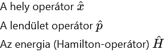<!-- img001.png -->

A **harmadik posztulátummal** pedig definiáltuk, hogy ha egy kvantumállapotot **megmérünk**, akkor ennek a hullámfüggvénye összeomlik és abban a pillanatban felvesz egy sajátértéket a hozzátartozó operátor. Ez egyben azt is jelenti, hogy onnantól kezdve a kvantuminformáció átalakul klasszikus információvá. Ezt pedig a hullámfüggvényhez tartozó sajátállapotának abszolútérték négyzete határozza meg, amit a mérnöki interpretációban a komplex valószínűségi amplitúdó abszolút érték négyezete lesz.

A **negyedik posztulátum** a harmadik posztulátum következményét írja le, miszerint a kvantumrendszer mérés utáni állapota már egy sajátértéknek megfelelő sajátállapotok egyike lesz, azaz a kvantumbit már klasszikus információt hordozó egységként kezeljük.

Végezetül az **ötödik posztulátum** a hullámfüggvény időbeli alakulását írja le Schrödinger-egyenlettel. 

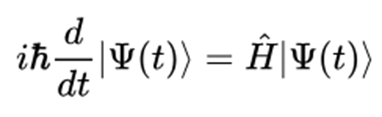<!-- img002.png -->

Az előadás második részében pedig összehasonlítottunk a **mérnöki interpretációban** használt posztulátumokkal. 

Az **első posztulátum** ugyanúgy a kvantumbit, azaz kvantumállapot leírását foglalta magában, ahol egy zárt fizikai rendszer aktuális állapota leírható egy olyan állapotvektorral, ami komplex együtthatókkal rendelkezik és egységnyi hosszú, Hilbert-térben van értelmezve. Tehát a kvantuminformatika alapköveként ismert kvantumbit (idegen szóval qubit) egy olyan kétállapotú rendszer, amely egyszerre veszi fel ezeket, azaz szuperpozícióban van. Ezzel ellentétben a klasszikus bit vagy az egyik vagy a másik állapotban lehet, ilyen kétállapotú rendszer lehet a foton polarizációja (vízszintes, függőleges), elektronspin, magspin in.  Az előadáson elhangzott a Schrödinger macskájának gondolatkísérlete, amelynek célja bemutatni a szuperpozíció “mágikus” létét. A kísérlet nem történt meg valós fizikai rendszeren, de azt kell elképzelni, hogy van egy zárt dobozban egy macska megy egy radioaktív atom, ami véletlenszerűen elbomolhat és ezzel megmérgezheti a macskát. Tehát az atom kvantummechanikai viselkedése miatt egyszerre léphet vel a bomlott és el nem bomlott állapota, azaz a macska egyszerre él és halott is. Azonban, ha kinyitjuk a doboz ajtaját, akkor abban a pillanatban eldől, hogy a macska túlélte-e az esetet vagy sem, tehát kvantummechanikai jelenségekre lefordítva a macska hullámfüggvénye összeomlik és felvesz egy sajátértéket, ami nekünk már csak klasszikus információként szolgál.

A **Hilbert-tér** a végtelen dimenziójú euklideszi vektorterek általánosítása és ahol értelmezve van:

- Belső szorzat (skalárszorzat): ⟨ψ∣ϕ⟩

- Értelmezhető a vektor hossza, azaz normája

- Metrikus, azaz két vektor között van távolság, ami mérhető

- Teljes: minden Cauchy-sorozatnak van határértéke a térben

A kvantummechanikában az állapotok (hullámfüggvények) egy Hilbert-térben értelmezett vektorai.

Ezt követően bevezettem különböző jelölési rendszereket a kvantumállapotokra: Dirac-féle formalizmust, illetve a Bloch-gömböt.

Ezt követően a **második posztulátumról** beszéltem, ahol egy kvantumrendszer időbeli fejlődését írjuk le unitér transzformációkkal.

**Unitér transzformációkra** igaz, hogy:

- Kezdő és végállapottól függ a kimenetel, azaz kölcsönösen egyértelmű

- Hossztartó leképezés, ami megőrzi a belső szorzatot, azaz a Hilbert-tér szerkezetén nem végez módosítást egy-egy tengely körüli elforgatás

- Unitér operátorok inverze megegyezik az adjungáltjukkal

- Ha egy kvantumrendszer állapotát egy másik bázisban akarjuk kifejezni, akkor az átalakítást unitér operátorral tesszük

- Pauli-kapu, Hadamard-kapu

A Hadamard-kapu egy olyan unitér transzformáció, amellyel képesek vagyunk szuperpozícióba állítani az adott kvantumállapotot, azaz a mérés pillanatáig a kvantumbit 50-50%-os valószínűséggel van egyik, illetve másik állapotban.

A **harmadik posztulátummal** definiáltam, hogy mit értünk **mérés** alatt, azaz hogyan teremtünk kapcsolatot a klasszikus és kvantumos világ között. Erre bevezettem egy mérődobozt, aminek előlapján *0;1; nem mérhető értékek* szerepeltek. Ezek tartoznak a mérés lehetséges eredményeinek halmazába. Majd mérési operátorok segítségével meg lehet határozni, hogy milyen valószínűséggel fogunk 0 vagy 1 vagy nem mérhető értéket kapni. Azonban a mérés után a kvantumállapot hullámfüggvénye összeomlik, és felvesz egy sajátértéket, ami után már ‘csak’ klasszikus információként tekintünk rá. Ez egyben azt is jelenti számunkra, hogy a mérés nem egy unitér transzformáció, mert se nem hossztartó, se nem kölcsönösen egyértelmű, így a mérés után még normalizálni kell a kapott értéket, amit a mérési valószínűség négyzetgyökével vett osztással tudunk megkapni. 

Végezetül pedig a **negyedik posztulátumot** mutattam be, amellyel olyan összetett rendszereket, azaz kvantumregisztereket tudunk létrehozni, amely szintén a Hilbert-térben értelmezhető. Ilyen rendszerek a későbbi protokolloknál (pl. Shor vagy Grover-algoritmus vagy kvantumhibajavító-algoritmusoknál). Skálázhatóság szerepe fontos szerepet tölt be a kvantumszámítástechnikában is. Fizikai interpretációk egyike lehet pedig az atomi sokaságon alapuló kvantumrendszerek. 

Kvantumregiszterek létrehozásához pedig **tenzoriális/tenzor** szorzattal juthatunk, amire hoztam pár gyakorló feladatot. Amit fontos megjegyezni, hogy n-qubites kvantumregiszter együttes állapotát 2^n –en db dimenziós vektortér írja le.

Összefoglalva, a négy posztulátum mérnöki megközelítésben az alábbi:

**1. posztulátum:** Egy zárt fizikai rendszer pillanatnyi állapota leírható egy olyan állapotvektorral, ami egységnyi hosszú és komplex együtthatóival értelmezve van a *H* Hilbert-térben.

**2. posztulátum:** Egy zárt fizikai rendszer időbeli fejlődése olyan unitér transzformációval írható le, amely csak a kezdő- és végállapottól függ.

**3. posztulátum:**

Legyen {*m*} a mérés lehetséges eredményeinek a halmaza. Egy mérés a mérési operátorok halmazával adható meg: 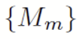<!-- img003.png -->. Ha a megmérendő rendszer állapota  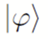<!-- img004.png --> , akkor annak a valószínűsége, hogy a mérés az *m* eredményt adja:

 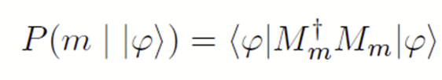<!-- img005.png -->

A mérés után a rendszer állapota az alábbi lesz:

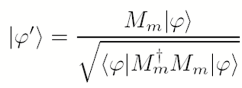<!-- img006.png -->

**4. posztulátum:** Ha V és Y két kvantumrendszerhez rendelt egy-egy Hilbert-tér, akkor előállítható egy olyan összetett rendszer, amelyhez hozzá rendelhetjük a 𝑊 = V⨂Y Hilbert-teret, ahol ⨂ a tenzor szorzás műveletét jelöli.

3. Összefonódás

**2026. szeptember 23.,** **Előadó:** **Bacsárdi** **László**

*Az előadás összefoglalóját mesterséges intelligencia készítette az előadáson elhangzottak alapján.* 

**Az előző két óra összefoglalása**

Az óra az előző két óra összefoglalásával kezdődött.

Az előadó röviden összefoglalta a **négy posztulátum** jelentőségét mérnöki szempontból. A **Dirac-féle jelölésrendszer** (ket és bra) átismétlésre került, és elhangzott, hogy ebben a tárgyban az **egyszerűbb, vektoros jelölést** alkalmazzák, a **sűrűségoperátoros leírást** ebben a kurzusban nem oktatják.

Az előadó összefoglalta a **kvantumbit (qubit)** leírását: a ∣ψ⟩=a∣0⟩+b∣1⟩ állapotban, ahol az *a* és *b* komplex valószínűségi amplitúdók, amelyek abszolút érték négyzetének összege 1 (egységvektor).  ****Emlékeztetett a múlt órán bemutatott **öt alapkapura** (Pauli-X kapu, Pauli-Y kapu, Pauli-Z kapu, Fázisforgató kapu, Hadamard-kapu). Megmutatta mindegyiknek a mátrixát, és felhívta a figyelmet egy **logikai bukfencre** a tárgyhoz ajánlott angol nyelvű könyvben: a könyvben lévő egyenletek a kvantumkapuk kapcsán matematikailag helytelenek, mivel a műveletet és annak eredményét egyetlen egy helyre, az egyenlőségjel elé írták. Az előadó a diasorán a **helyes matematikai formát** mutatta be, amelyben a műveletet és az eredményt külön lépésben, kifejtve mutatják be. *(Ezt azért emelte ki, mert a kollégák és a könyv is hajlamosak "átsuhanni" ezen a ponton.)*

Két eredményt emelt ki a **Hadamard** **kapuval** kapcsolatban, amelyet "éjjel 2-kor is tudni kell":

1. A Hadamard kapu alkalmazása a ∣0⟩ bemeneten.

2. A Hadamard kapu alkalmazása a ∣1⟩ bemeneten.

A ∣0⟩ állapotra alkalmazott Hadamard kapu eredménye a **∣+⟩** **állapot** (olvasd: „ket plusz”), a ∣1⟩ állapotra alkalmazott Hadamard kapu eredménye a **∣−⟩** **állapot** (olvasd: „ket mínusz”) lett. Vagyis mindkét eredmény két **50−50%-os szuperpozíciójú állapotot** hoz létre, melyeket ∣+⟩ és ∣−⟩ állapotoknak neveznek. A ∣+⟩ állapot (de akár a ∣−⟩ is) egy **tökéletes véletlenszám-generátor** is egyben, mivel a mérés 50%-ban 0-t és 50%-ban 1-et ad eredményül. A ∣0⟩,∣1⟩ bázis mellett a ∣+⟩,∣−⟩ is **ortogonális bázist** képez.

**Házi feladatról**

Az előadó bemutatta a **házi feladat általános leírását**, amelyet majd a következő hetek során feltöltenek a Moodleban. A házi feladat célja, hogy a hallgatók elmélyedjenek egy általuk választott témában. A feladatok lehetnek **egyénileg vagy csapatban** is megoldhatók. Hangsúlyozta a házi feladat komolyságát, az ipari környezetre való felkészítést szolgálva: ott vagy **jó a megoldás** (és működik), vagy nem.

Az előadó elismételte a félév elején elmondottakat arról, hogy a MI használata megengedett, de felhívta a figyelmet a **hallucináció** veszélyére, példát hozva olyan magyar cégnevekre, amelyek nem léteztek. Hangsúlyozta, hogy a hallgatóknak **ellenőrizniük** kell az MI által generált információt.

**Összefonódás**

Az összefonódás nem tévesztendő össze a **szuperpozícióval**, hanem egy olyan állapot, amit **nem lehet két különálló kvantumbit** **tenzorszorzatára** **bontani** (ez az ún. **szorzatállapotok** ellentéte). Ilyen állapot például:

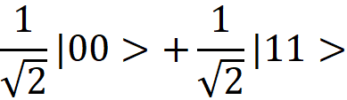<!-- img007.png -->

Ez az állapot azt jelenti, hogy az összefonódott pár két tagja (két kvantumbit) között egy **nagyon különleges korreláció** áll fenn:

- Ha az összefonódott pár **egyik tagját** megmérjük, 50% valószínűséggel **0-t**, és 50% valószínűséggel **1-et** kapunk.

- Azonban, ha az egyik tagot megmérjük és **0-t** kapunk, a pár **másik tagjának** abban a pillanatban **nincs más választása, mint szintén a 0-ás értéket felvenni**.

- Ugyanez igaz az 1-es értékre is: ha az egyik tag **1-est** vett fel, akkor a másik is **1-est** fog felvenni.

Ez a jelenség nem csak kis távolságban, hanem nagy távolságban is működik, vagyis akkor is, ha az összefonódott pár két tagja nagyon messze van egymástól, méghozzá a non-lokalitás (nem helyhezkötöttség) elve miatt. 

Az előadó megnyugtatott mindenkit, hogy noha a jelenség gyorsabb a fénysebességnél, **nem használható kommunikációra**, így nem sérti a relativitáselméletet:

- A mérés eredménye **teljesen véletlenszerű** (50% 0, 50% 1), tehát nem tudunk információt bevinni a rendszerbe (akárcsak egy tökéletesen zajos csatornában).

- Csak egy előre megbeszélt terv alapján tudhatjuk (pl. ha 0-t mér, akkor krumplit kezd el termeszteni a Marson ragadt űrhajósunk, ha 1-et, akkor búzát), hogy mi történt a távoli partnerrel, de a mérés eredményét **nem tudjuk befolyásolni**.

  

Az előadó érdekességként kiemelte, hogy a kvantumkommunikációban még abban is **meg kell egyezni**, hogy mit értünk **vízszintes és függőleges** alatt a mérés során (azaz  ∣0⟩ és ∣1⟩ bázis) alatt, mivel nagy távolságon ez is relatív lehet. 

Elmondta azt is, hogy mérnökként a  <!-- img008.png -->

állapotot mutatja, ahol a korreláció az **azonos** értékre vonatkozik. Azonban létezik egy másik összefonódott állapot is (amit inkább a fizikusok használnak), ahol a mérés eredménye **pontosan ellentétes** lesz (pl. az egyik helyen ∣0⟩-t mérünk,  a másik helyen pedig ∣1⟩-et):

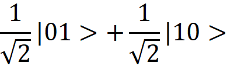<!-- img009.png -->

Az összefonódott állapotok előállítására a **CNOT (vezérelt NEM) kapu** szolgál. A CNOT kapu **két bemenettel** rendelkezik:

1. A **vezérlés** (control) a felső vezeték.

2. Az **adat** (data) az alsó vezeték.

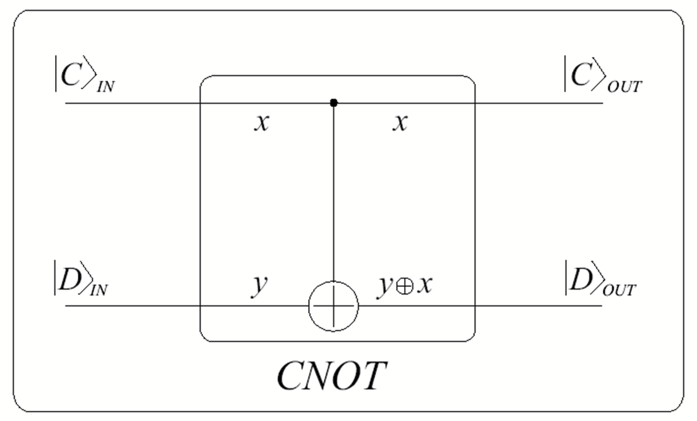<!-- img010.png -->

*Ábra forrása: Imre S.,* *Wiley, 2005*

A kapu működése:

- Ha a **vezérlés értéke 0**, akkor a kapu **nem csinál semmit**, átengedi az adat bitet.

- Ha a **vezérlés értéke 1**, akkor az **alsó biten negálást** (NOT műveletet) hajt végre, hasonlóan a klasszikus digitális technikához.

A CNOT kapu igazságtáblája a klasszikus logikához hasonlóan írható fel. Az összes többi kapuhoz hasonlóan a CNOT kapunak is van egy mátrixa, de mivel ez kétbites kvantumkapu, ezért a mátrixa **4×4-es**, amely azonban egyszerűen memorizálható. Ha a bemenet vezérlése 0 (a mátrix bal felső része), akkor az identitás transzformáció (nem csinál semmit) látható. Ha a vezérlés 1 (a mátrix jobb alsó része), akkor egy **Pauli-X transzformációt** (negálás) hajt végre.

Ha a CNOT kapu bemenetére a vezérlőn **szuperpozíciós állapotot** (a∣0⟩+b∣1⟩), az adaton pedig egy ∣0⟩ állapotot viszünk, a kimeneten összefonódott állapot jelenik meg, az a∣00⟩+b∣11⟩. 

A CNOT kapu elméletének bemutatása után az előadó definiálta a **négy Bell-állapotot**, amelyek a vezérlő és adatbitek négy klasszikus bemenetéből (∣00⟩,∣01⟩,∣10⟩,∣11⟩) állíthatók elő. Ezeket az állapotokat **John Bell** tiszteletére nevezték el (1964-es publikáció nyomán), és rendelkeznek azzal a tulajdonsággal, hogy **ortogonálisak** egymásra.

<!-- img011.png -->

*Ábra forrása: Imre S.,* *Wiley, 2005*

Az előadó tisztázta, hogy a Bell-állapotokra vonatkozó ábrán szereplő *a* és *b* betűk nem komplex valószínűségi amplitúdókat jelentenek, hanem egyszerűen a bemeneti állapotok. Ebben az esetben a és b értéke **0 vagy 1** lehet, ami a négy lehetséges kezdeti bázisállapotot (a, b=00,01,10,11) jelöli. Ezzel a négy kezdeti állapot lefedve, a fenti áramkör (Hadamard + CNOT) a **négy Bell-állapotot** állítja elő: 

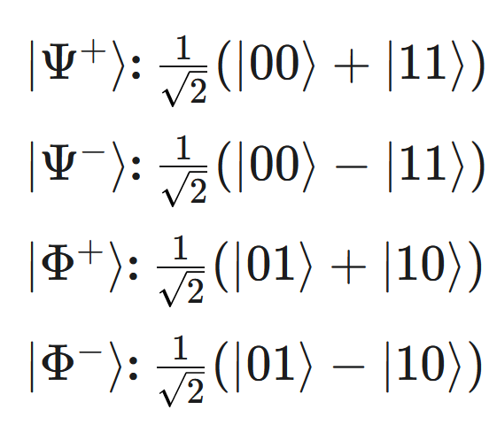<!-- img012.png -->

Kiemelte, hogy az összefonódás nem korlátozódik két bitre (2-es összefonódás), létezik **több bittel is** (pl. **GHZ állapotok,** ami a hármas összefonódás).

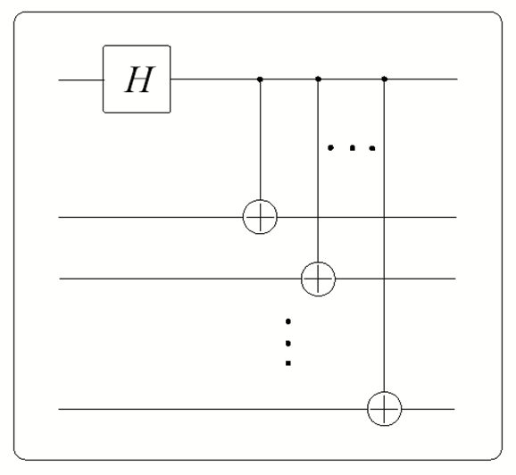<!-- img013.png -->

*Ábra forrása: Imre S.,* *Wiley, 2005*

Ez utóbbival kapcsolatban elhangzott, hogy biztonsági szempontból aggályos lehet. Ha két fél egy összefonódott állapotot használ titkos kulcs előállítására (pl. **véletlenszám generálásra**), és miközben a fotonok úton vannak, egy harmadik fél "hozzáfonódik" a rendszerhez (egy általános kvantum összefonódás révén), akkor **hármas összefonódás** jön létre. Ez a támadó (a harmadik fél) **azonnali kapcsolatba** kerül mindkét eredeti kvantum bittel, ami kompromittálhatja a titkos kulcsot, mivel ő is megismerheti azt.

Az összefonódás számos területen felhasználható a kvantumtechnológiában:

- **Kvantumteleportáció** (quantum teleportation)

- **Szupersűrű tömörítés** (superdense coding).

- **Kvantummemória** és **kvantum jelerősítés**.

- **Titkos kulcs megosztása** (bizonyos feltételekkel, erről majd később lesz szó

Az összefonódás egy olyan jelenség, amelyet **klasszikus módon nem lehet előállítani**, és ami a klasszikus világban nem létezik.

4. Mérés

**2025. október 1.,** **Előadó: Imre Sándor**

A mérés átjáró a kvantum és a klasszikus világ között, egyfajta Q/C átalakító. Az érzékszerveink számára felfoghatatlan kvantumos működést teszi megfigyelhetővé, mint mikor egy kulcslukon benézünk a szobába. Nem látjuk teljes részletességében, de azért használható információkhoz jutunk.

A mérés egy olyan eszköz, aminek 1 kvantumos bemenete és 2 kimenetet (egy klasszikus és egy kvantumos) van. A klasszikus kimenet az ún. skála, amin 0 és pozitív egész számok vannak feltüntetve. Ez hordoz információt a bemenetre küldött kvantumállapotról. Mivel a megmérendő elemi részecske igencsak összemérhető a mérőberendezéssel, ezért az befolyásolhatja a részecske állapotát. Ezért van kvantumos kimenete a mérődoboznak.

A mérés áramköri jele:

<!-- img014.png -->

A mérést a 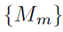<!-- img015.png --> mátrixhalmazzal adjuk meg, ahol minden *m* skálaértékhez tartozik egy mátrix. A mérési operátorok nem unitér transzformációk, mivel információvesztéssel jár a mérés, azaz nem kölcsönösen egyértelmű és emiatt nem is unitér!

A mérési posztulátum ismert mérődoboz és bemeneti állapot esetén megadja a mérési statisztikát.

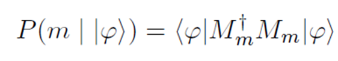<!-- img016.png -->

és a *k* skálaértéket mérve a hozzá tartozó mérés utáni állapotot:

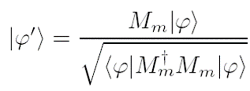<!-- img017.png -->

A teljességi reláció ugyan nem része a posztulátumnak, hanem következménye, de egyben hasznos kiegészítője is. Segít ellenőrizni, hogy minden szóba jöhető érték felkerült-e a skálára.

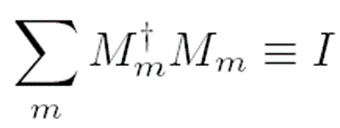<!-- img018.png -->

A mérési posztulátum egy analitikus állítás. Ismert mérődoboz és bemeneti állapot esetén segít elemezni/analizálni, hogy mire számíthatunk. Minket mérnököket sokkal inkább az érdekel, hogy adott műszaki problémához mikén konstruálható megfelelő mérés. **A projektív mérés egy ilyen mérési konstrukció**.

A projektív mérés **olyan esetben segít** megfelelő mérést definiálni, amikor a rendszerünk egymásra **merőleges ún. ortogonális kvantumállapotok**at hoz létre. Vigyázat, a klasszikus állapotok mindig ortogonálisak, de vannak olyan ortogonális kvantumállapotok is, melyek nem klasszikusak, pl. <!-- img019.png --> <!-- img020.png -->

A projektív mérés konstruálása lineáris egyenletrendszerek megoldását követeli meg, de a folyamat józan megfontolásokkal végletesen leegyszerüsíthető:

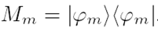<!-- img021.png -->

Projektív mérés esetén a mérési operátorok speciális tulajdonsággal bírnak, ún. Önadjungált (másnéven hermetikus) operátorok. Ez a tulajdonságazt eredményezi, hogy a mérési posztulátum és a teljességi reláció képletei egyszerűsödnek.

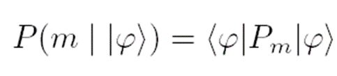<!-- img022.png -->

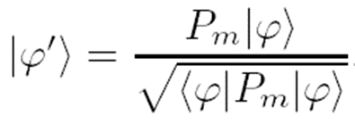<!-- img023.png -->

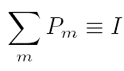<!-- img024.png -->

A projektív mérés sajátos tulajdonsága, hogy egyszer megmérve egy elemi részecskét, ha ugyanezen részecskére még egyszer alkalmazzuk ugyanezt a mérést a mérési eredmény és a mérés utáni állapot nem változik.

Amennyiben csak projektív mérődobozaink vannak, akkor is végre tudunk hajtani egy általános mérést, amennyiben növeljük a kvantumbitek számát (az állapottér méretét/dimenziószámát) és egy alkalmasan választott unitér transzformációt hajtunk végre a megnövel kvantumregiszteren. Ebben az esetben a fölső kvantumregiszteren ugyanazt a statisztikát kapjuk, mintha csak ezen hajtottuk volna végre az általános mérést.

Már itt felhívjuk a figyelmet arra, hogy **a mérhetőség/megkülönböztethetőség és a másolhatóság szoros kapcsolatban állnak egymással**. Ezzel a következő órán fogunk megismerkedni.

<!-- img025.png -->

A POVM (Positive Operator Valued Measurement) mérések olyan esetben kínálnak konstrukciós szabályt, amikor az állapothalmazunkban nem-ortogonális állapotok vannak. Ilyenkor egy extra skálaértéket kell felvenni a műszerre. Amikor ide mutat a műszer, azzal azt jelzi, hogy nem tudja eldönteni, melyik állapotot adtuk be a mérődobozba. A többi skálaérték esetén viszont biztosak lehetunk a kijelzés helyességében. A POVM konstukciót MSc-s kvantumos tárgyakban lehet megismerni.

5. Kvantuminterferometer, NCT

**2025. október 8.,** **Előadó: Imre Sándor**

A kvantuminterferométer kiváló eszköz a kvantumos jelenségek egyszerű szemléltetésére, illet arra, miként tudjuk a posztulátumokat alkalmazva leírni és elemezni egy kvantumos rendszer működését valamint az átlépést a kvantumosból a klasszikus világba.

A kvantuminterferométer elnevezése a klasszikus interferencia jelenségre vezethető vissza. Ott klasszikus elektromágneses hullámok erősítik vagy oltják ki egymást a tér különböző pontjain jellegzetes interferenciaképet mutatva.

<!-- img026.png -->

Fényhullámok interferenciája (wikipédia)

A kvantumos interforométerben ehhez képes a valószínűségi amplitúdók (közvetve a valószínűségek) interferálnak, azaz erősítik vagy oltják ki egymást.

A kvantuminterferométer 2 nyalábosztóból (féligáteresztő tükörből), két normál smink vagy borotválkozó tükörből és egy adalékolt üveglapból áll, mely eltérő módon késleltetheti a fotonokat a két ágban.

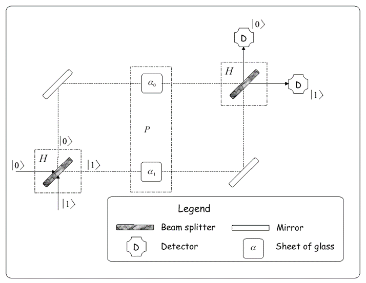<!-- img027.png -->

A féligáteresztő tükör a rá küldött fotonokat 50% eséllyel engedi át vagy veri vissza. Önmagában úgy viselkedik mint egy levegőbe feldobott pénzérme, ami vagy az eredeti vagy a másik oldalára esik le. Praktikusan egy olyan dobozként modellezhetó, melynek van egy logikai 0-ás és egy logikai 1-es bemenete, valamint ugyanilyen kimenetei.

Elsőként a kvantuminterferométert mint zárt fizikai rendszert vizsgáljuk. Ehhez az építőelemeket alkalmasan választott kvantumkapukkal helyettesítjük. A féligáteresztő tükrüket Hadamard-kapukkal, az üveglepot pedig egy fáziskapuval.

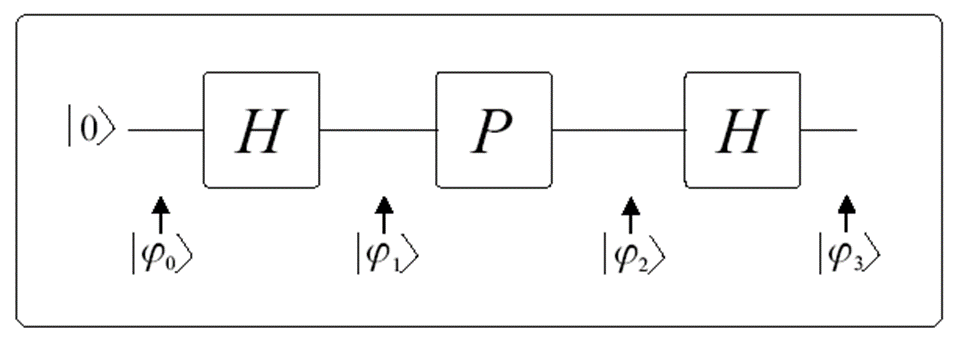<!-- img028.png -->

Az elemzéssel meghatározhatjuk a 2 detektor megszólalási valószínűségeit:

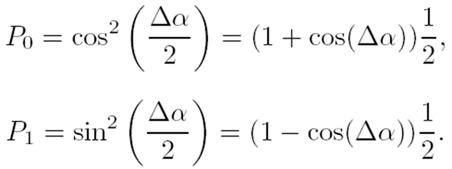<!-- img029.png -->

Amennyiben a fázistolás 0 fok, akkor a 0-ás detektor 1 valószínűséggel szólal meg az 1-es pedig soha. Azaz két véletlenszerűen működő eszköz együtt determinisztikus működést eredményezett. Ez klasszikusan nem lehetne lehetséges, hiszen a klasszikus valószínűségek mindig 0 és 1 közé esnek, azaz nem tudják kioltani egymást.

A továbbfejlesztett modellben egy pillangó is megjelenik, melynek egyik elemi részecskéje össze van fonódva az interferométerben repülő fotonnal.

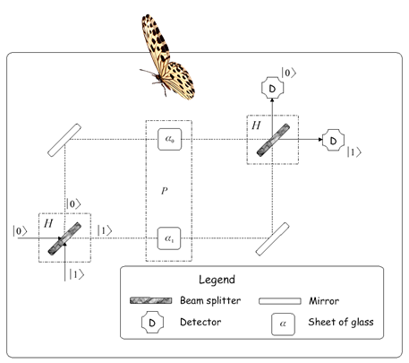<!-- img030.png -->

Az elemzést újra elvégezve a detektorok megszólalási valószínűségei a következők:

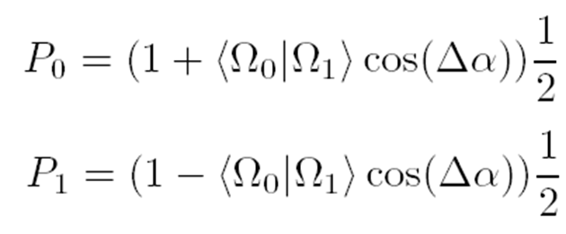<!-- img031.png -->

Jól látható, hogy itt a környezet változásának mértéke is befolyásolja a valószínűségeket, azaz a determinisztikus működés akár teljesen véletlenné is válhat egy rendszeren kívülre vezető összefonódás miatt! Ez a hatás nehezíti a kvantumszámítógépek fejlesztését.

A **No –cloning**, azaz másolhatatlansági tétel neve egy kicsit félrevezető. Próbáljunk meg egy tökéletes kvantumos másológépet tervezni. 

<!-- img032.png -->

A tervezés megkönnyítése érdekében megengedjük, hogy a környezet is hasson a Q másolóra, ezt valósítja meg az U transzformáció. Ugyanakkor kellően nagy U-t választva el tudjuk érni, hogy a rendszer zárt legyen, azaz érvényesek legyenek a kvantummechanika posztulátumai. Ekkor az U transzformációnak unitérnek kell lennie a 2. posztulátum értelmében. Az unitérségnek most azt az elvivalens  definícióját alkalmazzuk miszerint bármely 2 bemenő vektor skaláris szorzatának meg kell egyeznie a hozzájuk tartozó kimeneti állapotok skaláris szorzatával.

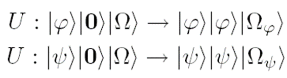<!-- img033.png -->

Azaz a bemeneten

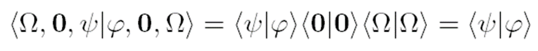<!-- img034.png -->

és a kimeneten

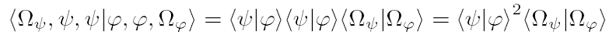<!-- img035.png -->

levő állapotoknak egyenlőnek kell lenniük. Ez vagy akkor teljesül ha 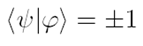<!-- img036.png -->azaz a két állapot azonos vagy ha 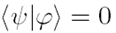<!-- img037.png -->, azaz a 2 állapot merőleges. Ez utóbbi jó hír, mert igy a klasszikus COPY utasítás nem kerül veszélybe.

Összegezve a fentieket kimondjuk a No cloning tételt:

**Nem készíthető olyan unitér kvantumkapu, amivel tetszőleges kvantumállapot-halmaz hibamentesen másolható.** **De**

**– Ortogonális állapotok halmaza másolható!**

**– Ismert állapot másolható!**

6. Tetszőleges kvantumbit előállítása alap kvantumkapuk segítségével. Szupersűrűségű tömörítés. Kvantumteleportáció.

**2025. október 15., Előadó: Oláh Kitti**

*Az előadás összefoglalóját természetes intelligencia készítette az előadáson elhangzottak alapján.*

A kvantumszámítás célja, hogy számításigényes problémákat oldjunk meg kvantummechanikán alapuló módszerekkel. Ennek kapcsán bemutatásra került egy tetszőleges kvantumáramkör előállítása, amelynek kvantumáramköri leírása:

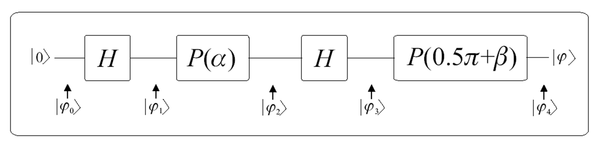<!-- img038.png -->Elsőként kiválasztunk egy kvantumállapotot, amely esetünkben ∣0⟩ lesz és Hadamard-kaput alkalmazva szuperpozícióba állítjuk, amellyel el is végeztük az inicializálást.

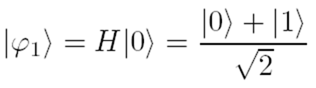<!-- img039.png --> kvantumállapotra alkalmazunk egy α szöggel vett fázisforgatást, ez egyben azt is jelenti, hogy a szuperpozícióban lévő állapot valószínűségi amplitúdóját elforgatja ezzel a szöggel. Érdemes ezt megnézni a korábban (2. Posztulátumok c. előadás) említett Bloch-gömb szimulátorokon keresztül. Így a fáziskapu alkalmazása után a kvantumállapotunk:

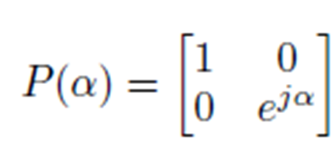<!-- img040.png -->            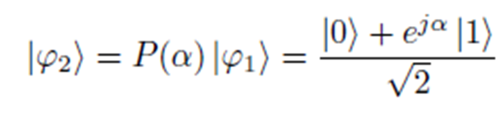<!-- img041.png -->

A fáziskapu diagonális mátrixában is jól látszik, hogy a ∣1⟩ állapot valószínűségi amplitúdójánál fog megjelenni a forgatás hatása. Ugyanakkor érdemes megjegyezni, hogy a fáziskapu nem változtatja meg a mérési valószínűséget (azaz a mérési statisztikát), csak a komplex fázisokat módosítja, amelynek hatása a szuperpozícióban lévő állapotok interferencia jelenségénél lép föl. Ezt követően ismét alkalmazunk egy Hadamard-kaput:

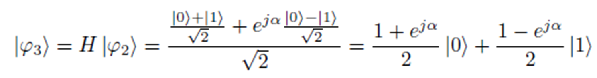<!-- img042.png -->

Végezetül pedig egy másik szöggel vett fázisforgatást végeztünk:

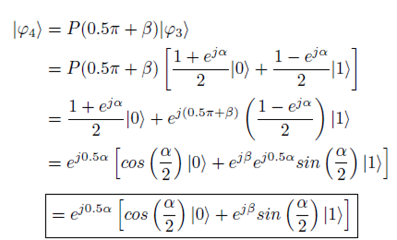<!-- img043.png -->

Ahhoz, hogy jobban megértsük ezt a bekeretezett végállapotot, érdemes bevezetni az Euler-formulát. Utána pedig be kell bizonyítani, hogy az alábbi két egyenlőség helyesen áll fen a kifejezések között, amelynek levezetése itt látható:

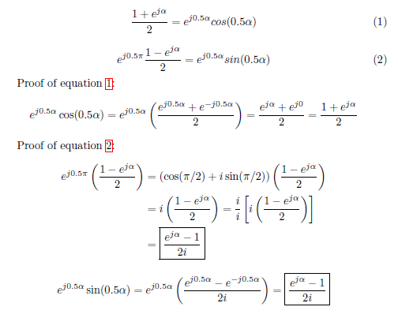<!-- img044.png -->

Az előadás következő témája két kvantumkommunikációs protokoll bemutatása volt. Elsőként a szupersűrűségű tömörítést mutattam be, amelyet Charles H. Bennett és Stephen J. Wiesner fogalmaztak meg 1992-ben (“Communication via one- and two-particle operators on Einstein-Podolsky-Rosen states”). A klasszikus információátviteli képesség korlátokba ütközik, amelyet ezzel a protokollal szeretnénk megoldani. A következő ábra szemlélteti a protokoll architektúráját: 

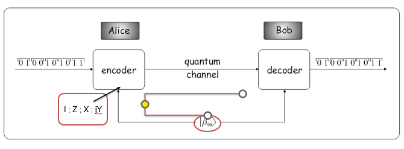<!-- img045.png -->

Mivel kvantumkommunikációban leggyakrabban a fotonok hordozzák az információt, így a következő két protokoll esetében is erre fogok hivatkozni. Az inicializálás során Alice és Bob megosztanak egymás között egy EPR-pár, azaz összefonódott fotonpárt, amely valamelyik Bell-állapotot tartalmazza, ebben az esetben: 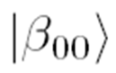<!-- img046.png -->. Ezután Alice dibitenként megkapja a tömörítésre szánt klasszikus információcsomagot, amelyet egy speciális kódolással továbbít a kvantumcsatornán. A kódolás az alábbi táblázat szerint működik, azaz ha Alice 00 dibitet kap, akkor a nála lévő összefonódott kvantumállapoton elvégez egy Identitás-transzformációt (*I-transformation).*

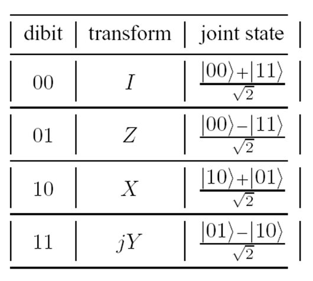<!-- img047.png -->

Miután Bob megkapta Alice-től kvantumbitjét, elvégez rajta egy projektív mérést megkülönböztetve a 4 lehetséges Bell-állapot. Viszont Bobnak nem muszáj elvégezni a mérést, mert van egy másik módja is a dekódolásra. Ha kihasználjuk, hogy ezek unitér transzformációk, azaz kölcsönösen egyértelmű és hossztartó leképezésük van, akkor meg tudjuk határozni az adott állapotot a transzformáció inverz folyamatából.

A Bell-állapotokat az alábbi kvantumáramkör alapján állíthatunk elő, ahol 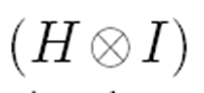<!-- img048.png --> és 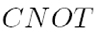<!-- img049.png --> kapuk hermitikusak, így Bobnak elég ezeknek az inverzét venni ahhoz, hogy megépítse a dekóderét.

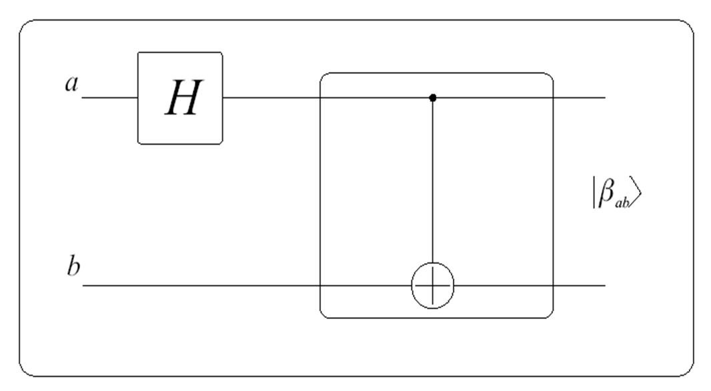<!-- img050.png -->

Tehát:

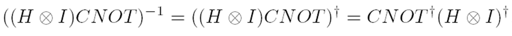<!-- img051.png -->

*[Érdemes megjegyezni, hogy ha a kvantumkapuk párhuzamosan vannak kötve az áramkörben, az* *tenzorszorzást* *jelent, míg a soros kapcsolás mátrixszorzást]*

A következő kvantumkommunikációs protokoll a kvantumteleportáció, amelynek elméletét 1993-ban Charles H. Bennett, Gilles Brassard, Claude Crépeau, Richard Jozsa, Asher Peres and William K. Wootters (“Teleporting an unknown quantum state via dual classical and Einstein-Podolsky-Rosen channels”). Az alábbi ábra szemlélteti a kvantumáramköri leírását, amely során Alice szeretne elküldeni Bob számára egy tetszőleges állapot: 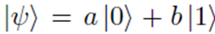<!-- img052.png -->.

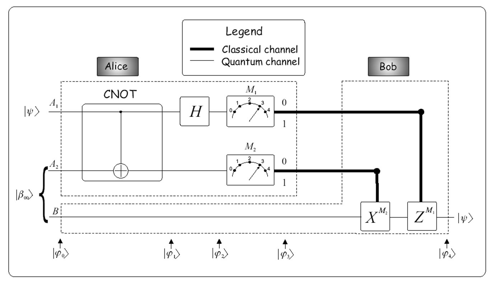<!-- img053.png -->

Az szupersűrűségű tömörítéshez hasonlóan itt is az inicializáláshoz megosztunk egy EPR-párt azaz összefonódott fotonpárt Alice és Bob között, ami ez esetben a 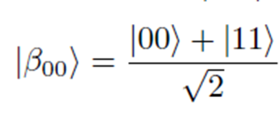<!-- img054.png --> Bell-állapot lesz. Ezt követően Alice összefonódtatja a két vezetékén (A_1 és A_2) lévő állapotokat egy CNOT-kapuval majd szuperpozícióba helyezi egy Hadamard-kapuval, amelynek részállapotai:

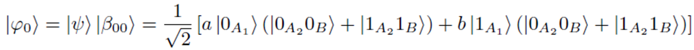<!-- img055.png -->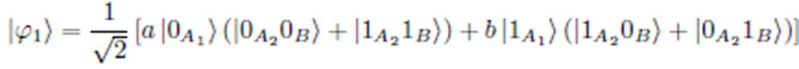<!-- img056.png -->

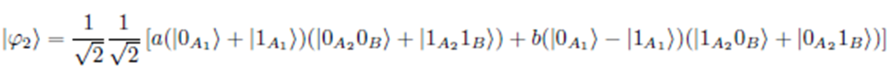<!-- img057.png -->

<!-- img058.png -->

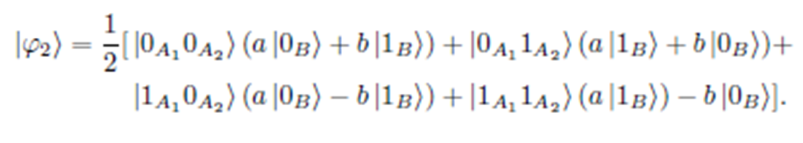<!-- img059.png -->

Azt követően Alice elvégzi a méréseket, melynek eredményeit már klasszikus csatornán továbbítja Bob felé. A mérési eredmények függvényében dől el, hogy Bobnak melyik transzformációt/transzformációkat kell elvégezni, ehhez tartozó táblázat alapján:

<!-- img060.png -->

Végezetül sikeres kvantumteleportációval kapcsolatos kísérleti elrendezések, illetve eredmények kerültek bemutatásra, egészen a laboratóriumi, illetve szabadtérben, műholdas architektúrában. Ezeknek a referenciái megtalálhatók a diasorban.

7. QKD

**2025. október 22., Előadó:** **Galambos Máté**

*Az előadás összefoglalója természetes és mesterséges intelligencia közti párbajból született az előadáson elhangzottak alapján.* 

 ****

**Kvantumkulcsszétosztás dióhéjban**

A kvantummechanikában a mérés elkerülhetetlenül hatással van az állapotokra. Amikor egy kvantumrendszert mérünk, nemcsak információt nyerünk ki belőle, hanem egyúttal a mérés hatására a rendszer állapota megváltozik, vagy más szóval a hullámfüggvény "összeomlik". Ez a jelenség lényeges különbséget jelent a klasszikus fizikához képest, ahol egy jól megtervezett mérés nem (vagy legfeljebb elhanyagolható mértékben) változtatja meg a rendszer állapotát.

Ez a hatás különösen fontos a kvantumos kulcsszétosztásban, mivel, ha egy támadó megpróbál lehallgatást végezni vagy beavatkozni a rendszerbe, az megváltoztatja az állapotot, és ez a változás észrevehető a kommunikációs partnerek számára. Ez a tulajdonság lehetővé teszi, hogy a kulcsokat (jelszavakat) biztonságosan oszthassák meg, mivel detektálhatóvá válik egy potenciális támadás, ezáltal garantálva a kommunikáció titkosságát.

A kvantumkulcsszétosztás (Quantum Key Distribution QKD) során tehát véletlenszerű bitértékeket viszünk át két kommunikáló fél között. Amennyiben a felek meggyőződnek róla, hogy nincsenek lehallgatásra, manipulációra utaló jelek, akkor az így átvitt kulcsot klasszikus titkosításra használják.

**Klasszikus kriptográfia**

Mindannyian ismerünk olyan műveleteket, melyeket egy irányban könnyű elvégezni, de visszafele nehéz: deriválni könnyű, de integrálni nem, prímeket összeszorozni könnyű, de a szorzatot prímtényezőkre bontani nem.

Erre épít a kriptográfiában a nyilvános kulcsú titkosítás (más néven nyílt kulcsú vagy aszimmetrikus titkosítás). Ez egy olyan módszer, mely két különböző kulcsot használ: egy nyilvános kulcsot (a rejtjelezéshez), amit bárki megismerhet, és egy magánkulcsot (a visszafejtéshez), amit csak a tulajdonosa ismer. Ez lehetővé teszi az adatok biztonságos küldését anélkül, hogy a titkos kulcsot át kellene adni.

A nyílt kulcsú titkosítások jelenleg a legelterjedtebbek, mivel könnyen implementálhatóak. A probléma velük, hogy nincs bizonyítékunk rá, hogy tényleg biztonságosak. A tapasztalat alapján elfogadjuk, hogy a titkosítás feltörésére jelenleg nincs széles körben ismert hatékony megoldás, de egyrészt sosem tudhatjuk, hogy egy támadónak pontosan mennyi erőforrás áll a rendelkezésére és milyen titkos kódtörő eljárásokat ismer, másrészt nem tudhatjuk, hogy mit hoz a jövő. Biztosan tudjuk, hogy egy érett kvantumszámítógép hatékonyan tudna törni számos elterjedt nyilvános kulcsú titkosítást, de ez csak egy példa arra, hogy a fenyegetés valós: egy új hardver vagy matematikai tétel bármikor felbukkanhat, amivel korábban nehéznek látszó problémák hirtelen könnyűvé válhatnak.

Ezzel szemben a szimmetrikus kulcsú titkosításnál ugyanaz a kulcs szerepel mind a titkosítás, mind a visszafejtés során. Ez gyorsabb és kevésbé bonyolult, de kihívásokat is jelent, mivel a kulcsot biztonságosan kell megosztani a kommunikáló felek között, így jelenleg csak speciális esetekben alkalmazzák. A célunk az lesz, hogy a szimmetrikus titkosításokat kombináljuk lehallgathatatlan kvantumos kulcsszétosztással.

Az egyszer használatos kulcs (One Time Pad, OTP) egy különösen biztonságos szimmetrikus titkosítási módszer, melynél a titkosításhoz használt kulcs véletlenszerű, olyan hosszú, mint az üzenet, és csak egyszer használják, majd eldobják. Előnye, hogy matematikailag bizonyíthatóan tökéletes biztonságot nyújt, mivel a titkosított szöveg teljesen véletlenszerűvé válik, és nem lehet visszafejteni a kulcs ismerete nélkül.

**QKD**

A kvantumos kulcsszétosztás (QKD) olyan protokollokat takar, amelyek lehetővé teszik két fél számára, hogy biztonságosan osztozzanak egy titkos kulcson, a kvantummechanika alapelveire támaszkodva.

Egjegyzendő, hogy bár a kulcsszétosztás elterjedt név, a helyesebb kifejezés a "kulcsbővítés" vagy "kulcsnövesztés" (key expansion), mivel a protokollok nem egyszerűen megosztják a kulcsot, hanem lehetőséget adnak arra, hogy egy kiinduló kulcsot (melyet a rendszer telepítésekor egyetlen egyszer osztunk meg) biztonságosan növeljék, bővítsék.

*CV/DV*

A kvantumos kulcsszétosztó eljárásokat több szempont szerint kategorizálhatjuk. Az egyik alapvető megkülönböztetés a változók típusa szerint történik: diszkrét változós (DV, discrete variables) és folytonos változós (CV, continuous variables) protokollokra. A diszkrét változós protokollok például a kvantumállapotokat véges, diszkrét, bináris értékekben (pl. <!-- img061.png --> vagy <!-- img062.png -->, vagy a kvantumállapotok közötti kétállapotú szuperpozíciók) reprezentálják, mint amilyen a BB84 protokoll. Ezek a módszerek általában könnyebben leírhatóak és elemezhetőek matematikailag, és jól működnek hosszú távolságokra, rosszabb csatornaviszonyok mellett, de kisebb kulcsgenerálási ráta érhető el velük.

A folytonos változós protokollok viszont végtelen dimenziós Hilbert térbeli kvantumállapotokat használnak. Ilyen a gyakorlatban könnyen előállítható gyengített lézerpulzusokkal (melyekben például a fotonszám lehet <!-- img063.png -->, <!-- img064.png -->,… <!-- img065.png --> vagy tetszőlegesen sok) és legtöbbször a pulzusok intenzitásába és/vagy fázisába kódolnak információt.  Ezek a módszerek általában könnyebben megvalósíthatók, lehetővé teszik a nagyobb adatátviteli sebességet, de bonyolultabb matematikai eszközökre van szükség a biztonságuk bizonyításához így a biztonsági elemzések is lassabban fejlődnek, kevésbé érettek.

*Előállít és megmér/ összefonódás alapú*

Egy másik megkülönböztetés szerint a kvantumkulcsszétosztási protokollokat két fő típusba sorolhatjuk: ezek az előállít és megmér (prepare and measure, P&M) típusú, illetve az összefonódás alapú (entanglement-based) protokollok.

Az előállít és megmér típusú protokollokban az egyik fél olyan kvantumállapotokat készít, melyekről pontosan tudja, hogy egy adott bázisban mérve milyen mérési eredményt adnának, majd azokat elküldi a másik félnek, aki megméri azokat. A kulcs titkosságát itt a támadó számára ismeretlen mérési bázis biztosítja. A BB84 protokoll tipikus példája ennek a kategóriának. Az ilyen protokollok előnye, hogy egyszerű kivitelezésűek, és nem igényelnek összefonódott állapotokat a kezdeti lépésben. Hátrányuk viszont, hogy érzékenyek a zajokra és a veszteségekre az átviteli közegen, különösen nagy távolságokon.

Az összefonódás alapú protokollokban a résztvevők közösen hoznak létre vagy használnak kvantumállapotokat, amelyek között összefonódás (entanglement) van. Így egyikük sem tudja előre, hogy egy mérésnek mi lesz a kimenetele, csak azt tudják, hogy a mért értékeknek korrelálniuk kell egymással. A híres E91 protokoll például összefonódott fotonokat használ, amelyek közösen tartalmaznak információt. Előnyük, hogy nagyobb biztonságot nyújtanak, különösen, ha a kommunikációs csatornában zaj vagy zavar lép fel. Hátrányuk viszont, hogy összetettebb a kivitelezésük, és az összefonódott állapotok létrehozása technológiailag kihívást jelent.

*Szabadtéri/vezetékes*

Az átviteli közeg szempontjából a kvantumkommunikáció két fő típusát különböztetjük meg: a szabadtéri és az optikai szálas átvitelt. A levegőn keresztüli kommunikáció vízszintesen rövid vagy függőlegesen hosszú távolságokra ideális. Előnye, hogy könnyen telepíthető, mobilis infrastruktúra alakítható ki vele (így például hajókat, drónokat, repülőgépeket is össze tud kapcsolni). Hátránya viszont, hogy a légkör alacsonyabb rétegében a zajok, eső, köd és egyéb környezeti tényezők jelentősen csökkenthetik a rendszer hatékonyságát és rendelkezésre állási idejét. Rövid távon városi vagy regionális hálózatokban alkalmazható, de a légkör alsó rétege fölött műholdas kommunikációban már lehetővé teszi a világméretű kvantumhálózatok kiépítését is.

Az optikai szálas átviteli rendszerek, közepes távolságokra és stabilabb szolgáltatást igénylő esetekben alkalmazhatók. Előnyük, hogy alacsony veszteséget és magas átviteli sebességet biztosítanak, valamint kevésbé érzékenyek a környezeti zavarokra. Hátrányuk viszont, hogy a szálak vesztesége miatt országok vagy kontinensek között a kommunikáló feleket jelveszteség miatt nem lehet közvetlenül összekötni. Ilyen esetekben köztes csomópontokra van szükség, azonban a kvantumos jelismétlők és eszközfüggetlen csomópontok (device independent node, ahol nem számít ki készítette vagy üzemelteti ezt a csomópontot) egyelőre nem skálázhatóak. Ezen rendszereket elsősorban nagyvárosi és ipari környezetekben alkalmazzák, ahol a közepes távú, megbízható kommunikáció fontos.

**BB84**

A BB84 protokoll egy (diszkrét változós, előállít és megmér típusú) kvantumkriptográfiai protokoll, amely lehetővé teszi két fél számára (általában Alice és Bob), hogy biztonságosan oszthassanak meg titkos kulcsot. A kvantumkriptográfia első és legmélyebben elemzett, legtöbbször megvalósított, valamint zárthelyiben leggyakrabban felbukkanó protokollja, így nagy elméleti és gyakorlati jelentősége van.

Alapfogalmak:

  - Alice és Bob két fél, akik szeretnének titkos kulcsot megosztani.

  - A protokoll során Alice kvantumállapotokat küld Bobnak, miközben mindketten véletlenszerűen kiválasztott bázisokat használnak a mérésekhez.

  - Két bázist használnak: a rectilineáris (függőleges-vízszintes) és a diagonális (két 45°-os szögben forgatott átlós).

A kulcsszétosztás főbb lépései:

1. Állapotok generálása és küldése (Alice részéről):

   1. Alice generál egy sor véletlenszerű bitet (0 vagy 1).

   2. Minden bithez véletlenszerűen kiválaszt egy bázist (rectilineáris vagy diagonális).

   3. Alice a bit értékét a kiválasztott bázisban kvantumállapotba kódolja (pl. 0 vagy 1 bit esetén, a rectilineáris bázisban: |0⟩ vagy |1⟩, a diagonális bázisban: |+⟩ vagy |−⟩).

   4. Ezután elküldi ezeket a kvantumállapotokat Bobnak.

2. Mérés (Bob részéről):

   5. Bob is véletlenszerűen kiválaszt egy bázist minden küldött kvantumállapothoz (rectilineáris vagy diagonális).

   6. Méri a kapott kvantumállapotokat a saját bázisában, és eredményül kap egy bitet (0 vagy 1).

3. Bázisok kommunikációja:

   7. Miután minden kvantumállapotot mértek, Alice és Bob nyilvánosan (pl. nyilvános, autentikált csatornán) egyeztetik, mely bázisokat használtak küldés és mérés során. (Azt viszont nem beszélik meg, hogy az adott bázisban mi volt a mérési eredmény.)

4. Bázisegyeztetés (sifting):

   8. Alice és Bob kiszűrik azokat az eseteket, ahol a küldő és mérő bázisok megegyeztek, mert csak ezekben az esetekben van értelme a mérési eredményeknek.

   9. A nem egyező bázisokat elvetik.

   10. Az egyező bázisokban született bitértékeket összegyűjtik, és ezekből alkotják a közös titkos kulcs egy részét.

5. Hibajavítás (reconciliation) és bizalmasságnövelés (privacy amplification):

   11. Alice és Bob elvégzik a hibajavítást és a titkos kulcs ellenőrzését (pl. a kulcs egy véletlenszerű részének összehasonlításával), hogy kiszűrjék az esetleges lehallgató által okozott zavarokat.

   12. Az összehasonlított részben lévő hibák alapján megbecsülik, hogy egy lehallgató mennyi információval rendelkezhet a kulcsról a hibák alapján.

   13. A megmaradt titkos kulcsot transzformálják (key destillation), amivel kisebb, de a támadó által kevésbé ismert kulcsuk lesz. Utófeldolgozásként gyakran alkalmaznak hash-függvényeket vagy más kriptográfiai módszereket, például Toeplitz-mátrixokat, amelyek segítségével a kulcs a kiszivárgott információtól megtisztítható.

   14. Ezután biztonságosan megosztott titkos kulcsuk lesz, amelyet további titkosítási protokollokban használnak.

Mérés esetén egy támadó (bevett elnevezéssel Eve) nem feltétlenül azonos bázist választ, mint Alice és Bob, aminek hatására hibák jelennek meg a kommunikációban. Ez alapján egy lehallgatási kísérlet detektálható, a hibák számából megbecsülhető, hogy Eve a kulcs mekkora részét hallgatta le, legfeljebb hány bitet ismerhet belőle.

Ez a lépéssorozat biztosítja, hogy az esetleges lehallgató nem tudja megszerezni a kulcsot anélkül, hogy a jelenlétét felfedeznék.

**B92**

A B92 kvantumkulcsmegosztási protokoll egy egyszerűbb, kétállapotú kvantum protokoll. Itt az előző példával szemben a mérési bázisok adják majd a titkos kulcsbiteket. Lépésről lépésre a kulcsszétosztás:

1. **Állapotok kiválasztása**: A kommunikáló felek, Alice és Bob, két kvantumállapotot választanak ki, például |0⟩ és |+⟩, amelyek nem egyeznek meg, de nem is ortogonálisak.

2. **Üzenet küldése**: Alice véletlenszerűen kiválaszt egy bitet (0 vagy 1). A bit értékétől függően, a megfelelő kvantumállapotot (|0⟩ vagy |+⟩) küldi el Bobnak.

3. **Kvantumállapotok továbbítása**: Alice elküldi a kiválasztott kvantumállapotot Bobnak az átviteli csatornán.

4. **Mérés Bob részéről**: Bob véletlenszerűen választ egy mérési beállítást, amely lehetővé teszi, hogy egyértelműen azonosíthassa az egyik állapotot (ha jó bázisban mér), de nem mindkettőt. A mérésnek két lehetséges eredménye születhet:

   1. A mérés eredmény szerint az állapotból egyértelműen következtethet a küldött bit bázisára. (Hiszen sem |-⟩, sem |1⟩ nem lehet mérési eredmény, csak akkor, ha Bob rossz bázisban mért, ami alapján Bob már tudja Alice bázisát.)

   2. A mérés eredménytelen (nem ad információt) arról, hogy Alice milyen bázist használt.

5. **Eredmények kommunikálása**: Bob nyilvánosan kommunikálja, mely esetekben tud egyértelműen következtetni a kódolási bázisra a mérési eredményéből. (De azt nem, hogy ez a bázis mi volt.)

6. **Bázisegyeztetés**: Azokat az eseteket tartják meg, ahol Bob mérése egyértelmű eredményt adott. Ezekből a megbízható eredményekből Alice és Bob közösen kialakítják a kulcsot, ami a mérési/kódolási bázisnak felel meg.

7. **Biztonsági ellenőrzés**: A felek a kulcs egy részét feláldozzák és egyeztetik, hogy megbizonyosodjanak a protokoll biztonságáról, és kiszűrjék az esetleges harmadik fél által történő lehallgatást.

8. **Hibajavítás és bizalmasságnövelés**: A felek kijavítják a kulcs megmaradt részében lévő hibákat, megbecsülik, hogy a támadó legfeljebb hány bitet ismerhet, és matematikai módszerek (key destillation) segítségével kisebb, de biztonságosabb kulcsot állítanak elő.

**Valós esetek**

Nem ideális kvantumcsatorna esetén a rendszer hibái miatt zaj terheli a kommunikációt, egy lehallgató jelenléte nélkül is. A biztonság kedvéért mindig azt feltételezzük, hogy minden hiba lehallgatásból származik, hiszen a támadó elméletileg helyettesítheti a csatornát a saját, veszteség és hibamentes csatornájával is, majd a bitekből annyit hallgathat le, hogy a csatorna szokásos zaját reprodukálja. A bizalmasságnövelés (privacy amplification) ilyen esetben is megfelelő védelmet tud nyújtani, feltéve, hogy Alice és Bob több kulcsbitet ismer, mint Eve (más szóval Alice és Bob között a csatornakapacitás nagyobb, mint Alice és Eve között).

8. Kvantuminformatikai rendszerek építőelemei

**2025. október 29., Előadó: Bacsárdi László**

*Az előadás összefoglalóját mesterséges intelligencia készítette az előadáson elhangzottak alapján.*

*Az óra első felében megoldottuk az első kis zárthelyi feladatait, és áttekintettük az előző két óra anyagát.*

A kvantumszámítógépek és algoritmusok felépítéséhez számos alapvető „építőkockára” van szükség. Az alapvető elméleti és fizikai komponensek a következők:

**Kvantumbitek:** A kvantuminformáció alapvető egysége. Fizikailag bármilyen zárt rendszer lehet kvantumbit, amelynek két megkülönböztethető állapota van (pl. foton polarizációs állapota, atom töltöttségi állapota, elektronszpin).

**Kvantumregiszterek:** Két vagy több kvantumbit összekapcsolása.

**Kvantumkapuk:** Unitér transzformációkat végrehajtó műveletek egy vagy több kvantumbiten.

**Mérés:** A kvantumállapot értékének kiolvasása, amely klasszikus eredményt ad.

**Kvantumáramkör:** A kvantumkapukból kvantumáramköröket építhetünk, amelyek egy-egy kvantumalgoritmust reprezentálnak.

A kvantumszámítógép működéséhez elengedhetetlen a szoftveres háttér is, beleértve az operációs rendszert és a programozási, kezelési szoftvereket. Fontos azonban megkülönböztetni a kvantumszámítástechnika (unitér transzformációk) és a kvantumkommunikáció (pl. optikai szál, fotonforrás, detektor) eszközeit.

 ****

**Megvalósítási kihívások**

A kvantuminformatika néhány technológiai kihívása:

**Zaj:** A kvantumszámítógépek belső zaja miatt megnő a hibaszám, ami rendkívül magas kvantumbitszámot tesz szükségessé az összetett problémák, mint például az RSA titkosítás feltörése esetén. Becslések szerint 10-20 millió kvantumbitre is szükség lehet a Shor-algoritmus futtatásához.

**Skálázhatóság:** A legfontosabb kérdés, hogy mondjuk egy 10 kvantumbittel működő megoldás miként bővíthető 100 vagy 1000 kvantumbitre, minimális környezeti zavar (zaj) mellett. A fizikai platformoknál (pl. csapdázott ionok, szupravezetés, fotonalapú rendszerek) a kulcskérdés, hogy a demonstrált néhány kvantumbites kísérletek felskálázhatók-e ipari méretű rendszerré. A szoftveres szimuláció könnyű, de a hardver valós megvalósítása nehéz feladat.

 

**A DiVincenzo kritériumok**

A kvantumszámítógép megvalósításához szükséges feltételeket **Divincenzo kritériumokként** fogalmaztuk meg. Ezen 5 fő kritérium mentén ítélhető meg a különböző fizikai platformok (pl. NMR, csapdázott ionok, szupravezetés) alkalmassága egy univerzális kvantumszámítógép megalkotására:

- Jól skálázható fizikai rendszer

- Inicializálható (kezdeti állapotba állítható) rendszer.

- Hosszú dekoherenciaidő:

- Univerzális kapukészlet

- Állapotkiolvasás képessége

 

A kritériumok teljesítése platformonként változik. Szándékosan egy korábbi évre vonatkozó értékelés szerepel a diasorban. A 2018-as adatok alapján a szupravezetéses rendszerek kapták a legjobb értékelést (az IBM akkoriban már ilyen megoldásokkal dolgozott és tette elérhetővé a felhőben). 2025-re a szupravezetés (IBM, IQM) továbbra is meghatározó, de a fotonalapú számítógépek is piacra léptek, elérhetővé téve a felhőben, ami a technológia gyors fejlődését mutatja. Jelenleg nincs egyértelműen piacvezető technológiai platform.

**A kvantumalgoritmusok általános receptje**

A kvantumalgoritmusok általánosan öt fő lépésből állnak, ezekről részletesen a következő előadáson lesz szó.

**Inicializálás:** A klasszikus probléma kvantumos nyelvre való megfogalmazása és a kvantumbitek beállítása ismert kiinduló állapotba.

**Kvantumpárhuzamosság:** Unitér transzformáció (pl. Hadamard kapu) alkalmazása az összes lehetséges állapot szuperpozíciójának létrehozására.

**Amplitúdóerősítés:** A helyes megoldáshoz tartozó valószínűségi amplitúdó megnövelése, ezáltal más állapotok valószínűségének csökkentése. 

**Mérés:** A kvantumáramkör eredményének kiolvasása. Fontos, hogy a kvantumszámítógép belső működése **valószínűségi alapon** nyugszik, így a mérés nem feltétlenül adja vissza a helyes megoldást elsőre (pl. Shor algoritmusa is valószínűség-alapú).

**Utófeldolgozás:** A klasszikus utófeldolgozás (a mérés eredményéből a keresett probléma megoldásának kinyerése) zárja az algoritmust.

A kvantumalgoritmusok (pl. Deutsch-Jozsa, kvantum Fourier transzformáció, Shor, Grover) megmutatják, *hogyan* oldják meg a problémát, de nem fedik fel azt a bonyolult, sokszor több tucat sikertelen megoldáson át vezető kutatási folyamatot, amely a végső áramkör megalkotásához vezetett.

A kvantumszámítástechnika és -kommunikáció alkalmazásával kapcsolatban a legégetőbb kérdés továbbra is az, hogy "Miért éri meg?". Még mindig keresik azt az egyedi problémát, amelynek kvantumos megoldása a hagyományos módszereket pénzügyileg is jelentősen felülmúlja.

9A. Kvantumos algoritmusok tervezési receptje

**2025. november 5., Előadó: Imre Sándor**

A kvantumos algoritmusok tervezését az alábbi ábra folyamatábrájának megfelelően végezzük. Az egyes modulok feladatát és megvalósításának módját külön-külön mutatjuk be.

<!-- img066.png -->

Az **inicializálás** a klasszikusból a kvantumos világba való átlépést jelenti. Hadamard-kapu segítségével az összes lehetséges bemeneti bázisállapotot (egész számot 0 és *N*-1 között) egyetlen egyenletes szuperpozícióba tesszük. Így egyforma esélye lesz mindegyiknek megnyerni a “versenyt”, azaz a folyamat végén közvetlenül, vagy egy függvényen keresztül kiválasztódni. Ezért találunk minden kvantumos algoritmus bemeneténél egy vagy több H-kaput.

<!-- img067.png -->

A **kvantumpárhuzamosság** az unitér transzformációkban rejlő azon előnyt aknázza ki, hogy az összes bázisállapoton (számon) 1 lépésben tudunk végrehajtani/kiértékelni egy függvényt. Az ezt végrehajtó unitér transzformációt a CNOT kapuból származtatjuk oly módon, hogy a vezérlésbe elhelyezzük a kiszámolandó függvényt. A függvénynek nem kell unitérnek lennie, azaz lehet nem kölcsönösen egyértelmű is, pl. *X*2.  

<!-- img068.png -->

A kapu úgynevezett mesteregyenlete a következő:

<!-- img069.png -->

Az igazság-táblázata pedig

<!-- img070.png -->

1-qubites párhuzamosság esetén a bemenet felső regiszterét egyenletes szuperpozícióval, az alsót pedig 0-val inicializálva a kimenetben megjelenik az összes lehetséges bemeneti számérték (0 és 1) és ezekre ki is értékeltük a függvényt

<!-- img071.png -->

Ezt az eredményt általánosítva sok qubitre a következőt kapjuk

<!-- img072.png -->

<!-- img073.png -->

Fontos, hogy a kvantumos párhuzamosság gyakorlatban történő alkalmazásánál sokszor már kvantumosan megjelöljük a leendő megoldást (a verseny nyertesét) azzal, hogy a hozzá tartozó valószínűségi amplitúdót -1-gyel (vagy *ejx*-szel) szorozzuk. Ez az eltérés azonban csak kvantumos érzékszervekkel lenne megfigyelhető. Klasszikusan csak a mérésen keresztül tudunk kinyerni információt. Ez viszont a valószínűségi amplitúdók abszolút értékéről hordoz információt. Azaz a –1-gyel szorzás észrevétlen marad.

Éppen ezért van szükség **amplitúdó erősítésre**, mely úgy módosítja a szuperpozíciót, hogy a megjelölt/vágyott egész szám/bázisvektor 1 vagy ahhoz közeli valószínűségi amplitúdót kapjon. Ez garantálja, hogy a mérés nagy valószínűséggel adja vissza a keresett egész számot. Az amplitúdóerősítés a legtöbb esetben egyetlen lépésben elérhető a Hadamard-transzformáció vagy a kvantum Fourier-transzformáció segítségével. De iteratív is lehet, azaz több lépést is igényelhet, mint azt a Grover-algoritmusnál látni fogjuk. Nincs egyértelmű recept az amplitúdóerősítésre. Csak példákat tudunk mutatni. Ezért ez a lépés komoly kreativitást és intuíciót igényel.

A **mérést** már tárgyaltuk a kvantummechanika posztulátumai között. A projektív vagy a POVM mérési konstrukcióval gondosan beállított mérési operátorok garantálják a helyes mérési eredményt. Ezt csak elrontani lehet!

Az **utófeldolgozás** során a mérési eredményt a kezdeti probléma megoldásává alakítjuk. A legtöbb esetben az utófeldolgozás egyszerűen a mért érték közléséből áll, azonban néha összetett matematikai levezetésekre is szükség lehet, mint pl. rendkeresésnél.

9B. A Deutsch-Jozsa-algoritmus

**2025. november 5., Előadó: Imre Sándor**

A Deutsch-Jozsa-algoritmus egy egyszerű probléma látványos kvantumos megoldását kínálja, ezért kiválóan alkalmas bevezető ujjgyakorlatként. A probléma maga, absztrakt, ezért motiváció gyanánt népmesei köntösbe öltöztetve tálaljuk. Hősünk, a legkisebb királyfi miközben a királykisasszony kiszabadításán fáradozik a sárkány barlangja felé tartva egy útkereszteződéshez ér. Az út szélén egy vénséges vén anyóka (röviden: boszorkány) ül, aki akkor adja meg a korrekt útbaigazítást, ha hősünk kitalálja, hogy melyik boszorkánycsaládba tartozik: konstans vagy kiegyenlített? A konstans boszorkányok mindig csak IGEN-nel vagy csak NEM-mel válaszolnak. A kiegyenlített boszorkányok a kérdések felére IGEN-nel, a másik felére NEM-mel válaszolnak. Azaz 2-féle konstans és nagyon sokféle kiegyenlített boszorkány létezik.

<!-- img074.png -->

Tudományos alapon a boszorkányokat egy *n*-bites bemenetű és 1-bites kimenetű függvénnyel modellezhetjük.

<!-- img075.png -->

Klasszikus királyfiknak, ha biztosra akarnak menni, akkor akár *N*/2+1 kérdést is fel kell tenniük a boszorkánynak míg el tudják dönteni a típusát hisz N/2 IGEN vagy NEM után is lehet a boszi akár konstans, akár kiegyenlített. *N*=2*n*

<!-- img076.png -->

A királyfinak nincs vesztegetni való ideje, ezért ennél hatékonyabb, kvantumos megoldást keres.  Az algoritmus tervezési recept szerint a fenti ábrának megfelelően először Hadamard-kapukat alkalmaz, így az összes binárisan kódolt kérdést egyetlen szuperpozícióba vonja össze. Ezt a szuperpozíciót fel tudjuk bontani két tagra, melyeket pirossal és zölddel jelöltünk.

<!-- img077.png -->

A boszorkány, miután megkapta a szuperpozíciós kérdéshalmazt kiszámolja a kvantumos válaszát a kvantumos párhuzamosság szabálya szerint.

A piros első tagra vonatkozó eredményt már megismertük a kvantumpárhuzamosságnál

<!-- img078.png -->

<!-- img079.png -->

A zöld taggal pedig egyszerűen végezhetünk

<!-- img080.png -->

Ezekből összerakva a boszorkány válasz szuperpozícióját a következőt kapja vissza a királyfi

<!-- img081.png -->

<!-- img082.png -->

Érdekesség, hogy az alsó regiszternek ugyanaz lett a kimeneti állapota, mint a bemeneti volt. Jóllehet a boszorkányban nem volt rövidzár. Ennek csupán a mátrixalgebra az oka.

Vegyük észre, hogy a királyfinak adott válaszban egyes *x*-eknek a +1 másoknak -1 jelenik meg a valószínűségi amplitúdóikban. De ez csak kvantumosan látszik, kimérni nem tudjuk, hiszen a mérés során az abszolút érték képzésnél ez a különbség eltűnik. Ezért a királyfi bölcsen amplitúdó erősítést hajt végre egy újabb H-kapu segítségével. Vigyázat,  a bemeneti és ez a H-kapu teljesen más feladatot lát el!

Az amplitúdó erősítő H-kapu minden *x*-re hat, a rendszer lineáris voltából kifolyólag  ezért a zöld jelzésnek megfelelően behelyettesíthetjük a képletbe. Itt ugyanaz történik, mint mikor középiskolában egy soros áramkör ellenállásain eső összes feszültsége egyfelöl egyezik a telepfeszültséggel, vagy külön-külön az egyes ellenállásokon eső feszültséget kiszámolhatjuk az I áram és az adott ellenállás szorzataként, majd ezeket a feszültségeket összeadjuk.  Az alábbi képletben az *xx’* két bináris vektor skaláris szorzatát jelöli.

<!-- img083.png -->

<!-- img084.png -->

Miután a királyfi végrehajtotta az amplitúdó erősítést, nézzük meg, hogy a mérődoboz melyik *x’* értéket milyen valószínűséggel választja. Ehhez meg kell határozni a hozzájuk tartozó valószínűségi amplitúdókat. Esetünkben a nagy zárójelben álló cx’ mennyiségek az amplitúdók. Ezeknek kell az abszolút érték négyzetét vennünk. 

Nézzük először annak valószínűségét, hogy a műszer a 0 értékre mutat.

<!-- img085.png -->

Tudjuk, hogy *xx*’=0 ha *x*’=0, ezért a képlet a jobb oldalra egyszerűsödik. Ha a boszorkány IGEN konstans vagy NEM konstans, azaz *f*(*x*) = 1 vagy *f*(*x*) = 0 mindig, akkor 2*n* darab +1-t vagy –1-et adunk össze, azaz a végeredmény +1 vagy –1 lesz. Az osztás után. Ezek abszolút értéke 1, azaz konstans boszorkány esetén a mérőberendezés **mindig** a 0-ra mutat. Ha a boszorkány kiegyenlített, akkor viszont ugyanannyi +1 és -1 lesz a szummában, így az összegük 0 lesz, azaz ide (a 0-ás skálaértékre) semmiképpen sem mutat a műszer. Hova mutat akkor? Bárhová, kivéve a 0-t. Azaz a királyfi a 0 skálaérték helyére odaírhatja, hogy “konstans” az össze többi skálaértéket pedig letörölheti és helyükre a “kiegyenlített kerül”.  Az utófeldolgozás ebben az esetben csupán a skálaértékek felülírására korlátozódik.

Összegezve, a királyfi egyetlen kvantumos kérdés és az arra kapott válasz bírtokában 1 valószínűséggel helyes válasz tud adni!

Ha olyan boszorkánnyal találkoznánk, aki intelligensebb és IGEN és NEM helyett szofisztikált válaszokat ad, azaz az *f*(*x*) kimenete nem bináris, hanem egy bináris vektorhalmazból választódik ki, akkor forduljunk bátran a Simon-algoritmushoz.

10A.  Kvantumos Fourier-Transzformáció

**2025. november 12., Előadó: Imre Sándor**

A Klasszikus Diszkrét Fourier-Transzformáció (DFT) két komplex-együtthatós vektor között teremt kapcsolatot oly módon, hogy a kimeneti vektor minden egyes együtthatója a bemeneti vektor összes együtthatójáról hordoz információt.

 <!-- img086.png -->

A kvantumos Diszkrét Fourier Transzformáció (QFT) a klasszikus analógiájára a bemeneti szuperpozíciót leíró kvantumállapot valószínűségi amplitúdóit transzformálja kimeneti amplitúdókká a Fourier-transzformáció szabályának megfelelően.

<!-- img087.png -->

<!-- img088.png -->

<!-- img089.png -->

Egy adott bázisállapot QFT-je

<!-- img090.png -->

Míg egy tetszőleges szuperpozíció QFT-je

<!-- img091.png -->

Az inverez QFT is a klasszikus inverz trafó analógiájára működik

<!-- img092.png -->

<!-- img093.png -->

A következőkben arra szeretnénk példát mutatni, hogy ja ismert egy összetett kvantumos transzformáció (esetünkben a QFT), ami a tervezés során előállt, akkor miképpen lehet ezt elemi kvantum kapukból megvalósítani. Azaz példát fogunk mutatni a dekompozícióra. Célunk egy hatékony, QFT-t megvalósító áramkör megtalálása, amely elemi kvantumkapukból épül fel. Hangsúlyozzuk, hogy a módszer nem feltétlenül eredményezi a legkisebb elemi kapu számot, de jól mutatja a dekompozíció logikáját. 

A dekompozícióhopz elkészítjük a QFT egy ekvivalens tenzorszorzat reprezentációját, amely külön-külön megmondja, hogy mit tegyünk az egyes kvantumhuzalokkal, milyen 1- esetleg 2-qubites transzformációkra van szükség ahhoz, hogy az adott bemeneti vezeték állapotából a QFT-nek megfelelő kimeneti vezetékállapotot kapjuk.

<!-- img094.png -->

Előtte azonban bevezetünk a [0,1] tartományon értelmezett valós számok ábrázolásának bináris módját. Induljunk ki a <!-- img095.png -->  egész számokból. Ezek bináris alakja  <!-- img096.png -->ahol <!-- img097.png -->.

Ezt a felírást általánosítva tört számokra, a 2 negatív hatványait használva a helyiértékekre

<!-- img098.png -->

Az eredeti QFT definícióból kezdjük a dekompozíciót. Elegendő egyetlen bázisállapotra megmutatni a tenzorszorzatos felírást. A rendszer lineáris volta miatt az eredmény tetszőleges szuperpozícióra is igaz lesz. Először a *k* egész számokat írjuk át bináris alakra. Utána pedig ez *e* kitevőjében levő szummát bontjuk *e*-k kitevős szorzatára. 

<!-- img099.png -->

Ezt követően behelyettesítjük a *kl* = 0 és *kl* = 1 bit-értékeket.

<!-- img100.png -->

Így megkaptuk a Fourier-transzformált szuperpozíciót 1-qubites állapotok tenzorszorzataként.

Tudjuk, hogy az *l*-dik vezeték kimenetén az alábbi állapot jön létre

<!-- img101.png -->

Az *i* egész szám bináris alakja <!-- img102.png -->. Az *e* kitevőjében pedig az alábbi helyettesítést alkalmazhatjuk

<!-- img103.png -->

Így a QFT tenzorszorzatos alakja a következő

<!-- img104.png -->

A szorzat tényezői a Fourier-transzformált szuperpozíció egyes vezetékeken megjelenő része. Most már a kezünkben van a tenzorszorzatos felírás. A könnyebb megvalósítás érdekében egy SWAP kaput is alkalmazunk a QFT áramkör kimenetén, mely felcseréli a bemeneti vezetékek sorrendjét a kimeneten.

Először az n-dik vezetéket vesszük szemügyre

<!-- img105.png -->

Az ehhez tartozó kimeneti 1-qubites állapot:

<!-- img106.png -->

Mivel *in* = 0 vagy 1, ezért <!-- img107.png --> és így 

<!-- img108.png -->

Azaz ennek előállításához elegendő egy *H*-kapu az *n*-dik vezetéken.

A következő lépés az *n*-1-edik vezetékre kerülő kapuk meghatározása. 

<!-- img109.png -->

Az elérendő kimeneti állapotból jól látszik, hogy két vezetéktől is függ

<!-- img110.png -->

Ez visszavezethető az *n*-dik vezetéken is használt H-kapura csak most az *n*-1-edik vezetéken és egy fázisforgató kapura, amint az *n*-dik vezeték vezérel.

<!-- img111.png -->

<!-- img112.png -->

A fenti logikával meghatározhatjuk a többi vezetékre kerülő kapukat is. A QFT elemi kapukból történő felépítése az alábbi ábrán látható. Az indító Hadamard-kapuk után vezérelt fáziskapuk következnek

<!-- img113.png -->

majd a qubitek sorrendjét helyreállító ún. SWAP kapu.

<!-- img114.png -->

A QFT komplexitása *O*(*n*2), ami nem gyorsabb, mint a Fast Fourier Transzformáció. A QFT nem is a Fourier-együtthatók gyorsabb kiszámítására szolgál, mivel azokat valószínűségi amplitúdók képviselik! Sokkal inkább amplitúdó erősítésre szoktuk használni.

10B.  Kvantumos fázisbecslés

**2025. november 12., Előadó: Imre Sándor**

A kvantumos fázisbecslés egy absztrakt matematikai probléma kvantumos megoldását jelenti. Számos gyakorlati probléma hatékony megoldásának az alapja, pl. RSA feltörés vagy kvantumos adatbázis műveletek. A későbbiekben ezek tárgyalásánál vissza fogunk utalni az itt ismertetett fázisbecslésre.

Nézzük először magát a problémát: Minden sajátvektorral rendelkező unitér transzformáció sajátértékei a következő formában írhatók fel: <!-- img115.png -->

Az <!-- img116.png --> sajátértékek és a <!-- img117.png --> sajátvektorok segítségével az *U* unitér transzformáció kifejezhető az alábbi alakban

<!-- img118.png -->

Ezt hívjuk spektrális dekompozíciónak. A kérdés a következő: ha tetszőleges számú ismeretlen *U* unitér transzformációt használhatunk fekete dobozokként, akkor hogyan számítsuk ki a sajátértékek <!-- img119.png --> fázisát vagy az ezzel ekvivalens <!-- img120.png --> fázistényezőjét, ahol <!-- img121.png -->.

**Ideális eset**

Először azt az esetet vizsgáljuk, amikor a fázistényező racionális tört, azaz két eész szám hányadosa. Esetünkben <!-- img122.png -->, <!-- img123.png -->.

Tegyük fel, hogy képesek vagyunk előállítani egy olyan kvantumos szuperpozíciót, ami épp az *i* szám Fourier transzformáltja, azaz

<!-- img124.png -->

Ekkor az <!-- img125.png --> jelölést figyelembe véve egy inverz QFT segítségével visszakaphatjuk *i*-t és 

ebből <!-- img126.png --> megadja a keresett fázistényezőt. A kérdés az, hogy *U* transzformációk felhasználásával elő tudjuk-e állítani a megfelelő Fourier-transzformált alakot?

Tudjuk, hogy a QFT felírható tenszorszorzatos alakban is, ahol az *l*-dik vezeték kimeneti állapota

<!-- img127.png -->

és a záróljelen belüli 1-qubites szuperpozíció egy H-kapu és egy <!-- img128.png -->-gyel vezérelt fázisforgatás segítségével állítható elő. A fázisforgatásnál a kitevőben levő <!-- img129.png --> úgy állítható elő, hogy az U transzformációra valamelyik sajátvektorát adjuk <!-- img130.png -->-szer egymás után, mivel a sajátvektort az unitér transzformáció mindig a hozzátartozó <!-- img131.png -->sajátértékével szorozza minden egyes alkalommal.

<!-- img132.png -->

A fentiek tükrében a kvantumos fázisszámoló algoritmusunk a szokásos 5 blokkból épül fel. Az inicializálás *H*-kapuk segítségével előállítjuk az összes lehetséges *i* számot egyenletes amplitúdó eloszlással, azaz mindegyiknek induláskor egyforma az esélye. Ezt követi a kvantumos párhuzamosítás, mely vezérelt *U* kapukkal előállítja a megfelelő Fourier-transzformáltat. 

Ebben ugyan eltérnek a valószínűségi amplitúdók, de az abszolút értékük egyforma <!-- img133.png -->. Ezért szükség van az amplitúdó erősítésre, melyet most egy IQFT kapuval valósítunk meg. Ez olyan amplitúdó eloszlást állít elő, melyben egyetlen *i*=*m* számnak van 0-tól eltérő amplitúdója (ami emiatt abszolút értékben csak 1 lehet). Azaz 1 valószínűséggel a helyes *m*=*i* választ kapjuk (*m* a mért érték). Az utófeldolgozás egyszerű, *m*-t <!-- img134.png -->-nel osztjuk.

<!-- img135.png -->

Mielőtt tovább lépnénk még egy kérdést meg kell válaszoljunk. Nevezetesen, hogy tesszük az alsó regiszter bemenetére az egyik sajátvektort, ha nem ismerjük. Mivel az unitér transzformációk sajátvektorai ortonormált **bázist** alkotnak, ezért az általuk kifeszített tér valamennyi vektora (állapota) felírható a lineáris kombinációjukként. Azaz bármilyen állapotot teszünk a bemenetre, az tartalmazni fog 1 vagy több sajátvektort. Mivel az egész rendszer lineáris, ezért, ha a bemenet több sajátvektort tartalmaz, akkor a mérés előtti szuperpozíció tartalmazza a hozzájuk tartozó sajátértékek fázisait (pontosabban az *m* egész számokat) és a mérés ezek közül fog egyet kiválasztani. Tehát néhányszor megismételve a becslést ki fognak potyogni a fázisok.

**Gyakorlati eset**

Ilyenkor a fázistényező irracionális valós szám. Emiatt az IQFT végrehajtásakor a <!-- img136.png --> és <!-- img137.png --> különbsége nem ad 0-t, ez befolyásolja a <!-- img138.png --> valószínűségi amplitúdók kiszámolását. Nem csak egy bázisállapot amplitúdója lesz 1 abszolút értékű, hanem több is. 

<!-- img139.png -->

<!-- img140.png -->

Ennek pontos meghatározásához vegyük észre, hogy a kék ellipszisben levő <!-- img141.png --> valószínűségi amplitúdó nem más, mint egy mértani sor összegképlete.

<!-- img142.png -->

Ebből abszolút érték képzéssel kiszámolható az egyes állapotok (egész számok mérési valószínűsége. Az alábbi ábrán () a vízszintes tengely oly módon van elcsúsztatva, hogy 0-hoz kerüljön az optimális mérendő *m* egész szám (*h* = *i*-*m*). A függőleges logaritmikus tengely pedig a mérési eredmények valószínűségét mutatja. A 0 körül kialakuló “szoknya” azt jelenti, hogy van esélye mást mérnünk, mint az optimális *m*. Ha ez az eltérés nagyobb, mint amit az adott műszaki probléma megenged, akkor a rendszer hibázni fog. Emiatt kvantumos bizonytalanság jelenik meg a rendszerben és a fázisszámoló algoritmusunk valójában **fázisbecslővé** válik. Innen az elnevezés.

<!-- img143.png -->

Ez a bizonytalanság minket mérnököket nem zavar, hiszen sosem a tökéletesre, hanem az adott feltételek mellett legjobb megoldásra törekszünk. Azaz a tévesztés valószínűsége és a rendszer paraméterei (költsége) között kapcsolatot kell meghatározzuk. Ha ez megvan, onnantól a megrendelő döntheti el, hogy milyen pontosságot szeretne, mi meg tudjuk mondani az árát.

Belátható, hogy ha 2-*c* klasszikus számábrázolási pontosságot várunk el a fáztistényező tekintetében és a szoknya miatti kvantumos bizonytalanságot <!-- img144.png --> valószínűség alá akarjuk szorítani, akkor a felső regiszterben *n* bitre (vezetékre van szükség)

<!-- img145.png -->

Ha az elvárásaink a fázisra magára vonatkoznak akkor pedig

<!-- img146.png -->

Azaz megalkottuk a kapcsolatot a rendszer pontossága, és megbízhatósága, valamint az erőforrásigénye között. A fenti képletek azt jelentik, hogy a kvantumbizonytalanság tizedére csökkentéséhez ~3 extra qubitre van szükség a felső regiszterben.

Fontos még tudnunk, hogy elemi kapukban mérve a rendszer komplexitása <!-- img147.png -->. 

Mielőtt tovább lepnénk, egy érdekes kapcsolatra szeretnénk felhívni a figyelmet. Az alábbi ábrán a Deutsch-Jozsa-algoritmus látható a már ismert formában.

<!-- img148.png -->

Ugyanakkor egy másik nézőpontból ez egy fázisbecslő algoritmusként is tekinthető, mely a Pauli X kapun végez fázisbecslést. Fontos látnunk, hogy ebben az esetben a második H-kapu valójában egy bináris IQFT-t testesít meg. (További érdekesség, hogy a vezérelt *X*-kapu valójában egy CNOT kapu.)

<!-- img149.png -->

A Hadamard transzformáció ugyanis a QFT egy speciális esete:

<!-- img150.png -->

<!-- img151.png -->

Általánosan

       <!-- img152.png -->

10C.  Shor-algoritmus és az RSA-törése

**2025. november 12., Előadó: Imre Sándor**

Először is tekintsük át az RSA nyilvános kulcsú rendszer működését. Ez egy nyilvános kulcsú kriptográfiai rendszer, ami azt jelenti, hogy Bob először létrehoz egy titkos *LB* kulcsot. Ebből kiszámítja a *KB* nyilvános kulcsot, melyet szabadon elérhetővé tesz. Alice, aki BOBnak akar üzenetet küldeni a *KB* kulccsal betitkosítja az üzenetét, elküldi Bobnak, aki *LB* segítségével visszafejti azt. A rendszer biztonsága azon múlik, hogy míg *LB*-ből könnyű kiszámítani *KB*–t, addig a fordított irányú művelet matematikailag nehéz. 

Az RSA esetén a konkrét lépések a következők:

1. Bob válasz két nagy eltérő prímszámot *p*-t és *q*-t.

2. Kiszámolja az *N* = *pq* számot. 

3. Bob véletlenszerűen sorsol egy *a* számot, amire igaz, hogy relatív prím *N*-nel, azaz gcd(*a*,*N*)=1. A gcd() függvény a legnagyobb közös osztót meghatározó függvény (greatest common divisor).

4. Bob meghatározza az *a*-hoz tartozó *b* multiplikatív iverzet modulo <!-- img153.png --> értelemben.  <!-- img154.png --> és az Euler-függvény definíciója <!-- img155.png -->.

5. Bob kihírdeti a nyilvános kulcsot: <!-- img156.png -->.

6. Bob titkos kulcsa: <!-- img157.png -->.

A titkosítás és visszafejtés az alábbi módon történik:

<!-- img158.png -->

Jelenleg nem ismerünk olyan klasszikus algoritmust, mely képes lenne hatékonyan visszafejteni a titkod RSA kulcsot, azaz prímtényezőire bontani *N*-t. Peter Shor erre a kihívásra talált hatékony kvantumos algoritmust. Sőt, ahogy majd látni fogjuk, alternatív visszafejtő kulcsot is.

Shor a problémát a **rendkeresés** felől közelítette meg, ami egyfajta perióduskeresési feladatként is tekinthető. 

Tegyük fel, hogy van két számunk *x*<*N*, melyekre igaz, hogy relatív prímek, azaz gcd(x,*N*) = 1. Ekkor *x* modulo *N* szerint rendje az a legkisebb r egész, amire teljesül, hogy <!-- img159.png -->.

Az RSA feltörést megvalósító algoritmust egy konkrét példán keresztül kísérjük végig lépésről lépésre. Így jobban érthető lesz, hogy a részletek miként kapcsolódnak az egészhez.

Induljunk ki az *N*=33 összetett számból, aminek két törzstényezőjét keressük *p*-t és *q*-t.

1. Sorsolunk egy 0 < *x* < *N* egész számot, legyen *x* = 5.

2. Megkeressük *x* moduló *N* szerinti rendjét, *r*-t: <!-- img160.png --> 

3. Az *r* = 10-et kaptuk. Ha páratlan szám lenne, akkor újra sorsoljuk *x*-t. Meghatározzuk az <!-- img161.png --> változót. 

4. Kiszámolunk két további segédváltozót: <!-- img162.png --> és <!-- img163.png -->.

5. Végül a két prímtényezőt a következő módon kapjuk meg: <!-- img164.png --> és <!-- img165.png -->

És valóban <!-- img166.png -->!

A fenti módszer nem a középiskolában tanult változat, de ekvivalens azzal. Az egyes lépések közül csak a 2. rendkereső lépés nehéz számítási szempontból.  Legalábbis klasszikusan.

A kvantumos rendkereséshez hívjuk segítségül az algoritmus tervezési receptünket.

1. Először *H*-kapuk segítségével előállítunk egy olyan szuperpozíciót, ami tartalmazza az összes lehetséges *r*-t egyforma valószínűségi amplitúdóval. Így minden *r* egyforma eséllyel indul.

2. A kvantumpárhuzamosság felhasználásával előállítunk egy olyan szuperpozíciót, mely tartalmazza a hatványozó moduló függvény eredményét minden *r*-re. <!-- img167.png --> 

Ehhez olyan *U* kapura van szükségünk, ami az <!-- img168.png --> műveletet hajtja végre. Többször végrehajtva a kaput *x* hatványait is elő tudjuk állítani <!-- img169.png -->

*U* sajátvektorai a következő alakban írhatók fel (itt *b* a sajátvektor sorszáma!)

<!-- img170.png -->

Ha viszont megvizsgáljuk *U* sajátértékeit, akkor érdekes dolgot vehetünk észre

<!-- img171.png -->

Azaz a sajátérték fázistényezője tartalmazza a keresett *r*-t! Tehát az *U* transzformáción végrehajtott **fázisbecsléssel** meghatározható a *b*/*r* hányados.

<!-- img172.png -->

1. Ebből kifolyólag a korábban megismert IQFT-t használjuk amplitúdóerősítésként. Az alábbi ábrán az IQFT kimenetén látjuk az egyes *i* egész számok mérésének valószínűségét. Ezek közül választ ki a mérés majd egyet, amit *m*-mel jelölünk. A csúcsok azoknál az egész számoknál vannak, melyek a legjobb becslést eredményezik az egyes sajátérték fázistényezőkhöz. A csúcsok helyei <!-- img173.png -->.

 <!-- img174.png -->

1. A méres visszaad egy *m* értéket, amit 2*n*-nel osztva megkapjuk a *b*/*r* hányadost valamilyen közelítéssel, de a közelítés jóságát kézben tudjuk tartani a felső regiszter qubitjeinek számával.

2. Sajnos *b*/*r* önmagában nem elég *r* meghatározásához, hiszen *b* nem ismert. Ezért bár az eddigi lépések következtek a receptből, most okos utófeldolgozásra van szükség. Itt mutatkozott meg Shor matematikusi tehetsége és a következő tételt hívta segítségül.

Tétel: Ha <!-- img175.png --> valós szám, valamint b és r pozitív egész számok kielégítik a

<!-- img176.png -->

feltételt, akkor <!-- img177.png --> az <!-- img178.png --> lánctörtjének egyik konvergense.

A lánctört a racionális számok emeletes tört formában kezelt csoportja. Az ókor óta használják, fennmaradt számításokban eszközök és természeti jelenségek modellezésére.

<!-- img179.png -->      <!-- img180.png -->

A konvergensek a lánctörtből képezett olyan racionális számok, melyek egyre jobban közelítik az *a*/*b* racionális számot. Az utolsó konvergens maga az *a*/*b*

<!-- img181.png -->

Visszatérve a példánkhoz, tegyük fel, hogy a mérés az <!-- img182.png --> értéket választotta. A <!-- img183.png --> konvergensei a következők: 

<!-- img184.png -->

Ezek közül azt kell választanunk, amely legközelebb van a <!-- img185.png -->-hez és a nevezője kisebb, mint az *N* **= 33. Ez a 3/10, azaz *r* **= 10. Ellenőrizve a rend definícióját 510 mod 33 = 1.

Mivel a fázisbecslés rendkívül hatékony kvantumos algoritmus, ezért a rendkeresést is hatékonyan tudjuk megvalósítani!

**Az RSA feltörése**

Az első módszer magától értetődő. Miután meghatároztuk *r*-t, ki tudjuk számolni *p*-t és *q*-t. A publikus kulcsból felhasználva *a*-t, meg tudjuk ismételni a *b* multiplikatív inverz számítását. Ezzel eljutottunk a titkos kulcshoz.

A második módszer még gyorsabb. Kiszámítjuk a modulo r szerinti inverzét. Jelöljük ezt *b#* -al. Tehát tudjuk, hogy (*ab#*) mod *r* = 1, valamint az eredeti *b*-re igaz, hogy <!-- img186.png --> és <!-- img187.png -->. Ebből az következik, hogy *b#* = *b* + *kr*, azaz *b#* periódikus *r* szerint.

A moduló arritmetika miatt, ha *b#* -ot használjuk titkos kulcsként, az vissza fogja ugyanúgy fejteni az üzenetet, mint az eredeti *b* titkos kulcs.

<!-- img188.png -->

Tehát még a prímtényezők kiszámítására sincs szükség. A rendkeresés közvetlenül szolgáltat alternatív visszafejtő kulcsot.

Mivel a kvantumos RSA törés nem a kulcstér 2*n* méretével skálázódik, ahol *n* a kulcsbitek száma, hanem a kulcsbitek *n*3 polinomiális függvényével, ezért hiábavaló a jelenleg alkalmazott védekezési technika, hogy időről-időre megduplázzuk a kulcsbitek számát.

Az érdemi védekezésnek jelenleg 2 ismert útja áll előttünk:

1. Keresünk olyan klasszikus algoritmusokat, melyek ellenállnak a kvantumos törésnek. Ezt hívják **posztkvantum kriptográfiának**. A nehézség az, hogy még nem tudjuk, hol húzódnak a kvantumszámítógépek képességeinek határai, így csak egy adott pillanatra vonatkozóan jelenthetjük ki, hogy az ismert kvantumos algoritmusok nem tudnak hatékonyan törni egy adott posztkvantum titkosítást.

2. Kvantumos kulcsszétosztással biztonságosan tudunk távoli pontok között kulcsokat megosztani, ezekre építve pedig a kvantumos toréssel szemben is védett szimmetrikus kulcsú titkosításokat használhatunk. Ezzel a megoldással külön fejezetben foglalkozunk.

11. Grover-algoritmus

**2025. december** **3., Előadó: Imre Sándor**

Furcsán hangozhat, de az adatbáziskezelés egyidős az emberiséggel. Az írott történelem előtti időkben a minket körülvevő természetet az élelem és más erőforrások rendezetlen adatbázisaként is tekinthetjük, amelyben a szó szoros értelmében kimerítő kereséssel lehetett egy-egy elemet megtalálni. Vadászó-gyűjtögető őseink az adatbáziskezelés eme legalsó fokáról egy rendkívül innovatív felismeréssel léptek előre. Nevezetesen rendezett adatbázisban sokkal gyorsabb/hatékonyabb a keresés és a találat. A földművelés és az állattenyésztés valójában az erőforrások rendezéséről szól. Ha valaki cseresznyére vágyott, akkor elég volt a gyümölcsöst felkeresnie, ha birka pörköltre, akkor a juhászt. (Most tekintsünk el a fenti folyamat olyan negatív hatásaitól, mint az egyhangú táplálkozás okozta hiánybetegségek és az állatokról az emberre mutálódott vírusok és baktériumok (COVID, pestis stb.) Az emberiség a rendezett adatbázisokban történő hatékony adatbáziskeresést az elmúlt 10 000 évben tökélyre fejlesztette. Mindent rendezünk, ami a kezünk ügyébe kerül (iskolai osztályzatok, rendszámok, hadsereg, Olimpia stb.). Szerencsére az ember a tudatalattijában megőrzött valamicskét az ősidőkből, elég csak egy női retikülre/kézitáskára vagy a férfiak szerszámosládáira gondolni (tisztelet a kivételnek!), vágyunk arra, hogy átéljük a keresést a rendezetlenben (és persze a találatnak is örülünk). 

Itt érdemes megállnunk pillanatra és értelmeznünk a fentiek tükrében egy közös tapasztalatot. A nagyobb boltokban, szupermarketekben vásárlók tudják, hogy hétről hétre egyre jobban kiismerjük magunkat és csökken a vásárláshoz szükséges idő. Azután egyik éjszaka az üzemeltető látszólag össze-vissza átpakolja az árukat nem kevés munkával. Ezzel romba dönti a fejünkben a szupermarketről kialakított rendet. Mi pedig kezdjük elölről a rendezést hétről hétre. MI értelme az egésznek? A számunkra rendezetlen áruházban tovább tart a keresés és olyan polcok előtt is elhaladunk, melyeket egyébként hetekig nem is láttunk. Ügyes húzás és még vizsgáznia sem kellett a kereskedőnek Adatbázisokból.

Nos, nem volt hiábavaló a 10 000 éves kitartás, a kvantumos világ végre lehetővé tette, hogy rendezetlen adatbázisban is hatékonyan keressünk. Fejezetünk ezt a megoldást ismerteti, elemzi a következőkben.

**A feladat**

Legyen egy rendezetlen DB adatbázisunk, mely *N* elemből áll. Az elemeket az *x*-változóval indexeljük. Az adatbázisban a keresett elem *M*-szer fordul elő. A legjobb klasszikus megoldás *N-M*-1 lekérdezéssel találja meg biztosan az egyik keresett elemet. A találat azt jelenti, hogy meg tudjuk mondani a keresett elemre mutató indexértéket.

<!-- img189.png -->

**A megoldás: a Grover-algoritmus**

A Grover-algoritmus is az algoritmustervezés receptjét követi. Ennek megfelelően haladunk mi is az elemzéssel az alábbi ábrán végig haladva balról jobbra.

<!-- img190.png -->

Klasszikus állapotból indulunk és Hadamard-kapuk segítségével előállítunk egy egyenletes szuperpozíciót az összes index értékből ezzel egyforma esélyt biztosítunk minden indexnek, hogy győztesen kerüljön ki a versenyből.

<!-- img191.png -->

Az ábrán az alsó regiszter bemenetén szereplő *T* általános kapuról belátható, hogy a *T* = *H* választás is megfelelő, ezért a receptünk továbbra is érvényes. Kezdjünk Hadamard-kapukkal.

A továbbiakban megmutatjuk az indexekhez tartozó valószínűségi amplitúdók változását is. Az alábbi ábrán az egyenletes eloszlást láthatjuk. 

<!-- img192.png -->

Az egyszerűség kedvéért feltételezzük, hogy a keresett elem csak egyszer fordul elő az adatbázisban. Ennek indexe *x*0. A későbbiekben majd tárgyaljuk a többszörös előfordulást is.

A következő lépés az ún. orákulum (Eredetileg az ókorban az istenekkel kapcsolatot tartó és a válaszaikat a halandók felé megfogalmazó jósokat hívták így. A válaszok többnyire két- vagy többértelműek voltak, így egy vesztes csata után a reklamációra sem volt sok lehetőség 😊).

Az orákulum a kvantumpárhuzamosságért felel, képes minden adatbázis elemre egyszerre ránézni és a hozzájuk tartozó amplitúdókat -1-gyel vagy +1-gyel szorozni aszerint, hogy az adott index a keresési feladat megoldását jelentő elemre mutat vagy éppen nem-megoldásra. 

<!-- img193.png -->

Vegyük észre, hogy az orákulum már megjelöli a helyes választ (marked item), de ez számunkra makroszkópikus lények számára nem érhető el. Az orákulum után mérést végrehajtva a megoldásnak is ugyanakkor a valószínűsége mint a nem-megoldásoknak.

Az orákulum szabálya matematikai formalizmussal

<!-- img194.png -->

Az orákulum utáni állapot pedig

<!-- img195.png -->

Szükségünk van tehát az amplitúdóerősítésre, mely megemeli a keresett elem indexének amplitúdóját.  Ezt most az átlagra való tükrözésseé valósítjuk meg. 

Az **átlagra való tükrözés** során kiszámítjuk a valószínűségi amplitúdók átlagát és erre tükrözünk minden egyes amplitúdót. Az átlag a következő

<!-- img196.png -->

A tükrözés művelete pedig

<!-- img197.png -->

Mindez az amplitúdókon az alábbi változást idézi elő

<!-- img198.png -->

Jól látható, hogy a megoldás indexének amplitúdója megnőtt, míg a többi amplitúdó lecsökkent. Az átlagra való tükrözés a felső regisztert a következő alakra hozza

<!-- img199.png -->

Megmutatható az alábbi egyenlőség fennállása, azaz az 1. és 2. mintavételi ponton levő állapotok skaláris szorzata szoros kapcsolatban áll az átlag értékével és az adatbázis méretével.

<!-- img200.png -->

Az átlag helyére behelyettesítve az orákulum kimeneti állapotát így is felírhatjuk

<!-- img201.png -->

Mivel az 1. mintavételi ponton levő állapotot *H-*kapuval állítottuk elő, ezért az átlagra való tükrözéshez szükséges kapuk az alábbi egyenlőség bal oldalából kiolvashatók. Szükség van 2 db. H-kapura és köztük egy fáziskapura

<!-- img202.png -->

A teljes Grover-operátor képlete pedig <!-- img203.png -->.

A következő kérdés az, hogy mennyire sikeres az amplitúdó erősítés, azaz mennyire közelítjük 1-hez a keresett elem indexének mérési valószínűségét. Ehhez geometriai szemléltetést használunk. Mivel az *N*-dimenziós teret nehéz vizuálisan befogadni, ezért áttérünk a megoldások és a nem-megoldások 2-dimenziós terére. 

<!-- img204.png -->

A fenti ábrán a vízszintes tengely a nem-megoldásokra mutató indexek egyenletes szuperpozícióját  képviseli, míg a függőleges a megoldásokét.

<!-- img205.png -->

A megoldások számát jelölő *M* változó azért jelenik meg a képletekben, mert mostantól a keresett elem többszörös előfordulását is megengedjük az adatbázisban. 

Nézzük meg, hogy a felső regiszteren végzett eddigi lépéseink miként jelennek meg a 2-dimenziós térben! A *H*-kapuk utáni egyenletes szuperpozíciót fel tudjuk írni külön bontva a megoldásokat és a nem-megoldásokat

<!-- img206.png -->

Ezt az állapotot a piros nyíl/vektor mutatja. Legyen továbbá <!-- img207.png -->  a piros vektornak a vízszintes tengellyel bezárt szöge.  Az orákulum az összes megoldás amplitúdóját -1-gyel szorozza, ezért a piros vektor függőleges koordinátáját is. Ez egy tükrözést jelent a vízszintes tengelyre. Az orákulum utáni állapotot a kék vektor testesíti meg. Az átlagra való tükrözés pedig az eredeti piros vektorra tükröz. Az így kapott zöld vektort a két tükrözés eredőjeként kapjuk a piros vektorból. A két tükrözés együtt egy <!-- img208.png --> szögű forgatást jelent. Azaz egyszer végrehajtva a Grover-transzformációt <!-- img209.png --> szöggel fordítjuk el az indexregisztert megtestesítő vektort az óramutató járásával ellentétes irányba. 

Hányszor érdemes végrehajtanunk *G*-t? Tudjuk, hogy a függőleges tengely csak megoldásokat tartalmaz, azaz, ha sikerülne ebbe beforgatnunk az indexregisztert, akkor ott biztosan megoldást kapnánk a mérés eredményeként. Az iterációs lépések száma tehát egyszerűen meghatározható: az <!-- img210.png --> szögből indulva el kell jussunk <!-- img211.png -->-ig <!-- img212.png -->lépésekben. Természetesen nemcsak a pozitív függőleges tengely jó nekünk, hanem a negatív is, ha tovább forgatunk.

<!-- img213.png -->

Mivel csak egész számú *G*-doboz kapható a boltban, ezért a legközelebbi egész számra kell kerekítsük a lépésszámot

<!-- img214.png -->

Az egzakt matematikai számolás is ugyanezt adja. Az első egyenlet az *l*-forgatás utáni állapotot határozza meg. A második a skaláros szorzat segítségével fejezi ki, hogy a forgatott vektor és a vízszintes tengely merőleges egymásra. (Lehetne a függőleges tengellyel venni a skaláris szorzatot, de akkor a jobb oldalon 1 állna, ami csak nehezíti a számolást.)

<!-- img215.png -->

Nagy adatbázisok esetén, melyekben relatíve kevésszer fordul elő a keresett elem az  <!-- img216.png --> szög kicsi, ezért a szög szinusza magával a szöggel közelíthető

<!-- img217.png -->

Ebből ki tudjuk fejezni az optimális lépésszámot az *M* és *N* adatbázis paraméterek függvényében. 

<!-- img218.png -->

Azaz a szükséges lépésszám az adatbázis méretének gyökével arányos!

Vizsgáljuk meg a legközelebbi egészre történő kerekítés hatását! Emiatt az utolsó forgatás nem a megoldások tengelyébe, hanem csak annak közelébe forgatja az indexregisztert. Emiatt az indexregisztert leíró vektornak lesz vetülete a vízszintes, nem-nem megoldások tengelyére, azaz az algoritmus hibázhat. Magát a hibázást könnyű detektálni, elég csak a kapott index által mutatott elemet összevetni a keresettel. A hibázás valószínűsége

<!-- img219.png -->

Mivel az utolsó forgatás hibája nem lehet nagyobb, mint az induló <!-- img220.png --> szög, ezért a hibázás valószínűsége felülről korlátos, ezért

<!-- img221.png -->

A következő ábrán a hibázás, illetve a sikeres mérés valószínűsége látható a két korláttal egyetemben.

<!-- img222.png -->

Jól látható, hogy vannak olyan *M*/*N* arányok, ahol nincs hibázás! Azonban ezek a pontok a keresett elem előfordulási számától függ, amit nem tudunk kézben tartani, ezért ennél mérnökibb megoldásra van szükségünk. Háromféle módon is kontrollálhatjuk a tévesztés valószínűségét, természetesen a hatékonyság csökkenésének az árán (pontosabb, de lassabb és/vagy drágább).

*Az első megoldás* a **forgatások számával** operál. Korábban már említettük, hogy nemcsak a pozitív függőleges féltengely jó nekünk végállapotnak. Tovább forgatva az indexregisztert eljutunk a negatív függőleges féltengelyre, majd még tovább újra a pozitív féltengelyre és így tovább. Mivel a folyamat determinisztikus, ezért meghatározható akár a minimális hibavalószínűséghez tartozó lépésszám is adott *M*/*N esetén.*

*A második* *megoldás* azt használja ki, hogy a tévesztés valószínűsége korlátos az induló szög szerint. Ez a szög pedig az *M*/*N* aránytól függ, azaz ha növeljük ezt az arányt csökken a hibázás valószínűsége. Igaz, kisebb indulószög kisebb forgatási szöget eredményez, azaz lassabb lesz az algoritmusunk. De ez nem feltétlenül baj, hiszen a lassulás is gyökös, azaz még így is hatékonyabbak lehetünk a klasszikus megoldásnál. Hogyan tudjuk az *M*/*N* arányt növelni? Úgy, hogy virtuálisan kiegészítjük az adatbázist nem-megoldás elemekkel, így megnöveljük *N*-t és az arány is nő. Tehát ez a megoldás **az adatbázis méretét** **változtatja**.

A *harmadik megoldás* egy további szabadsági fokot aknáz ki. Nevezetesen **paraméterezhető** **kapukat használ**. **De erről az általánosított** **Grover-algoritmusról majd később.**

Mielőtt tovább lépnénk két speciális *M*/*N* esetet érdemes megvizsgálnunk. Ha *M*/*N* = 0.5, akkor az indulószög pont 45 fok a forgatás szöge pedig 90 fok. Azaz hiába forgatunk az indexregiszter mindig 45 fokot zár be a két féltengellyel, ezért a hibázás valószínűsége változatlan marad. Ilyenkor csak a második hibavalószínűség csökkentő megoldás működik. Vagy együtt az *M*/*N >* 0.5 esettel nem is érdemes a kvantumos megoldással bajlódnunk hiszen 0.5-nél nagyobb vagy egyenlő sikerességi valószínűségnél elég klasszikusan néhányszor véletlenszerűen belenyúlni az adatbázisba és meg fogjuk találni a keresett elem egyik reprezentációját. 

Itt hangsúlyozzuk, hogy a Grover-algoritmus nem tesz különbséget a megoldások között, közülük egyenletes eloszlással választ.

**A keresett elem előfordulási számának meghatározása - kvantumos számlálás**

Egy fontos kérdéssel nem foglalkoztunk eddig. A keresett elem előfordulási száma tipikusan nem ismert. Nélküle pedig nem tudjuk működtetni a Grover-keresést. Ha klasszikusan meg akarjuk számlálni, hogy a keresett elem hányszor fordul elő az adatbázisban, akkor végig kell mennünk az összes elemen, amivel elveszítjük a kvantumos keresés jelentette előnyt. Szükségünk van tehát egy kvantumos számláló algoritmusra!

Tekintsük a Grover-operátor által megvalósított forgatás felírását a 2-dimenzios terünkben 

<!-- img223.png -->

Ennek a mátrixnak a sajátvektorai

<!-- img224.png -->

és sajátértékei <!-- img225.png -->alakúak. Azaz a *G*-dobozokon végrehajtott fázisbecsléssel megkaphatjuk a forgatás szögét, amiről pedig tudjuk, hogy egyértelmű kapcsolatban áll *M*-mel. Tulajdonképpen nekünk a forgatás szöge is elégséges az optimális lépésszám meghatározásához, de *M* is értékes információt hordoz, amit más algoritmusokban is fel tudunk használni. Ezért hívják ezt az algoritmust **kvantumos számlálásnak**.

<!-- img226.png -->

Mivel a két sajátértékhez tartozó fázis csak előjelben tér el egymástól, ezért mindegy, hogy milyen állapotot teszünk az alsó, sajátvektor bemenetre. Az algoritmus megadja a forgatás szögére vonatkozó becslését. Mivel a fázisbecslés hatékonyabb, mint a gyökös Grover-algoritmus, ezért alkalmazása nem ront a keresés hatékonyságán.

12. Félévzáró előadás

**2025. december 10., Előadó:** **Bacsárdi László**

