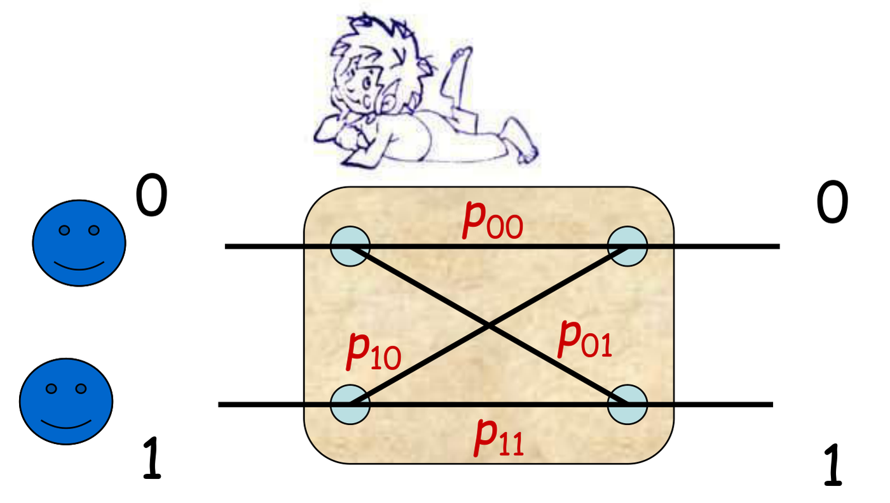
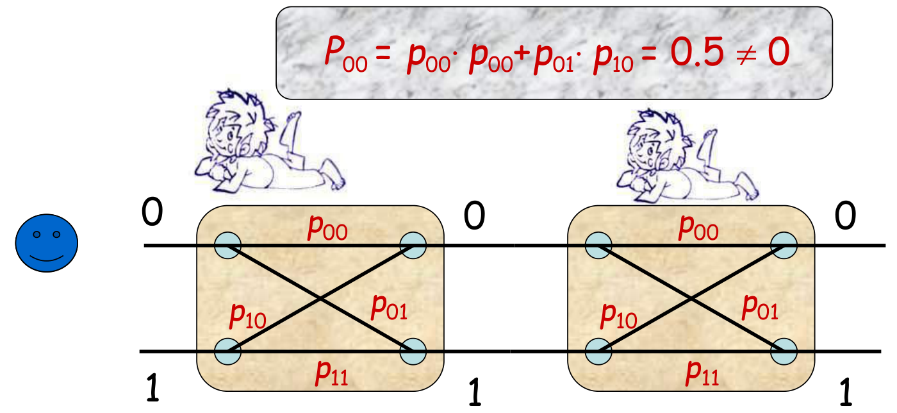
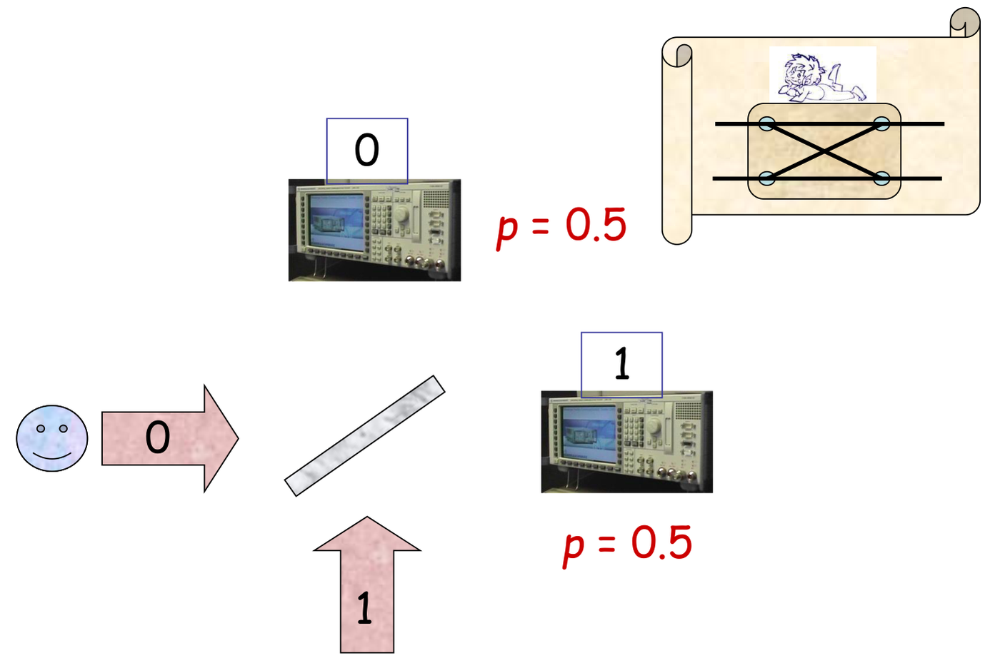
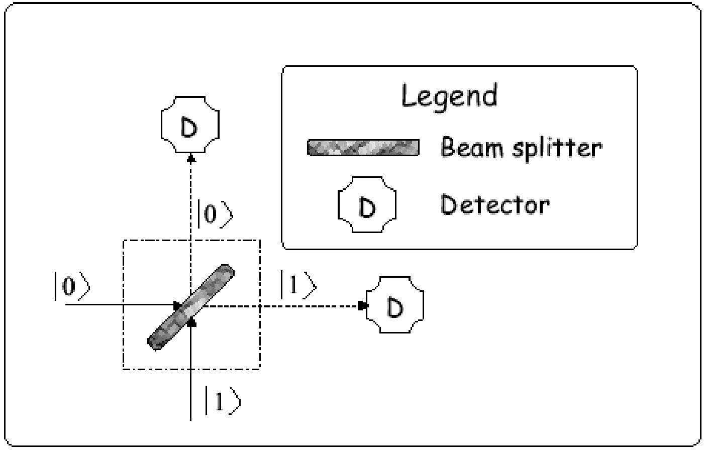
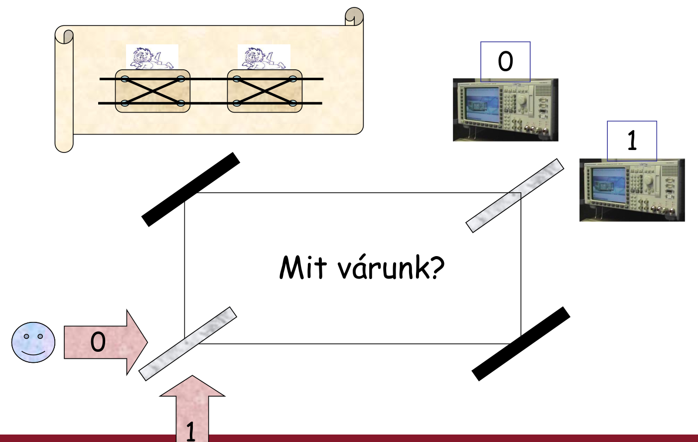
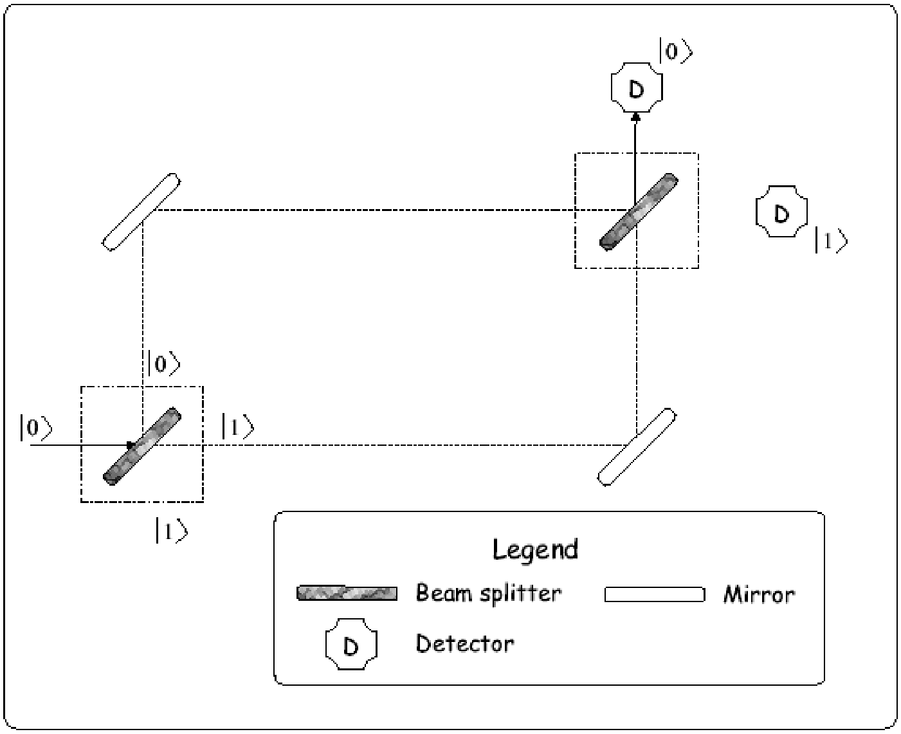
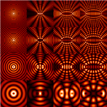
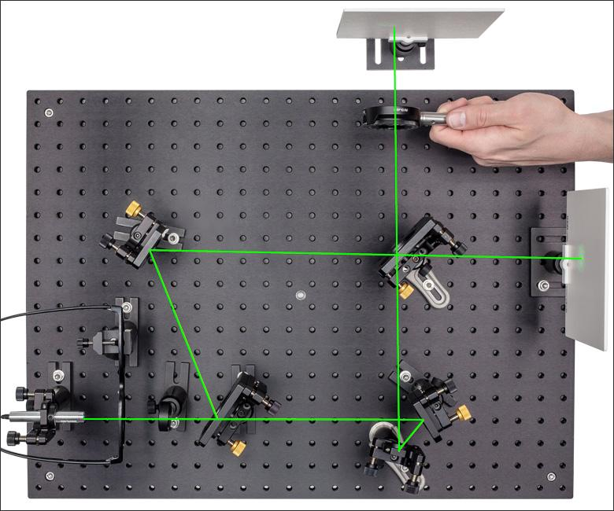
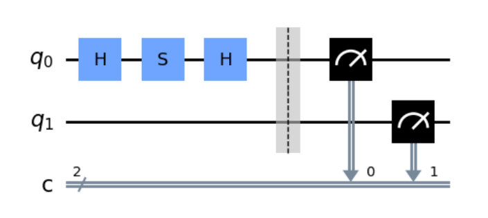
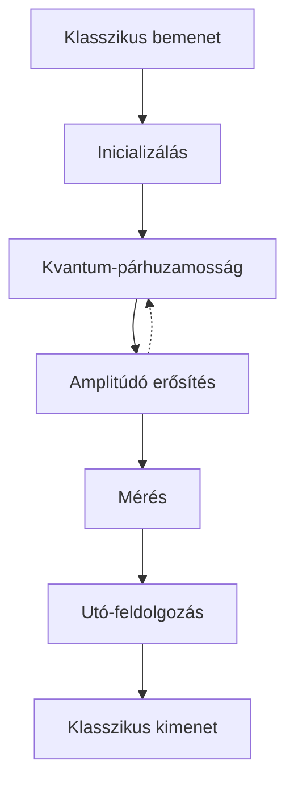

# A kvantuminterferométer

A kvantuminterferométer kiváló eszköz a kvantumos jelenségek egyszerű szemléltetésére. Megmutatja, hogyan írhatjuk le és elemezhetjük egy kvantumos rendszer működését a posztulátumokkal, és hogyan lépünk át a kvantumosból a klasszikus világba.

## Egy egyszerű kísérlet

Vegyünk egy valószínűségi dobozt, amelynek van egy logikai 0-s és egy logikai 1-es bemenete, és ugyanilyen kimenetei. A bemenetről $p_{00}$ valószínűséggel jutunk a 0-s, $p_{01}$ valószínűséggel az 1-es kimenetre (és hasonlóan $p_{10}$, $p_{11}$ az 1-es bemenetről). Ha mindegyik valószínűség 0,5, a doboz úgy viselkedik, mint egy levegőbe feldobott pénzérme, amely vagy az eredeti, vagy a másik oldalára esik.



Kössünk két ilyen dobozt egymás után, és küldjünk be valamit a 0-s bemeneten! A második doboz 0-s kimenetére kétféleképpen juthatunk: mindkét dobozban egyenesen, vagy az elsőben át, a másodikban vissza. A valószínűségek összeadódnak:

$$P_{00} = p_{00} \cdot p_{00} + p_{01} \cdot p_{10} = 0{,}5 \neq 0$$



Klasszikusan tehát két véletlen eszköz egymás után ismét véletlen eszközt ad.

## A féligáteresztő tükör

Optikában ilyen véletlen kapcsoló a **féligáteresztő tükör** (*half-silvered mirror*, *beamsplitter*), más néven nyalábosztó: a rá küldött fotonokat 50% eséllyel engedi át, 50% eséllyel veri vissza. A 0-s irányból érkező foton így $p = 0{,}5$ valószínűséggel a 0-s, $p = 0{,}5$ valószínűséggel az 1-es detektorba jut.





## Két féligáteresztő tükör: mit várunk?

Építsünk két féligáteresztő tükörből és két normál tükörből egy interferométert (Mach–Zehnder-elrendezés)! Az első nyalábosztó kétfelé osztja a nyalábot, a két tükör a két ágat a második nyalábosztóra tereli, amely után két detektor áll.



A két egymás utáni valószínűségi doboz alapján azt várnánk, hogy a fotonok 50–50% eséllyel szólaltatják meg a két detektort. Valójában a 0-s detektor 1 valószínűséggel szólal meg, az 1-es pedig soha: két véletlenszerűen működő eszköz együtt determinisztikus működést ad. A két féligáteresztő tükör együtt **azonosság transzformáció**.



Ez klasszikusan nem lehetséges, hiszen a klasszikus valószínűségek mindig 0 és 1 közé esnek, ezért nem tudják kioltani egymást. A kvantumos interferométerben viszont nem a valószínűségek, hanem a **valószínűségi amplitúdók** adódnak össze, és ezek erősíthetik vagy kiolthatják egymást. A nyalábosztót a [Hadamard-kapu](posztulatumok/kapuk.md#hadamard-kapu) írja le: amplitúdója a $0 \to 0$, $0 \to 1$ és $1 \to 0$ úton $\frac{1}{\sqrt{2}}$, az $1 \to 1$ úton $-\frac{1}{\sqrt{2}}$. A 0-s bemenetről az 1-es kimenetre a két úton

$$\frac{1}{\sqrt{2}} \cdot \frac{1}{\sqrt{2}} + \frac{1}{\sqrt{2}} \cdot \left(-\frac{1}{\sqrt{2}}\right) = 0$$

az eredő amplitúdó, a két út kioltja egymást. A 0-s kimenetre $\frac{1}{2} + \frac{1}{2} = 1$ az amplitúdó, a valószínűség is 1.

Az elnevezés a klasszikus interferencia jelenségére utal: ott klasszikus elektromágneses hullámok erősítik vagy oltják ki egymást a tér különböző pontjain, jellegzetes interferenciaképet mutatva.



Ha a két tükör közé extra detektorokat helyezünk, az eredmény ismét véletlenszerű lesz: a mérés megszünteti az interferenciát. A mérések jellemzően befolyásolják a megfigyelt rendszert, és így magukat a mérési eredményeket is (lásd [Mérés](meres.md#a-mérés-megváltoztatja-az-állapotot)).

## Az általánosított interferométer

Az általánosított kvantuminterferométer két nyalábosztóból (féligáteresztő tükörből), két normál „smink- vagy borotválkozó” tükörből és adalékolt üveglapból áll; az üveglap a két ágban eltérő mértékben késleltetheti a fotonokat: a felső ágban $\alpha_0$, az alsóban $\alpha_1$ fázistolást okoznak.


Az interferométert először zárt fizikai rendszerként vizsgáljuk. Az építőelemeket alkalmasan választott kvantumkapukkal helyettesítjük: a féligáteresztő tükröket Hadamard-kapukkal, az üveglapokat egy fáziskapuval.


$$H = \frac{1}{\sqrt{2}} \begin{bmatrix} 1 & 1 \\ 1 & -1 \end{bmatrix}, \qquad P = \begin{bmatrix} e^{j\alpha_0} & 0 \\ 0 & e^{j\alpha_1} \end{bmatrix}$$

### Elemzés mátrixokkal

Lépésről lépésre követjük az állapotot. A bemenet:

$$\ket{\varphi_0} = \ket{0}$$

Az első Hadamard-kapu után:

$$\ket{\varphi_1} = H\ket{\varphi_0} = \frac{1}{\sqrt{2}} \begin{bmatrix} 1 & 1 \\ 1 & -1 \end{bmatrix} \begin{bmatrix} 1 \\ 0 \end{bmatrix} = \begin{bmatrix} \frac{1}{\sqrt{2}} \\ \frac{1}{\sqrt{2}} \end{bmatrix}$$

Az üveglapok után:

$$\ket{\varphi_2} = P\ket{\varphi_1} = \begin{bmatrix} e^{j\alpha_0} & 0 \\ 0 & e^{j\alpha_1} \end{bmatrix} \begin{bmatrix} \frac{1}{\sqrt{2}} \\ \frac{1}{\sqrt{2}} \end{bmatrix} = \begin{bmatrix} \frac{e^{j\alpha_0}}{\sqrt{2}} \\ \frac{e^{j\alpha_1}}{\sqrt{2}} \end{bmatrix}$$

A második Hadamard-kapu után:

$$\ket{\varphi_3} = H\ket{\varphi_2} = \frac{1}{\sqrt{2}} \begin{bmatrix} 1 & 1 \\ 1 & -1 \end{bmatrix} \begin{bmatrix} \frac{e^{j\alpha_0}}{\sqrt{2}} \\ \frac{e^{j\alpha_1}}{\sqrt{2}} \end{bmatrix} = \begin{bmatrix} \frac{e^{j\alpha_0}+e^{j\alpha_1}}{2} \\ \frac{e^{j\alpha_0}-e^{j\alpha_1}}{2} \end{bmatrix}$$

### Elemzés a linearitás kihasználásával

Ugyanez mátrixszorzás nélkül is megkapható, ha kihasználjuk a lineáris rendszerekre vonatkozó ismereteinket. A Hadamard-kapu hatását a bázisállapotokra ismerjük:

$$H\ket{0} = \frac{\ket{0} + \ket{1}}{\sqrt{2}}, \qquad H\ket{1} = \frac{\ket{0} - \ket{1}}{\sqrt{2}}$$

Így $\ket{\varphi_1} = H\ket{0} = \frac{\ket{0} + \ket{1}}{\sqrt{2}}$. A fáziskapu a $\ket{0}$ tagot $e^{j\alpha_0}$-val, az $\ket{1}$ tagot $e^{j\alpha_1}$-val szorozza: $\ket{\varphi_2} = \frac{e^{j\alpha_0}\ket{0} + e^{j\alpha_1}\ket{1}}{\sqrt{2}}$. A második Hadamard-kapu után tagonként:

$$\ket{\varphi_3} = \frac{e^{j\alpha_0}}{\sqrt{2}} \cdot \frac{\ket{0} + \ket{1}}{\sqrt{2}} + \frac{e^{j\alpha_1}}{\sqrt{2}} \cdot \frac{\ket{0} - \ket{1}}{\sqrt{2}} = \frac{e^{j\alpha_0} + e^{j\alpha_1}}{2}\ket{0} + \frac{e^{j\alpha_0} - e^{j\alpha_1}}{2}\ket{1}$$

### A detektorok megszólalási valószínűsége

A kimenő állapotból kiemeljük a közös $e^{j\frac{\alpha_0+\alpha_1}{2}}$ tényezőt:

$$\begin{aligned} \ket{\varphi_3} &= \frac{e^{j\alpha_0} + e^{j\alpha_1}}{2}\ket{0} + \frac{e^{j\alpha_0} - e^{j\alpha_1}}{2}\ket{1} \\ &= e^{j\frac{\alpha_0+\alpha_1}{2}} \left( \frac{e^{j\frac{\alpha_0-\alpha_1}{2}} + e^{-j\frac{\alpha_0-\alpha_1}{2}}}{2}\ket{0} + \frac{e^{j\frac{\alpha_0-\alpha_1}{2}} - e^{-j\frac{\alpha_0-\alpha_1}{2}}}{2}\ket{1} \right) \end{aligned}$$

Jelölje a két ág fáziskülönbségét

$$\Delta\alpha \triangleq \alpha_0 - \alpha_1,$$

és használjuk fel az

$$\frac{e^{jx}+e^{-jx}}{2} = \cos(x), \qquad \frac{e^{jx}-e^{-jx}}{2j} = \sin(x)$$

azonosságokat $x = \frac{\Delta\alpha}{2}$ mellett. A kiemelt tényező globális fázis, így a detektorok megszólalási valószínűségei:

$$P_0 = \cos^2\left(\frac{\Delta\alpha}{2}\right) = (1+\cos(\Delta\alpha))\frac{1}{2}, \qquad P_1 = \sin^2\left(\frac{\Delta\alpha}{2}\right) = (1-\cos(\Delta\alpha))\frac{1}{2}.$$

- $\Delta\alpha = 0$: ideális eset. A 0-s detektor 1 valószínűséggel szólal meg, az 1-es soha; ez a két féligáteresztő tükör azonossága.
- $\Delta\alpha = \frac{\pi}{2}$: teljesen véletlen működés, $P_0 = P_1 = \frac{1}{2}$.

## Az interferométer három szemszögből

**Ahogy egy fizikus látja:** egy valódi Mach–Zehnder-interferométer egy optikai asztalon, lézerrel, nyalábosztókkal, tükrökkel és ernyőkkel.



**Ahogy egy villamosmérnök látja:** az elrendezésből a H–P–H kvantumáramkör lesz. A Qiskitben rajzolt áramkörben a $q_0$ kvantumbiten egy H, egy S (a $\frac{\pi}{2}$-es fáziskapu) és még egy H kapu van, a végén mérés.



**Ahogy egy informatikus látja:** az interferométer a kvantumalgoritmusok általános receptjét követi. A klasszikus bemenetből inicializálás után kvantumpárhuzamosság, majd amplitúdóerősítés, végül mérés és utófeldolgozás vezet a klasszikus kimenethez. A kvantumpárhuzamosság és az amplitúdóerősítés lépése szükség szerint ismételhető.



Az interferométer Qiskit-programként, ahol `Dalpha` a $\Delta\alpha$ fáziskülönbség (a Qiskit használatát a [Kvantumáramkörök Qiskitben](qiskit.md) fejezet mutatja be):

<!-- verify: prelude
from qiskit import QuantumCircuit
from qiskit_aer import Aer
Dalpha = 0
-->
```python
qc = QuantumCircuit(1,2)
qc.h(0)
qc.p(Dalpha, 0)
qc.h(0)
qc.measure(0,1)
qc.draw("mpl")
backend = Aer.get_backend("aer_simulator")
result = backend.run(qc, shots=10000).result()
counts = result.get_counts()
print(counts)
```

$\Delta\alpha = 0$ esetén a 10 000 mérés mindegyike 0-t ad:

```text
{'00': 10000}
```

A `qc.measure(0,1)` a 0. kvantumbit mérési eredményét az 1. klasszikus bitbe írja, ezért szerepel a kulcsokban két bit. $\Delta\alpha = \frac{\pi}{2}$ esetén nagyjából fele-fele arányban kapunk `'00'`-t és `'10'`-t, azaz 0-t és 1-et.

<p class="sources">Forrás: 05_INterferometer_es_NCT20261007.pdf (17–40. dia), Kvantuminformatikai alkalmazások jegyzet 2026 ősz.md</p>
