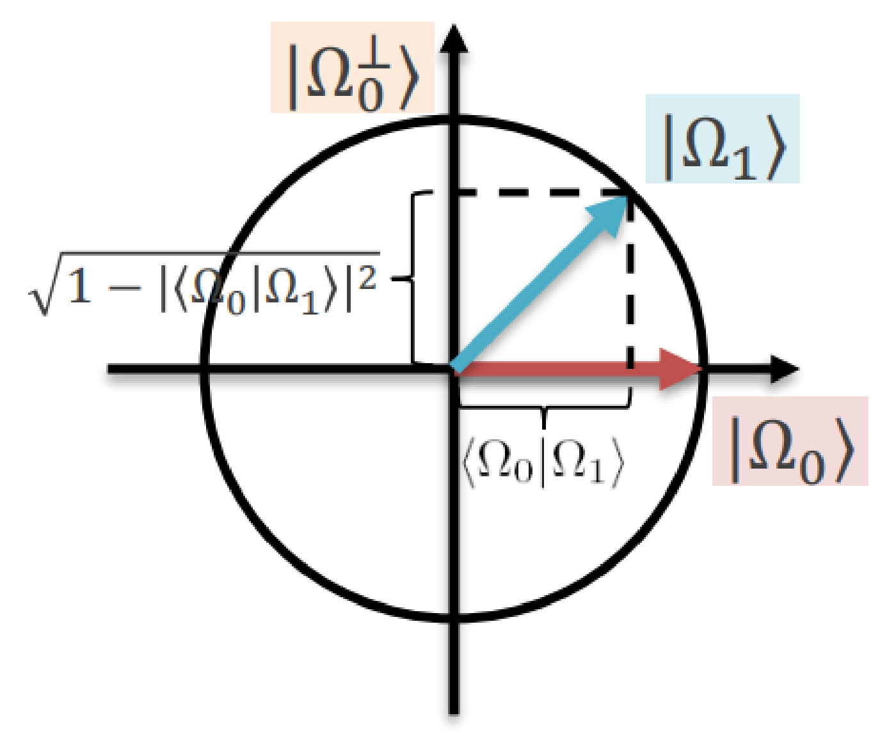

# Dekoherencia

## Összefonódás a környezettel

Az első két posztulátum csak **zárt** rendszerekre érvényes, ezért a környezettel való összefonódás nagyon veszélyes lehet. Ennek bemutatására a jól ismert [kvantuminterferométert](../interferometer.md) használjuk, és feltételezzük, hogy az interferométeren áthaladó foton a laboratóriumon (azaz a környezeten) kívül egy pillangóval összefonódik: a pillangó egyik elemi részecskéje összefonódik az interferométerben repülő fotonnal.

A környezet állapota $\ket{\Omega}$. A pillangó repülési szabálya: attól függően repül másképp, hogy a foton melyik ágban halad,

$$\ket{0}\ket{\Omega} \rightarrow \ket{0}\ket{\Omega_0}, \qquad \ket{1}\ket{\Omega} \rightarrow \ket{1}\ket{\Omega_1}$$

A pillangó a fáziskapu és a második Hadamard-kapu között hat, a $\ket{\varphi_2}$ állapotra:

## Elemzés

A pillangóhatás előtt a foton és a környezet együttes állapota:

$$\ket{\varphi_2} = \frac{e^{j\alpha_0}\ket{0} + e^{j\alpha_1}\ket{1}}{\sqrt{2}}\ket{\Omega} = \frac{e^{j\alpha_0}\ket{0}\ket{\Omega} + e^{j\alpha_1}\ket{1}\ket{\Omega}}{\sqrt{2}}$$

A pillangóhatás után:

$$\ket{\varphi_2'} = \frac{e^{j\alpha_0}\ket{0}\ket{\Omega_0} + e^{j\alpha_1}\ket{1}\ket{\Omega_1}}{\sqrt{2}}$$

Ezzel a Hadamard-kapu után:

$$\begin{aligned} \ket{\varphi_3} &= \frac{e^{j\alpha_0}\frac{\ket{0}+\ket{1}}{\sqrt{2}}\ket{\Omega_0} + e^{j\alpha_1}\frac{\ket{0}-\ket{1}}{\sqrt{2}}\ket{\Omega_1}}{\sqrt{2}} \\ &= \ket{0}\frac{e^{j\alpha_0}\ket{\Omega_0} + e^{j\alpha_1}\ket{\Omega_1}}{2} + \ket{1}\frac{e^{j\alpha_0}\ket{\Omega_0} - e^{j\alpha_1}\ket{\Omega_1}}{2} \\ &= e^{j\frac{\alpha_0+\alpha_1}{2}}\left(\ket{0}\frac{e^{j\frac{\alpha_0-\alpha_1}{2}}\ket{\Omega_0} + e^{-j\frac{\alpha_0-\alpha_1}{2}}\ket{\Omega_1}}{2} + \ket{1}\frac{e^{j\frac{\alpha_0-\alpha_1}{2}}\ket{\Omega_0} - e^{-j\frac{\alpha_0-\alpha_1}{2}}\ket{\Omega_1}}{2}\right) \end{aligned}$$

A $\Delta\alpha \triangleq \alpha_0 - \alpha_1$ jelöléssel, a globális fázist elhagyva:

$$\ket{\varphi_3} = \ket{0}\frac{e^{j\frac{\Delta\alpha}{2}}\ket{\Omega_0} + e^{-j\frac{\Delta\alpha}{2}}\ket{\Omega_1}}{2} + \ket{1}\frac{e^{j\frac{\Delta\alpha}{2}}\ket{\Omega_0} - e^{-j\frac{\Delta\alpha}{2}}\ket{\Omega_1}}{2}$$

Figyelem: $\ket{\Omega_0}$ és $\ket{\Omega_1}$ nem feltétlenül ortogonálisak. Feltételezve, hogy $\braket{\Omega_0|\Omega_1} \neq 0$ valós, $\ket{\Omega_1}$-et felbontjuk egy $\ket{\Omega_0}$ irányú és egy rá merőleges, $\ket{\Omega_0^\perp}$ irányú összetevőre:

$$\ket{\Omega_1} = \braket{\Omega_0|\Omega_1}\ket{\Omega_0} + \sqrt{1-|\braket{\Omega_0|\Omega_1}|^2}\,\ket{\Omega_0^\perp}$$

Ezt behelyettesítve:

$$\begin{aligned} \ket{\varphi_3} = {} & \frac{e^{j\frac{\Delta\alpha}{2}} + \braket{\Omega_0|\Omega_1}e^{-j\frac{\Delta\alpha}{2}}}{2}\ket{0}\ket{\Omega_0} + \frac{e^{-j\frac{\Delta\alpha}{2}}}{2}\sqrt{1-|\braket{\Omega_0|\Omega_1}|^2}\,\ket{0}\ket{\Omega_0^\perp} \\ & + \frac{e^{j\frac{\Delta\alpha}{2}} - \braket{\Omega_0|\Omega_1}e^{-j\frac{\Delta\alpha}{2}}}{2}\ket{1}\ket{\Omega_0} - \frac{e^{-j\frac{\Delta\alpha}{2}}}{2}\sqrt{1-|\braket{\Omega_0|\Omega_1}|^2}\,\ket{1}\ket{\Omega_0^\perp} \end{aligned}$$

A 0-s detektor megszólalási valószínűsége a $\ket{0}$-t tartalmazó két tag amplitúdóinak abszolútérték-négyzetösszege:

$$P_0 = \left|\frac{e^{j\frac{\Delta\alpha}{2}} + \braket{\Omega_0|\Omega_1} e^{-j\frac{\Delta\alpha}{2}}}{2}\right|^2 + \left|\frac{e^{-j\frac{\Delta\alpha}{2}}}{2}\sqrt{1-|\braket{\Omega_0|\Omega_1}|^2}\right|^2$$

A $z \in \mathbb{C}$: $|z|^2 = zz^*$ és az $\frac{e^{j\Delta\alpha}+e^{-j\Delta\alpha}}{2} = \cos(\Delta\alpha)$ összefüggés felhasználásával:

$$P_0 = (1 + \braket{\Omega_0|\Omega_1}\cos(\Delta\alpha))\frac{1}{2}, \qquad P_1 = (1 - \braket{\Omega_0|\Omega_1}\cos(\Delta\alpha))\frac{1}{2}$$

Hasonlítsuk össze ezt a pillangó nélküli eredménnyel, $P_0 = (1+\cos(\Delta\alpha))\frac{1}{2}$ és $P_1 = (1-\cos(\Delta\alpha))\frac{1}{2}$:

- Ha $\braket{\Omega_0|\Omega_1} = 1$, a pillangó állapota nem függ a foton útjától, az összefonódás eltűnik, és visszakapjuk a zárt rendszer eredményét.
- Ha viszont $\braket{\Omega_0|\Omega_1} = 0$, a működés teljesen véletlenné válik ($P_0 = P_1 = \frac{1}{2}$), és a megfigyelőt alaposan becsapjuk.

A környezet változásának mértéke tehát a valószínűségeket is befolyásolja: a determinisztikus működés egy rendszeren kívülre vezető összefonódás miatt akár teljesen véletlenné is válhat. Ez a hatás, a **dekoherencia**, nehezíti a kvantumszámítógépek fejlesztését.

Forrás: 05_INterferometer_es_NCT20261007.pdf (41–45. dia), Kvantuminformatikai alkalmazások jegyzet 2026 ősz.md

