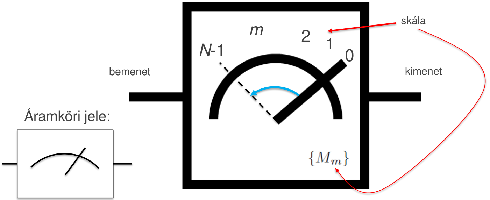
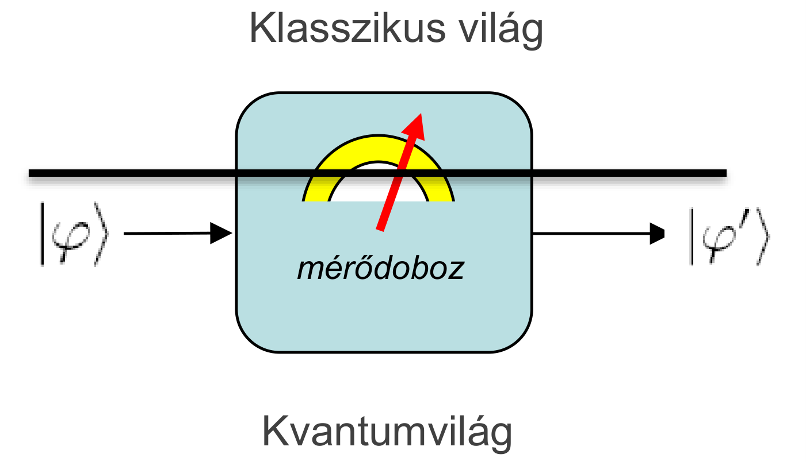
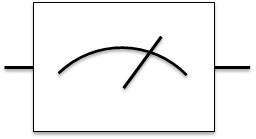
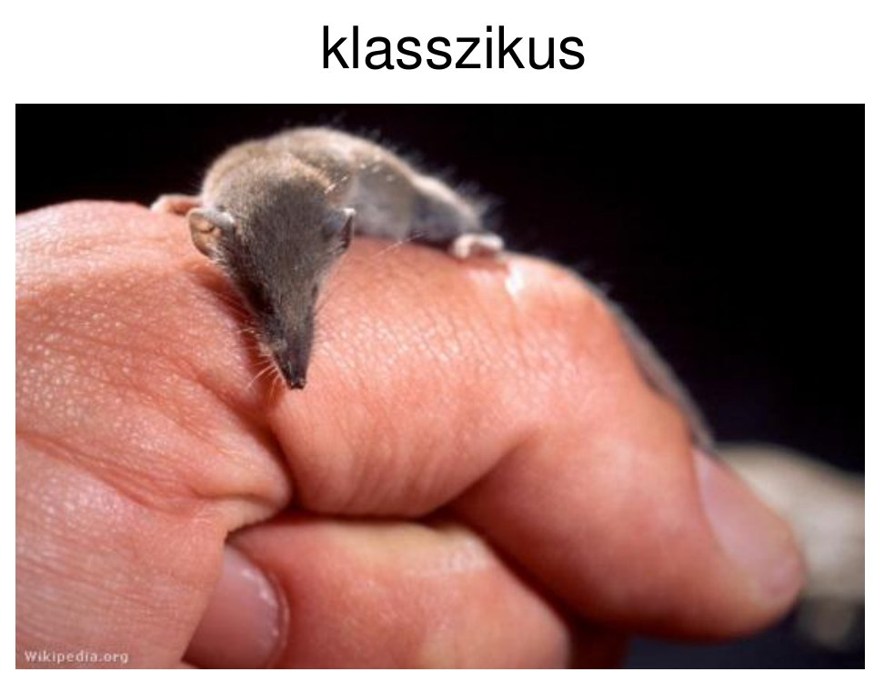
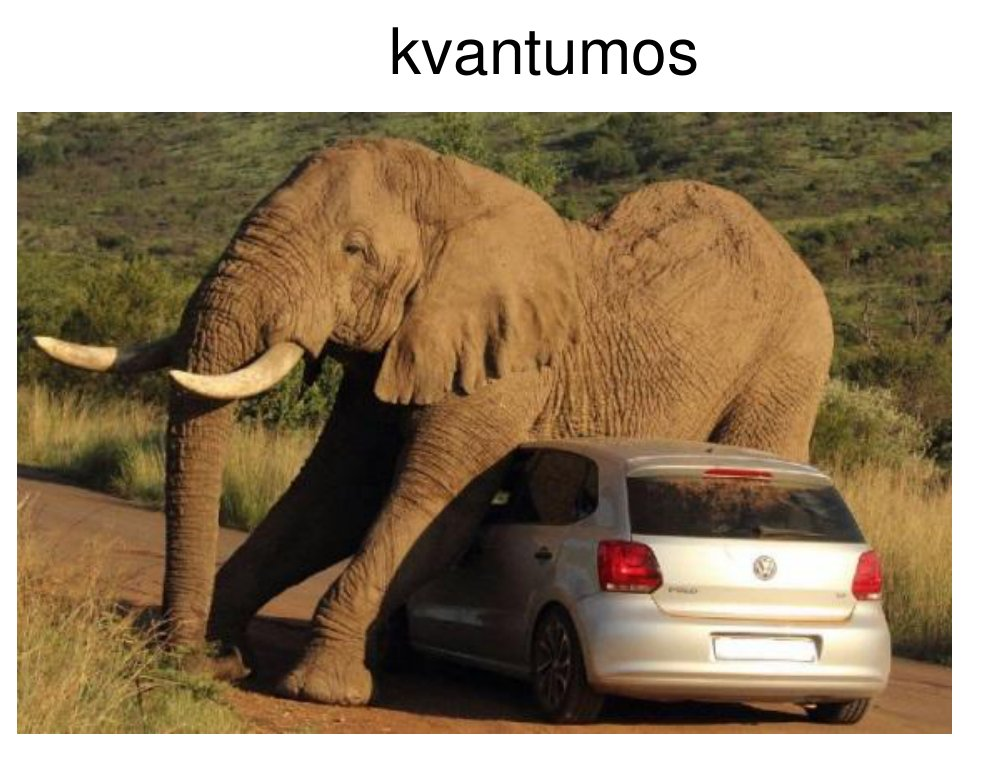
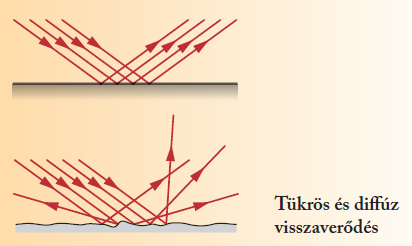
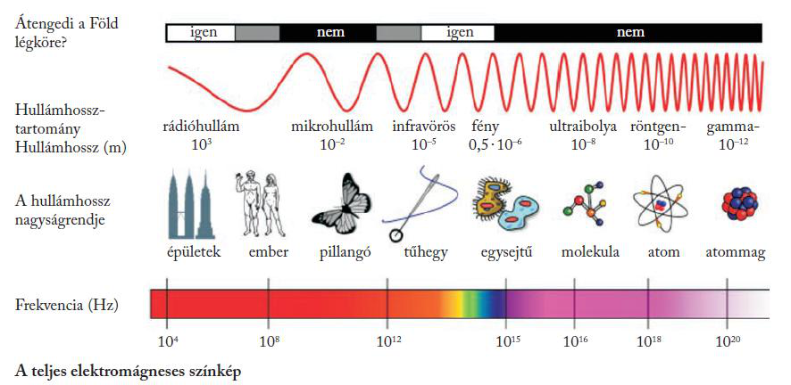

# Mérés

## Átjáró a kvantum és a klasszikus világ között

A mérés átjáró a kvantum és a klasszikus világ között. Az érzékszerveink számára felfoghatatlan kvantumos működést teszi megfigyelhetővé, mint amikor egy kulcslyukon benézünk a szobába: nem látjuk teljes részletességében, de használható információhoz jutunk. A mérés hatására a kvantuminformáció klasszikus információvá alakul, ezért a tárgy szívesebben hívja **Q/C átalakítónak**. Ez a mérnökibb, konstruktív elnevezés; a hagyományos, analitikus „mérés” szót is használjuk.

A mérést egy **mérődobozzal** modellezzük. Egy kvantumos bemenete és két kimenete van: egy klasszikus és egy kvantumos. A klasszikus kimenet a **skála**, amelyen 0 és pozitív egész számok szerepelnek ($0, 1, 2, \ldots, m, \ldots, N-1$); a mutató állása hordoz információt a bemenetre küldött kvantumállapotról. A megmérendő elemi részecske igencsak összemérhető a mérőberendezéssel, ezért a mérés befolyásolhatja a részecske állapotát; ezért van a mérődoboznak kvantumos kimenete is.

A mérés áramköri jele egy kis műszerszimbólum:

## A 3. posztulátum

Legyen $\{m\}$ a mérés lehetséges eredményeinek (a skálaértékeknek) a halmaza. Egy mérés a mérési operátorok

$$\{M_m\}$$

halmazával adható meg: minden $m$ skálaértékhez tartozik egy mátrix. Egy mérődoboz skáláján például a 0, az 1 és egy „nem mérhető” érték is szerepelhet; a mérési operátorok mindegyik érték valószínűségét megadják. Ha a megmérendő rendszer állapota $\ket{\varphi}$, akkor annak a valószínűsége, hogy a mérés az $m$ eredményt adja (a **mérési statisztika**):

$$P(m \mid \ket{\varphi}) = \bra{\varphi} M_m^\dagger M_m \ket{\varphi}$$

A mérés után a rendszer állapota (a **mérés utáni állapot**):

$$\ket{\varphi'} = \frac{M_m\ket{\varphi}}{\sqrt{\bra{\varphi} M_m^\dagger M_m \ket{\varphi}}}$$

A mérési operátorok nem unitér transzformációk. A mérés információvesztéssel jár: nem kölcsönösen egyértelmű és nem hossztartó. Ezért kell a mérés utáni állapotot normalizálni: a nevező, a mérési valószínűség négyzetgyöke, az $M_m\ket{\varphi}$ vetületet újra egységnyi hosszúra nyújtja.

## A véletlen természete

Mi az, hogy véletlen? A mérési statisztika képlete csak valószínűséget ad: ugyanazt az állapotot többször megmérve különböző eredményeket kaphatunk. Einstein ezt így utasította el: „Isten nem dobókockázik a világgal!” A válasz: „Dehogynem! Sőt, volt annyira nagyvonalú, hogy diffegyenletek helyett olykor elegendő feldobni egy kockát!”

## A teljességi reláció

A valószínűségszámításból tudjuk, hogy az összes lehetséges eredmény valószínűségének összege 1:

$$\sum_m P(m \mid \ket{\varphi}) = \sum_m \bra{\varphi} M_m^\dagger M_m \ket{\varphi} \equiv 1$$

Mivel ez minden $\ket{\varphi}$-re teljesül, a mérési operátorokra a **teljességi reláció** adódik:

$$\sum_m M_m^\dagger M_m \equiv I$$

A teljességi reláció nem része a posztulátumnak, hanem a következménye, de hasznos kiegészítője: segít ellenőrizni, hogy minden szóba jöhető érték felkerült-e a skálára.

## A mérés megváltoztatja az állapotot

A mérés utáni állapot képlete a mérés legfontosabb következményét írja le: a mérés megváltoztatja a mért állapotot. Klasszikusan a mérés olyan, mint egy cickány az ujjunk hegyén: alig érezzük, és nem zavarjuk meg. A kvantumos mérés inkább olyan, mint egy elefánt, amely ráül egy kis autóra.

Az elektromágneses hullámokkal végzett megfigyelés (mérés) paradoxona ugyanezt mutatja. Kis részletek csak kis hullámhosszal figyelhetők meg. Minél kisebb a hullámhossz, annál nagyobb a frekvencia, és így a foton energiája, tehát annál nagyobb a foton hatása a megfigyelt objektumra. A mérések jellemzően befolyásolják a megfigyelt rendszert, és így magukat a mérési eredményeket is. A megfigyeléshez a fénynek vissza kell verődnie a tárgyról: sima felületről tükrösen, érdes felületről szórtan (diffúzan).

## Analízis és konstrukció

A 3. posztulátum egy analitikus eszköz: ha adott (ismert) a mérődoboz és ismert a bemenő állapot, megmondja, mi fog történni, azaz mekkora valószínűséggel melyik eredményt kapjuk, és mi lesz a mérés utáni állapot. A matematikusoknak ez elég, hiszen zárt alakú képletek; a fizikusoknak is, hiszen leírták és értik a világot. A mérnökök viszont alkotni szeretnének: őket az érdekli, hogyan konstruálható egy adott műszaki problémához megfelelő mérés. Egy ilyen mérési konstrukció a [projektív mérés](meres/projektiv.md); a [POVM](meres/povm.md) egy másik.

Forrás: 04_Meresek20260930.pdf (18–25. dia), 05_INterferometer_es_NCT20261007.pdf (25. dia), 03_osszefonodasalapjai_20260923.pdf (8. dia), Kvantuminformatikai alkalmazások_posztulátumok.pdf (14. dia), Kvantuminformatikai alkalmazások jegyzet 2026 ősz.md

