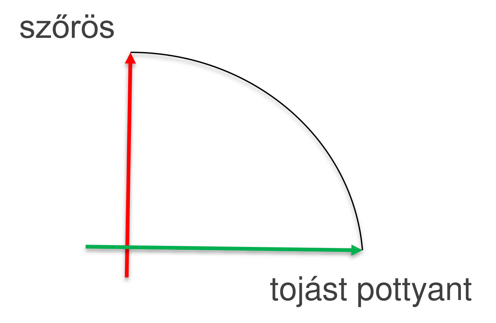
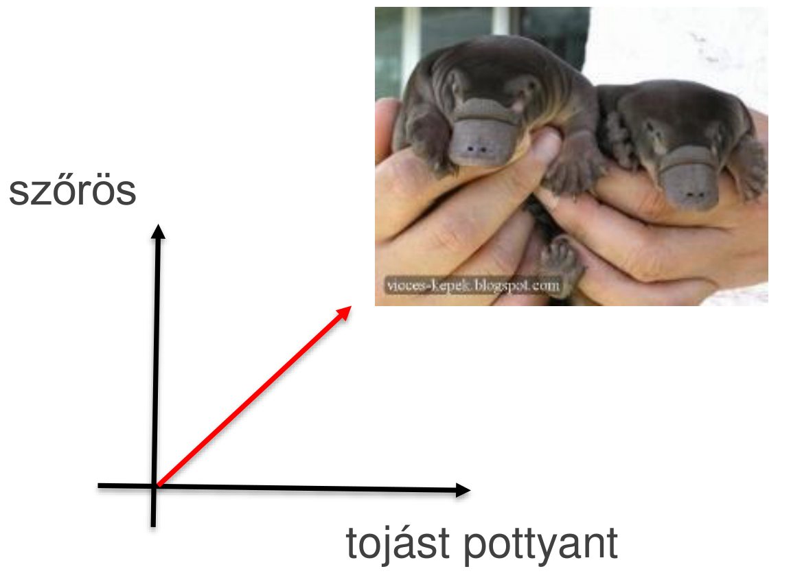
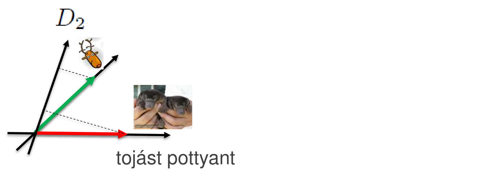

# Kitekintés: POVM

Mit tegyünk, ha a megkülönböztetendő állapotok nem merőlegesek egymásra? A [no-cloning tétel](../no-cloning.md) következménye, hogy ilyen állapotokat nem lehet egyértelműen, biztonságosan megkülönböztetni. Mégis van olyan mérési konstrukció, amely kezelhetővé teszi ezeket az eseteket: a **pozitív operátor értékű mérés** (POVM, *Positive Operator Valued Measurement*). Itt csak szemléltetjük; a részletek az MSc kvantumos tárgyaiban szerepelnek.

## Projektív példa: ortogonális állapotok

Egy állatkertben madarak és emlősök vannak, ezeket kell egy mérődobozzal megkülönböztetnünk. A skálaértékek: *emlős*, *madár*; a mért fizikai tulajdonságok: *szőrös*, *tojást pottyant*. A mérődobozt közvetlenül konstruáljuk:

- $P_0$: ha tojás pottyan ki belőle, akkor madár;
- $P_1$: ha szőrös, akkor emlős.

A két állapot ortogonális: a „szőrös” és a „tojást pottyant” egymásra merőleges irányok, így a projektív mérés biztosan megkülönbözteti őket.

## POVM példa: nem ortogonális állapotok

Megérkezik az állatkertbe egy rakás kacsacsőrű emlős, a madarak pedig délre költöznek. A kacsacsőrű emlős szőrös is, és tojást is pottyant: az állapota a két tengely között, ferdén áll. A projektív mérés eredményéből most nem következtethetünk biztosan, mert a „szőrös” válasz nem igazít el bennünket: emlős és kacsacsőrű emlős is lehet.

A mérődobozt ezért közvetett úton konstruáljuk: a mérőoperátorok a lehetséges állapotokra merőlegesek.

- $D_0$: vagy nem szőrös, vagy nem tojás potyog belőle (merőleges a „szőrös és tojás potyog belőle” állapotra), akkor emlős;
- $D_1$: ha tojás pottyan ki belőle (merőleges a szőrösre), akkor kacsacsőrű emlős;
- „nem tudom” állapot: emlős vagy kacsacsőrű emlős,

$$D_2 = I - D_0 - D_1.$$

A műszer skáláján tehát egy extra érték jelenik meg. Ha a mutató ide mutat, a műszer azt jelzi, hogy nem tudja eldönteni, melyik állapotot adtuk be a mérődobozba; a többi skálaérték esetén viszont biztosak lehetünk a kijelzés helyességében.

A piros (kacsacsőrű emlős) és a zöld (emlős) vektornak is van vetülete $D_2$-re. A három tengelyre vett vetületek együtt adják az 1 valószínűséget.

Forrás: 04_Meresek20260930.pdf (45–49. dia), 05_INterferometer_es_NCT20261007.pdf (11–15. dia), Kvantuminformatikai alkalmazások jegyzet 2026 ősz.md

