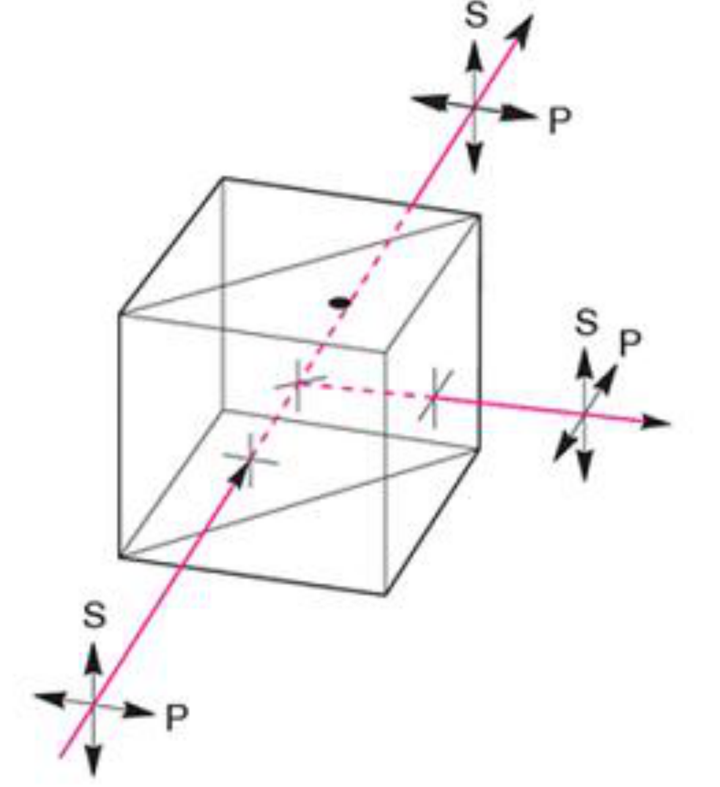
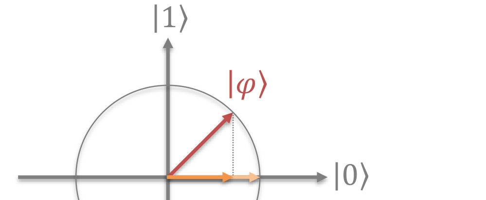
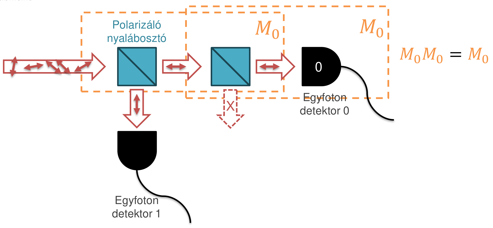
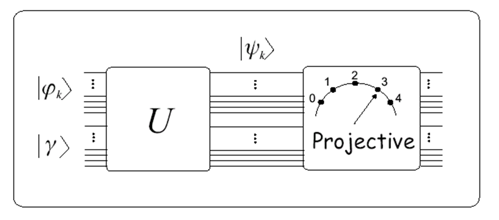

# Projektív mérés

A projektív mérés (Neumann-mérés) olyan esetben segít megfelelő mérést definiálni, amikor a rendszerünk egymásra merőleges, ún. **ortogonális** kvantumállapotokat hoz létre. A klasszikus állapotok mindig ortogonálisak, de vannak nem klasszikus ortogonális kvantumállapotok is, például a $\ket{+}$ és a $\ket{-}$.

## Mérés fizikailag

Egy foton polarizációját egy **polarizáló nyalábosztóval** és két egyfoton-detektorral mérhetjük meg. A nyalábosztó olyan optikai elem, amely a fény két polarizációs állapotát különválasztja: a vízszintesen polarizált fotonokat átengedi, a függőlegesen polarizáltakat letükrözi. Két fajtája van: az egyszerű nyalábosztó lemez speciális vékonyréteg-bevonattal (ez adott hullámhosszra specifikus), és a nyalábosztó kocka, két összeillesztett prizma, köztük vékonyréteg-bevonattal.

A mérőeszközben a vízszintesen polarizált fotonok a 0-s, a függőlegesen polarizáltak az 1-es detektorba jutnak. A két polarizációt így a kvantumbit két bázisállapotának feleltetjük meg:

$$\ket{\leftrightarrow} = \ket{0}, \qquad \ket{\updownarrow} = \ket{1}$$

Az $M_0$ mérési operátor a nyalábosztó és a 0-s detektor együttese, az $M_1$ a nyalábosztóé és az 1-es detektoré. A mérési statisztika képletével fogalmazzuk meg, mikor jó egy ilyen detektor:

$$P(m \mid \ket{\varphi}) = \bra{\varphi} M_m^\dagger M_m \ket{\varphi}$$

A **vízszintes** polarizációhoz tartozó detektor akkor jó, ha 100% eséllyel megszólal, ha vízszintesen polarizált foton érkezik, és 0% eséllyel szólal meg, ha függőleges foton érkezik:

$$\bra{0} M_0^\dagger M_0 \ket{0} = 1, \qquad \bra{1} M_0^\dagger M_0 \ket{1} = 0$$

Hasonlóan a **függőleges** polarizációhoz tartozó detektor akkor jó, ha 100% eséllyel megszólal, ha függőlegesen polarizált foton érkezik, és 0% eséllyel, ha vízszintes:

$$\bra{1} M_1^\dagger M_1 \ket{1} = 1, \qquad \bra{0} M_1^\dagger M_1 \ket{0} = 0$$

A **detektormodul** akkor teljes, ha minden lehetőséget detektál: tetszőleges polarizációjú beérkező foton esetén a függőleges és a vízszintes detektor közül egy és csakis egy biztosan megszólal. Ez a teljességi reláció:

$$M_0^\dagger M_0 + M_1^\dagger M_1 = I$$

## Vetítés és normálás

Tetszőleges polarizációjú beérkező foton a mérés után vagy függőleges, vagy vízszintes állapotba „bebillen”. A mérési operátor a mért állapotvektor irányába vetít: az $M_0\ket{\varphi}$ a $\ket{\varphi}$ vetülete a $\ket{0}$ tengelyre. A vetület általában rövidebb egységnyinél; a mérés utáni állapot képletében a nevezőben lévő normafaktor nyújtja egységnyi hosszúra:

$$\ket{\varphi'} = \frac{M_0\ket{\varphi}}{\sqrt{\bra{\varphi} M_0^\dagger M_0 \ket{\varphi}}}$$

Ha egy vízszintesen polarizált fotont egy második, ugyanilyen nyalábosztón is átküldünk, az biztosan átjut: a második nyalábosztó lefelé már nem enged ki fotont. Két egymás utáni $M_0$ ugyanazt adja, mint egy:

$$M_0 M_0 = M_0$$

## Projektív mérés konstruálása

Konstruáljuk meg a $\ket{\varphi_1} = \ket{0}$, $\ket{\varphi_2} = \ket{1}$ ortogonális állapotokat megkülönböztető mérést! Az $M_0$ operátort ilyen alakban keressük:

$$M_0 = \begin{bmatrix} a & b \\ c & d \end{bmatrix}$$

$M_0$ megtalálásához a következő egyenleteket kell megoldanunk:

$$\begin{aligned} \bra{0} M_0^\dagger M_0 \ket{0} &= 1 \\ \bra{1} M_0^\dagger M_0 \ket{1} &= 0 \\ M_0 M_0 &= M_0 \end{aligned}$$

Az első feltételből:

$$1 = \bra{0} M_0^\dagger M_0 \ket{0} = \begin{bmatrix} 1 & 0 \end{bmatrix} \begin{bmatrix} a & b \\ c & d \end{bmatrix}^\dagger \begin{bmatrix} a & b \\ c & d \end{bmatrix} \begin{bmatrix} 1 \\ 0 \end{bmatrix} = \begin{bmatrix} 1 & 0 \end{bmatrix} \begin{bmatrix} a^* & c^* \\ b^* & d^* \end{bmatrix} \begin{bmatrix} a & b \\ c & d \end{bmatrix} \begin{bmatrix} 1 \\ 0 \end{bmatrix} \Longrightarrow |a|^2 + |c|^2 = 1$$

A második feltételből:

$$0 = \bra{1} M_0^\dagger M_0 \ket{1} = \begin{bmatrix} 0 & 1 \end{bmatrix} \begin{bmatrix} a & b \\ c & d \end{bmatrix}^\dagger \begin{bmatrix} a & b \\ c & d \end{bmatrix} \begin{bmatrix} 0 \\ 1 \end{bmatrix} = \begin{bmatrix} 0 & 1 \end{bmatrix} \begin{bmatrix} a^* & c^* \\ b^* & d^* \end{bmatrix} \begin{bmatrix} a & b \\ c & d \end{bmatrix} \begin{bmatrix} 0 \\ 1 \end{bmatrix} \Longrightarrow |b|^2 + |d|^2 = 0$$

Mivel $|b|^2 \geq 0$ és $|d|^2 \geq 0$, az összegük csak úgy lehet 0, ha $b = d = 0$:

$$M_0 = \begin{bmatrix} a & 0 \\ c & 0 \end{bmatrix}$$

A harmadik feltétel, $M_0 M_0 = M_0$:

$$\begin{bmatrix} a & 0 \\ c & 0 \end{bmatrix} \begin{bmatrix} a & 0 \\ c & 0 \end{bmatrix} = \begin{bmatrix} a & 0 \\ c & 0 \end{bmatrix} \Longrightarrow a^2 = a, \quad ac = c$$

Ezekből és az $|a|^2 + |c|^2 = 1$ feltételből egy lehetséges megoldás, és hasonlóképpen $M_1$:

$$M_0 = \begin{bmatrix} 1 & 0 \\ 0 & 0 \end{bmatrix}, \qquad M_1 = \begin{bmatrix} 0 & 0 \\ 0 & 1 \end{bmatrix}$$

Ellenőrizzük a teljességi relációt:

$$\sum_m M_m^\dagger M_m = \begin{bmatrix} 1 & 0 \\ 0 & 0 \end{bmatrix} + \begin{bmatrix} 0 & 0 \\ 0 & 1 \end{bmatrix} = \begin{bmatrix} 1 & 0 \\ 0 & 1 \end{bmatrix} = I$$

Dirac-jelöléssel a két operátor egy-egy külső szorzat:

$$M_0 = \ket{0}\bra{0}, \qquad M_1 = \ket{1}\bra{1}$$

Ebből egy nagyon egyszerű és gyakorlatias ökölszabály következik: ha ortonormált állapotok $\{\ket{\varphi_m}\}$ halmazát kell biztosan megkülönböztetnünk, a hozzájuk tartozó mérési operátorok

$$M_m = \ket{\varphi_m}\bra{\varphi_m}.$$

## A projektorok tulajdonságai

Az így kapott mérési operátorokat **projektoroknak** nevezzük, és $P_m$-mel jelöljük:

$$M_m \longrightarrow P_m = \ket{\varphi_m}\bra{\varphi_m}$$

1. Önadjungált (hermitikus) operátorok, $P_m^\dagger \equiv P_m$, mivel $(\ket{\varphi_m}\bra{\varphi_m})^\dagger = \bra{\varphi_m}^\dagger \ket{\varphi_m}^\dagger = \ket{\varphi_m}\bra{\varphi_m}$.
2. $P_m P_m = \ket{\varphi_m} \underbrace{\braket{\varphi_m|\varphi_m}}_{\equiv 1} \bra{\varphi_m} = P_m$.
3. Ortogonálisak: $P_m P_n = \ket{\varphi_m} \underbrace{\braket{\varphi_m|\varphi_n}}_{\equiv 1 \text{ vagy } 0} \bra{\varphi_n} = \delta(m-n) P_m$.

Ezek miatt $P_m^\dagger P_m = P_m P_m = P_m$, és a mérési posztulátum, valamint a teljességi reláció képletei egyszerűsödnek:

$$P(m \mid \ket{\varphi}) = \bra{\varphi} P_m \ket{\varphi}, \qquad \ket{\varphi'} = \frac{P_m\ket{\varphi}}{\sqrt{\bra{\varphi} P_m \ket{\varphi}}}, \qquad \sum_m P_m \equiv I$$

### A mérés megismételhető

A projektív mérés sajátos tulajdonsága, hogy ha egy elemi részecskét megmértünk, és ugyanarra a részecskére még egyszer alkalmazzuk ugyanezt a mérést, a mérési eredmény és a mérés utáni állapot nem változik. Ha az első mérés után az állapot

$$\ket{\varphi_m} = \frac{P_m\ket{\varphi}}{\sqrt{\bra{\varphi} P_m \ket{\varphi}}}, \qquad P_m = \ket{\varphi_m}\bra{\varphi_m},$$

akkor a második mérés utáni állapot:

$$\ket{\varphi_m}' = \frac{P_m\ket{\varphi_m}}{\sqrt{\bra{\varphi_m} P_m \ket{\varphi_m}}} = \frac{\ket{\varphi_m}\braket{\varphi_m|\varphi_m}}{\sqrt{\braket{\varphi_m|\varphi_m}\braket{\varphi_m|\varphi_m}}} = \ket{\varphi_m}$$

Más szóval a mérést kétszer végrehajtva másodszorra ugyanazt az eredményt kapjuk, mint első alkalommal.

## Mérés a bázisállapotok szerint

Nézzük meg egy egyszerű példán, amit tanultunk! Mérjük meg a $\ket{\varphi} = a\ket{0} + b\ket{1}$ állapotot a $\ket{0}$, $\ket{1}$ bázisvektorok szerint. A két projektor:

$$P_0 = \ket{0}\bra{0} = \begin{bmatrix} 1 \\ 0 \end{bmatrix}\begin{bmatrix} 1 & 0 \end{bmatrix} = \begin{bmatrix} 1 & 0 \\ 0 & 0 \end{bmatrix}, \qquad P_1 = \ket{1}\bra{1} = \begin{bmatrix} 0 \\ 1 \end{bmatrix}\begin{bmatrix} 0 & 1 \end{bmatrix} = \begin{bmatrix} 0 & 0 \\ 0 & 1 \end{bmatrix}$$

A mérési statisztika:

$$P(0 \mid \ket{\varphi}) = \bra{\varphi} P_0 \ket{\varphi} = \begin{bmatrix} a^* & b^* \end{bmatrix} \begin{bmatrix} 1 & 0 \\ 0 & 0 \end{bmatrix} \begin{bmatrix} a \\ b \end{bmatrix} = \begin{bmatrix} a^* & b^* \end{bmatrix} \begin{bmatrix} a \\ 0 \end{bmatrix} = |a|^2$$

$$P(1 \mid \ket{\varphi}) = \bra{\varphi} P_1 \ket{\varphi} = \begin{bmatrix} a^* & b^* \end{bmatrix} \begin{bmatrix} 0 & 0 \\ 0 & 1 \end{bmatrix} \begin{bmatrix} a \\ b \end{bmatrix} = \begin{bmatrix} a^* & b^* \end{bmatrix} \begin{bmatrix} 0 \\ b \end{bmatrix} = |b|^2$$

A mérés utáni állapotok:

$$\ket{\varphi_0'} = \frac{P_0\ket{\varphi}}{\sqrt{P(0 \mid \ket{\varphi})}} = \frac{a\ket{0}}{|a|}, \qquad \ket{\varphi_1'} = \frac{P_1\ket{\varphi}}{\sqrt{P(1 \mid \ket{\varphi})}} = \frac{b\ket{1}}{|b|}$$

Az $a/|a|$ és a $b/|b|$ egységnyi abszolút értékű, tehát csak globális fázis: a mérés után az állapot $\ket{0}$, illetve $\ket{1}$.

## Általános és projektív mérés kapcsolata

Ha csak projektív mérődobozaink vannak, akkor is végre tudunk hajtani egy általános mérést. Ehhez növeljük a kvantumbitek számát (az állapottér dimenzióját) egy $\ket{\gamma}$ segédregiszterrel, a megnövelt kvantumregiszteren egy alkalmasan választott $U$ unitér transzformációt hajtunk végre, majd projektív mérést végzünk. Ekkor a felső kvantumregiszteren ugyanazt a statisztikát kapjuk, mintha csak ezen hajtottuk volna végre az általános mérést. Ez a **Neumark-kiterjesztés**: bármely általános mérés végrehajtható projektív mérésként, kiegészítő kvantumbitek és egy unitér transzformáció segítségével.

A mérhetőség (megkülönböztethetőség) és a másolhatóság szoros kapcsolatban áll egymással; ezt [A no-cloning tétel](../no-cloning.md) mutatja meg.

## Gyakorló feladatok

1. Konstruáljuk meg azokat a mérési operátorokat, amelyek biztosan megkülönböztetik a $\ket{\varphi_0} = \frac{\ket{0}+\ket{1}}{\sqrt{2}}$ és a $\ket{\varphi_1} = \frac{\ket{0}-\ket{1}}{\sqrt{2}}$ állapotot!

Forrás: 04_Meresek20260930.pdf (27–44. dia), 05_INterferometer_es_NCT20261007.pdf (4–10. dia), gyak1.pdf (18–23. dia), Kvantuminformatikai alkalmazások jegyzet 2026 ősz.md

