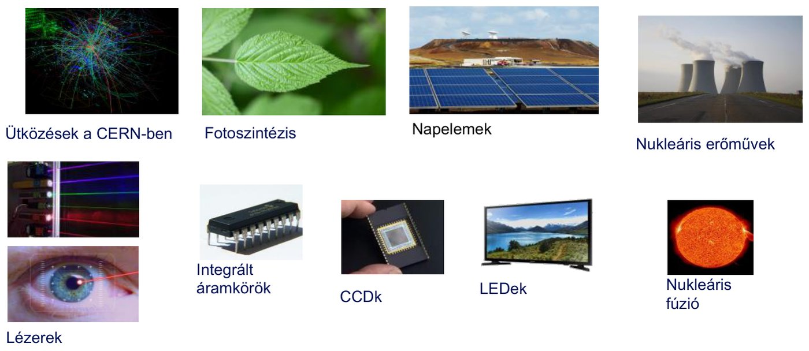
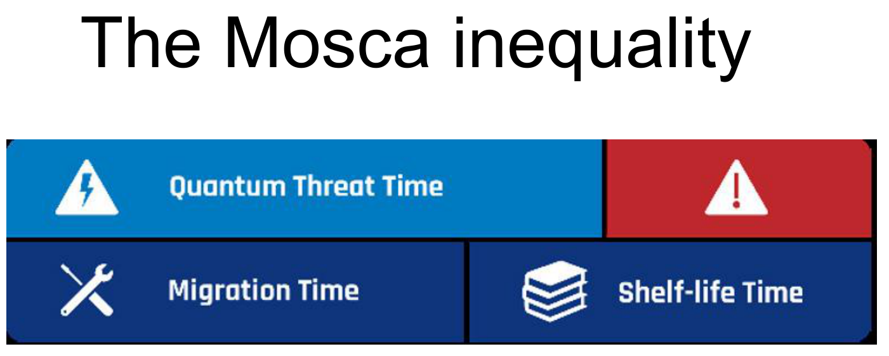
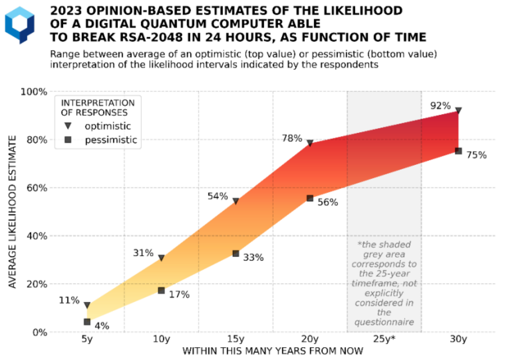
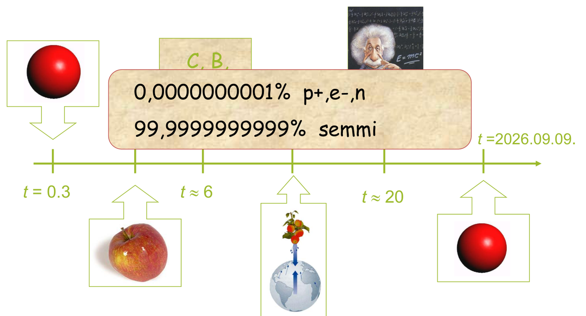

# A kvantuminformatika motivációja

## Mi az a kvantum?

Egy rendszerre akkor aggatjuk rá a „kvantum” jelzőt, ha a kvantummechanika törvényei szerint működik. A kvantummechanika a fizika azon területe, amely a részecskék viselkedését írja le a nanométeres mérettartományban. A kvantum alapú rendszerek speciális jellegzetességei többek között:

- kvantáltság,
- hullám-részecske kettősség,
- alagúteffektus,
- szuperpozíció,
- kvantuminterferencia.

A kvantum alapú jelenségek alapvetően a nanométer tartományban jelennek meg, de a kvantummechanika törvényei jelentik az alapjait sok makroszkopikus rendszernek is. Ilyenek az ütközések a CERN-ben, a fotoszintézis, a napelemek, a nukleáris erőművek, a lézerek, az integrált áramkörök, a CCD-k, a LED-ek és a Napban zajló nukleáris fúzió.

A kvantumrendszereket olyan jelenségek jellemzik, mint az alagúteffektus, a szuperpozíció és az összefonódás. Ezek a jelenségek elsőre szokatlannak tűnhetnek, de a mindennapi technológiákban, például a CCD-kamerákban és a lézerek működésében már jelen vannak. A tárgy az alkalmazásokból indul ki, így a kvantumvilág hosszas elméleti bevezetés nélkül is megérthető.

## A második kvantumtechnológiai forradalom

Schrödinger 1952-ben azt írta, hogy soha nem kísérletezünk egyetlen elektronnal, atommal vagy kis molekulával: „*We never experiment with just one electron or atom or (small) molecule. In thought-experiments we sometimes assume that we do; this invariably entails ridiculous consequences... we are not experimenting with single particles, any more than we can raise Ichthyosauria in the zoo*” (Brit. J. Phil. Sci. 3, 233). Ez nem igaz: ma egyedi fotonokkal és elektronokkal is kísérletezünk, és a második kvantumtechnológiai forradalom korát éljük.

Ez a forradalom az 1980-as évek közepén kezdődött. A kvantumfizika alapelveit használja új eszközök és rendszerek létrehozására: kvantumszámítógépek, kvantumérzékelők és kvantumkommunikációs hálózatok épülnek rá, és nemcsak a kutatásban, hanem a technológiai fejlesztésben is áttörést hozott. A kvantumtechnológia fejlődése Richard Feynman munkásságával vált igazán lendületessé az 1980-as években: ő hívta fel a figyelmet a nanoskálán rejlő informatikai lehetőségekre, és ennek nyomán kezdődött meg a kvantumalgoritmusok és a kvantumszámítógépek fejlesztése. A kvantumtechnológia alapvetően más elveken működik, mint a hagyományos informatika, ezért újfajta megközelítést és gondolkodásmódot igényel az informatikusoktól és a mérnököktől.

A fejlődés ütemét jól mutatja a prímtényezős felbontás: a 15-öt prímtényezőire bontó kvantumeszköz 2002-ben készült el, a 143-at ($11 \cdot 13$) felbontó kísérlet tíz évvel később, 2012-ben. 2018-ban az IBM a felhőben elérhetővé tette a kvantumszámítógépét a kutatók és a vállalatok számára; ez jelentősen hozzájárult ahhoz, hogy a kvantumszámítástechnikát a pénzügyekben, a gyógyszergyártásban és a logisztikában is alkalmazni kezdjék. A jövőben a kvantumkommunikációs hálózatok a kvantumszámítógépek összekapcsolását is lehetővé teszik.

## A kvantumszámítógép mint fenyegetés

A Peter Shor által 1995-ben bemutatott Shor-algoritmus képes az RSA feltörésére, és a kulcshossz növelése nem jelent ellene jelentős védelmet. Nemcsak a titkosított adatok vannak veszélyben, hanem a teljes digitális hitelesítési lánc is, a digitális aláírásokkal és a weboldalak tanúsítványaival együtt. A fenyegetés két területet hívott életre:

- A **posztkvantum kriptográfia** olyan klasszikus, matematikai algoritmusokat fejleszt, amelyek ellenállnak a kvantumszámítógépes támadásoknak. A biztonságuk egy feltételezésen nyugszik a jövőbeli kvantumszámítógépek képességeiről; a NIST (az amerikai szabványügyi hivatal) által szabványosított algoritmusok is folyamatos felülvizsgálat alatt állnak.
- A **kvantumkommunikációs megoldások** a fizika törvényszerűségei miatt garantálnak feltörhetetlen biztonságot. A kvantumkommunikációs hálózatok kutatása erre a biztonsági kihívásra válaszul indult meg, és az Európai Unió is jelentős összegeket fektet bele.

### Mikor?

A Mosca-egyenlőtlenség a fenyegetés súlyosságát a **migrációs idő** fogalmával magyarázza. A migrációs idő (*migration time*) az az időtartam, amely ahhoz kell, hogy a jelenlegi rendszerünket lecseréljük egy kvantumszámítógépes támadásokkal szemben védettre; ez bizonyos esetekben akár 5–7 év is lehet. Az adatoknak ezen felül van egy eltarthatósági ideje (*shelf-life time*): ennyi ideig kell titokban maradniuk. Baj akkor van, ha a migrációs idő és az eltarthatósági idő összege hosszabb, mint a kvantumfenyegetés megjelenéséig hátralévő idő (*quantum threat time*):

$$\text{migrációs idő} + \text{eltarthatósági idő} > \text{a kvantumfenyegetésig hátralévő idő}$$

A Global Risk Institute 2023-as felmérése szakértői becslésekből adja meg, mekkora valószínűséggel lesz adott időn belül olyan digitális kvantumszámítógép, amely 24 óra alatt feltöri a 2048 bites RSA-t. Az ábra sávja a válaszok optimista (felső) és pesszimista (alsó) értelmezésének átlaga között húzódik: 10 éven belül 17–31%, 20 éven belül 56–78%, 30 éven belül 75–92%.

A kvantumszámítógépek még a fejlesztés korai szakaszában járnak, és messze vannak attól a teljesítménytől, amely az RSA feltöréséhez kell. A Google szakértői szerint ehhez 20 millió kvantumbitre lenne szükség, a mai hardverek, például az IBM-éi, nagyjából 1000 kvantumbittel rendelkeznek. A Cloud Security Alliance (a felhőszolgáltatások biztonságával foglalkozó nemzetközi szervezet) mégis konkrét dátumot jelölt meg: 2022. március 9-én bejelentette, hogy becslése szerint **2030. április 14-ig** lesz olyan kvantumszámítógép, amely feltöri a mai kiberbiztonsági infrastruktúrát (például a 2048 bites RSA-t), és weboldalán visszaszámláló órát (*Year to Quantum*, Y2Q) indított, emlékeztetőül, hogy a vállalatoknak már most fel kell készülniük. A konkrét dátum a probléma sürgősségét mutatja.

## A kvantumos szemléletmód

Egy mindennapi tárgy, az alma, mást jelent egy kisgyereknek, a newtoni fizikának és a relativitáselméletnek. Az alábbi idővonal ezt mutatja: kb. $t = 0{,}3$ évesen az alma egy piros golyó, $t \approx 2$ évesen „alma”, $t \approx 6$ évesen betűkből összerakható szó, $t \approx 14$ évesen a gravitáció példája, $t \approx 20$ évesen az $E = mc^2$ világa. A kvantumos szemléletmód ennél mélyebbre megy: az almának csak $0{,}0000000001\%$-a proton, elektron és neutron ($p^+, e^-, n$), $99{,}9999999999\%$-a „semmi”.

A tárgy célja, hogy a félév során elsajátítsuk ezt a kvantumos szemléletmódot, amely alapvetően eltér a hagyományos fizikai gondolkodástól.

Forrás: 01_bevezetes_20260909.pdf (8–11., 25–26., 57. dia), 03_osszefonodasalapjai_20260923.pdf (4. dia), Kvantuminformatikai alkalmazások jegyzet 2026 ősz.md

