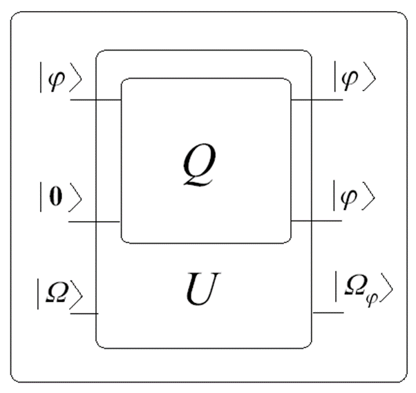
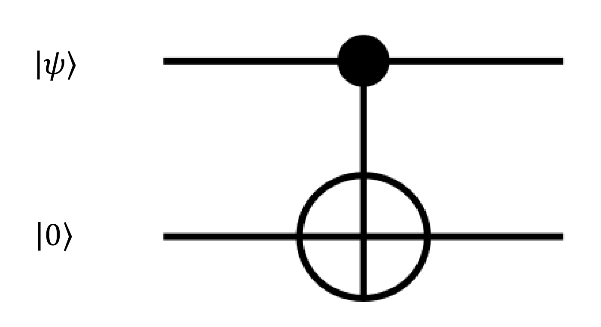

# A no-cloning tétel

A **no-cloning** (másolhatatlansági) tétel neve kissé félrevezető. Próbáljunk meg egy tökéletes kvantumos másológépet tervezni, és nézzük meg, mikor lehetséges ez!

## Az univerzális kvantummásoló

A másológépnek három vezetéke van:

- az első vezeték a másolandó $\ket{\varphi}$ kvantumállapot,
- a középső vezeték a segéd kvantumbitek, kezdetben $\ket{\mathbf{0}}$ állapotban; ide kerül a másolat,
- az alsó vezeték a környezet, $\ket{\Omega}$ állapotban.

A tervezés megkönnyítése érdekében megengedjük, hogy a környezet is hasson a $Q$ másolóra; ezt valósítja meg az $U$ transzformáció. Kellően nagy $U$-t választva elérhetjük, hogy a rendszer zárt legyen, azaz érvényesek legyenek rá a kvantummechanika posztulátumai. Ha létezik ilyen $U$, akkor meghatározhatjuk belőle $Q$-t.

## Létezik-e ilyen U?

A másolás azt jelenti, hogy bármely két állapotra

$$\begin{aligned} U &: \ket{\varphi}\ket{\mathbf{0}}\ket{\Omega} \rightarrow \ket{\varphi}\ket{\varphi}\ket{\Omega_\varphi} \\ U &: \ket{\psi}\ket{\mathbf{0}}\ket{\Omega} \rightarrow \ket{\psi}\ket{\psi}\ket{\Omega_\psi} \end{aligned}$$

A 2. posztulátum szerint $U$-nak unitérnek kell lennie. Az unitérség egyenértékű definícióját alkalmazzuk: bármely két bemenő vektor skaláris szorzatának meg kell egyeznie a hozzájuk tartozó kimeneti állapotok skaláris szorzatával. A bemeneten

$$\braket{\Omega, \mathbf{0}, \psi | \varphi, \mathbf{0}, \Omega} = \braket{\psi|\varphi}\braket{\mathbf{0}|\mathbf{0}}\braket{\Omega|\Omega} = \braket{\psi|\varphi},$$

a kimeneten

$$\braket{\Omega_\psi, \psi, \psi | \varphi, \varphi, \Omega_\varphi} = \braket{\psi|\varphi}\braket{\psi|\varphi}\braket{\Omega_\psi|\Omega_\varphi} = \braket{\psi|\varphi}^2\braket{\Omega_\psi|\Omega_\varphi}.$$

A két belső szorzat akkor egyenlő, ha

- $|\braket{\psi|\varphi}| = 1$, azaz a két állapot csak egy globális fázisban különbözik, vagyis fizikailag azonos ($\ket{\varphi} = \ket{\psi}$); vagy
- $\braket{\psi|\varphi} = 0$, azaz a két állapot merőleges egymásra.

Az első eset az egyenlőségből következik: ha $\braket{\psi|\varphi} \neq 0$, akkor egyszerűsítés után $\braket{\psi|\varphi}\braket{\Omega_\psi|\Omega_\varphi} = 1$, és mivel mindkét tényező abszolút értéke legfeljebb 1, ez csak $|\braket{\psi|\varphi}| = 1$ mellett teljesülhet. A második eset jó hír: így a klasszikus COPY utasítás nem kerül veszélybe, hiszen a klasszikus állapotok ortogonálisak.

## A tétel

> [!IMPORTANT]
> **No-cloning tétel:** Nem készíthető olyan unitér kvantumkapu, amellyel tetszőleges kvantumállapot-halmaz hibamentesen másolható. De
>
> - ortogonális állapotok halmaza másolható,
> - ismert állapot másolható.

Ismert állapotot úgy másolhatunk, hogy egy új kvantumbitet ugyanebbe az állapotba készítünk elő.

A másolhatóság és a mérhetőség (megkülönböztethetőség) szoros kapcsolatban áll egymással. A [projektív mérés](meres/projektiv.md) éppen az ortogonális állapotokat tudja biztosan megkülönböztetni, ugyanazokat, amelyeket másolni is tudunk; nem ortogonális állapotokat sem másolni, sem egyértelműen megkülönböztetni nem lehet (lásd [POVM](meres/povm.md)).

## Gyakorló feladat

A CNOT-kaput klasszikus bemenetekkel kipróbálva azt tapasztaljuk, hogy ha a target bit $\ket{0}$, a kapu a control bit értékét a target bitre másolja. Készítsünk ez alapján a CNOT-kapuval független másolatot egy tetszőleges $\ket{\psi}$ kvantumbitről!

$$\ket{\psi} = x\ket{0} + y\ket{1}, \qquad |x|^2 + |y|^2 = 1$$

1. Hogy néz ki egy független másolat? $\ket{\psi} \otimes \ket{\psi} = \,?$
2. Mit ad a CNOT-kapu tetszőleges $\ket{\psi}$ control bemenet esetén?

   

3. Mikor egyezik meg a két eredmény egymással?

Forrás: 05_INterferometer_es_NCT20261007.pdf (47–49. dia), Kvantuminformatikai áramkörök tervezése.pdf (4. feladat), Kvantuminformatikai alkalmazások jegyzet 2026 ősz.md

