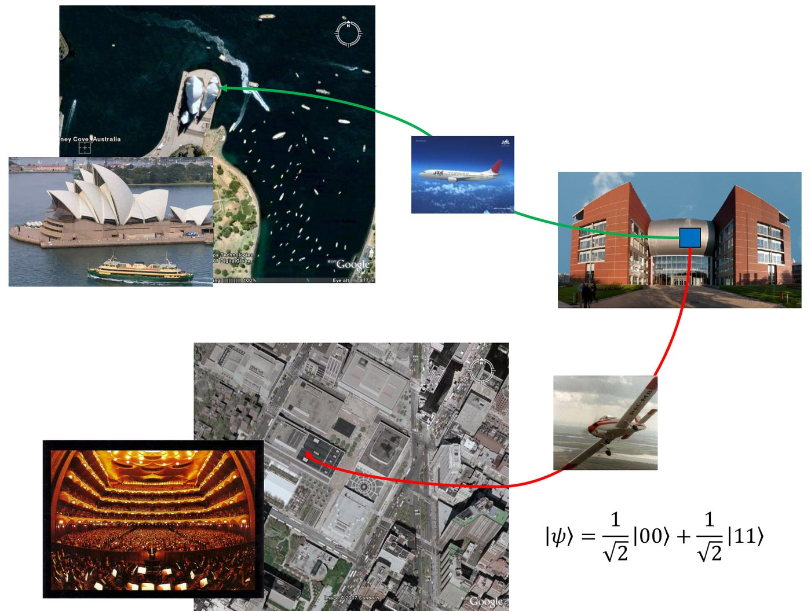

# Összefonódás

## Szorzatállapot és összefonódott állapot

Bontsuk fel a 4. posztulátum alapján az alábbi kétbites állapotot két kvantumbit tenzorszorzatára!

$$\ket{\varphi} = a\ket{00} + b\ket{11}$$

$$\ket{\varphi} = \ket{\varphi_1} \otimes \ket{\varphi_2} \;\Rightarrow\; \ket{\varphi_1} = \,?\qquad \ket{\varphi_2} = \,?$$

Ilyen felbontás nincs (ha $a$ és $b$ egyike sem 0). Ha ugyanis $\ket{\varphi_1} = c_0\ket{0} + c_1\ket{1}$ és $\ket{\varphi_2} = d_0\ket{0} + d_1\ket{1}$ lenne, akkor a szorzatban $\ket{01}$ együtthatója $c_0 d_1 = 0$, $\ket{10}$ együtthatója $c_1 d_0 = 0$ kellene legyen, miközben $c_0 d_0 = a \neq 0$ és $c_1 d_1 = b \neq 0$; ez lehetetlen.

A kvantumállapotoknak tehát két típusa van:

- **szorzatállapot** (*product*): felbontható az egyes kvantumbitek állapotának tenzorszorzatára;
- **összefonódott állapot** (*entangled*): nem bontható fel két különálló kvantumbit tenzorszorzatára.

Az összefonódás nem tévesztendő össze a szuperpozícióval. A szuperpozíció egyetlen kvantumbit tulajdonsága is lehet ($\ket{\varphi} = a\ket{0} + b\ket{1}$), az összefonódás viszont több kvantumbit együttes állapotának tulajdonsága.

## Az összefonódott pár különleges korrelációja

Gyakorlatilag (szinte) minden hatékony kvantumalgoritmusban és kommunikációs protokollban megjelenik az alábbi állapot:

$$\ket{\psi} = \frac{1}{\sqrt{2}}\ket{00} + \frac{1}{\sqrt{2}}\ket{11}$$

Általánosabban a $\ket{\varphi} = \varphi_0\ket{00} + \varphi_3\ket{11}$ alakú állapotokban mindkét tagban az első és a második kvantumbit értéke megegyezik.

Az összefonódott pár két tagja (két kvantumbit) között nagyon különleges korreláció áll fenn:

- Ha az összefonódott pár egyik tagját megmérjük, 50% valószínűséggel 0-t, 50% valószínűséggel 1-et kapunk.
- Ha az egyik tagot megmérjük, és 0-t kapunk, a pár másik tagjának abban a pillanatban nincs más választása, mint szintén a 0 értéket felvenni.
- Ugyanez igaz az 1-re: ha az egyik tag 1-et vett fel, a másik is 1-et fog.

A jelenség nem csak kis, hanem nagy távolságon is működik, akkor is, ha a pár két tagja nagyon messze van egymástól: ez a nemlokalitás (nem helyhez kötöttség) elve. Képzeljük el, hogy a két kvantumbit ugyanonnan indul, az egyik Sydney-be, a másik New Yorkba utazik; az egyik megmérése után a másik állapota is azonnal eldől.

Noha a jelenség gyorsabb a fénysebességnél, mégsem használható kommunikációra, így nem sérti a relativitáselméletet:

- A mérés eredménye teljesen véletlenszerű (50% 0, 50% 1), tehát nem tudunk információt bevinni a rendszerbe, akárcsak egy tökéletesen zajos csatornában.
- Csak egy előre megbeszélt terv alapján tudhatjuk, mi történt a távoli partnerrel (például ha 0-t mér, krumplit kezd termeszteni a Marson ragadt űrhajósunk, ha 1-et, búzát), de a mérés eredményét nem tudjuk befolyásolni.

A kvantumkommunikációban abban is meg kell egyezni, mit értünk vízszintes és függőleges alatt (azaz mi a $\ket{0}$, $\ket{1}$ bázis), mivel nagy távolságon ez is relatív lehet.

Mérnökként jellemzően a fenti $\frac{1}{\sqrt{2}}\ket{00} + \frac{1}{\sqrt{2}}\ket{11}$ állapotot használjuk, amelyben a korreláció az azonos értékre vonatkozik. Létezik egy másik összefonódott állapot is (ezt inkább a fizikusok használják), amelyben a két mérés eredménye pontosan ellentétes: az egyik helyen $\ket{0}$-t mérünk, a másikon $\ket{1}$-et.

$$\frac{1}{\sqrt{2}}\ket{01} + \frac{1}{\sqrt{2}}\ket{10}$$

Összefonódott párt a [CNOT-kapuval](osszefonodas/cnot.md) állíthatunk elő; a négy alapvető összefonódott kétbites állapot a [Bell-állapotok](osszefonodas/bell.md) fejezetben szerepel.

## Mire jó mindez?

Az összefonódás egy olyan jelenség, amelyet klasszikus módon nem lehet előállítani, és a klasszikus világban nem létezik. Felhasználható többek között:

- szupersűrű tömörítésre (*superdense coding*),
- teleportációra (*quantum teleportation*),
- kvantum alapú kulcsszétosztásra (*quantum key distribution*), bizonyos feltételekkel,
- összefonódás-megosztásra (*entanglement swapping*),
- kvantummemóriában és kvantumos jelerősítésben,

és még nagyon sok más helyen.

Forrás: 03_osszefonodasalapjai_20260923.pdf (21–22., 30. dia), 04_Meresek20260930.pdf (12. dia), Kvantuminformatikai alkalmazások jegyzet 2026 ősz.md

