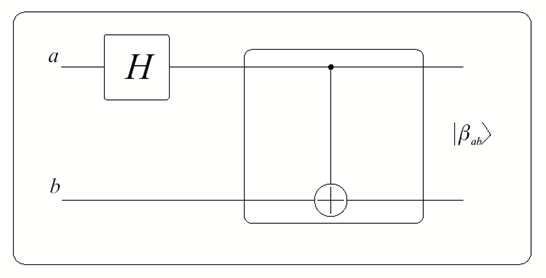
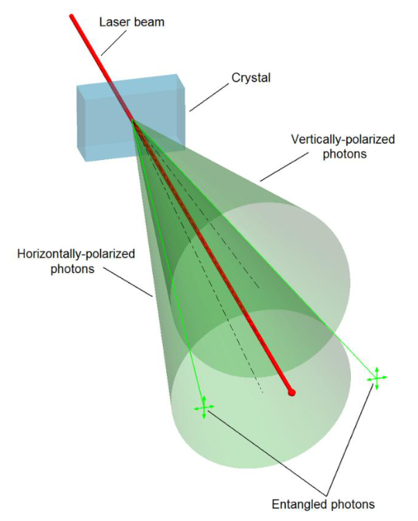

# Bell-állapotok

## Összefonódás előállítása H- és CNOT-kapuval

Nézzük meg a CNOT-kaput mint összefonódást előállító áramköri elemet! A felső vezetéken egy Hadamard-kapu szuperpozícióba állítja a vezérlőbitet, utána egy CNOT következik.

Az ábrán szereplő $a$ és $b$ itt nem komplex valószínűségi amplitúdók, hanem a bemeneti állapotok: értékük 0 vagy 1, $a, b \in \{0, 1\}$, ami a négy lehetséges kezdeti bázisállapotot ($ab = 00, 01, 10, 11$) jelöli. A kimeneten az áramkör a **Bell-állapotokat** állítja elő:

$$\ket{\beta_{ab}} = \frac{\ket{0, b} + (-1)^a\ket{1, NOT(b)}}{\sqrt{2}}$$

Például $a = b = 0$ esetén a Hadamard-kapu után az állapot $\frac{\ket{0} + \ket{1}}{\sqrt{2}} \otimes \ket{0} = \frac{\ket{00} + \ket{10}}{\sqrt{2}}$, a CNOT pedig a második tagban negálja az adatbitet, így $\ket{\beta_{00}} = \frac{\ket{00} + \ket{11}}{\sqrt{2}}$. A négy Bell-állapot:

$$\begin{aligned} \ket{\beta_{00}} &= \frac{\ket{00} + \ket{11}}{\sqrt{2}}, \\ \ket{\beta_{01}} &= \frac{\ket{01} + \ket{10}}{\sqrt{2}}, \\ \ket{\beta_{10}} &= \frac{\ket{00} - \ket{11}}{\sqrt{2}}, \\ \ket{\beta_{11}} &= \frac{\ket{01} - \ket{10}}{\sqrt{2}}. \end{aligned}$$

A nevüket John Bell tiszteletére kapták (1964-es publikációja nyomán). A Bell-állapotok ortogonálisak egymásra.

## Összefonódott fotonpárok

Fizikailag összefonódott fotonpárokat például spontán parametrikus lekonvertálással (*spontaneous parametric down-conversion*, SPDC) állítanak elő. Egy lézernyalábot egy kristályon (béta-bárium-borát vagy lítium-niobát) vezetnek át; a folyamat egyes fotonokat egymásra merőleges polarizációjú, II. típusú fotonpárokra hasít. A kristályból kilépő két fénykúp, a függőlegesen és a vízszintesen polarizált fotonoké, két egyenes mentén metszi egymást: ott lépnek ki az összefonódott fotonok.

## Több kvantumbit összefonódása

Az összefonódás nem korlátozódik két kvantumbitre. Egy általánosított kvantum összefonó áramkörben a felső vezeték egy Hadamard-kapu után egymás után több CNOT-kapu vezérlése, egy-egy további vezetékkel mint célbittel. Három kvantumbit esetén így áll elő a GHZ-állapot, a hármas összefonódás.

- Elegendő az összefonódott kvantumbitek egyikéhez hozzáfonódni ahhoz, hogy a teljes rendszerhez hozzáfonódjunk.
- Összefonódást nem tudunk előállítani klasszikus kommunikáció segítségével.

Az első pont biztonsági szempontból aggályos lehet. Ha két fél egy összefonódott állapotot használ titkos kulcs előállítására (például véletlenszám-generálásra), és miközben a fotonok úton vannak, egy harmadik fél egy általános kvantum összefonó révén „hozzáfonódik” a rendszerhez, hármas összefonódás jön létre. A támadó így azonnali kapcsolatba kerül mindkét eredeti kvantumbittel, és ő is megismerheti a titkos kulcsot.

Forrás: 03_osszefonodasalapjai_20260923.pdf (27–29. dia), 04_Meresek20260930.pdf (13. dia), Kvantuminformatikai alkalmazások jegyzet 2026 ősz.md

