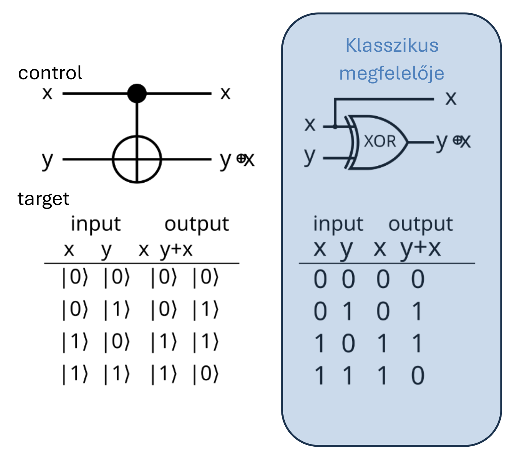

# A CNOT-kapu

## Vezérelt NEM kapu

A CNOT (vezérelt NEM, *controlled NOT*) kapu kétbites kvantumkapu. Két bemenete van:

1. a **vezérlés** (*control*) a felső vezeték,
2. az **adat** (*data*), más néven célbit (*target*), az alsó vezeték.

Ha a vezérlés értéke 0, a kapu nem csinál semmit, átengedi az adatbitet. Ha a vezérlés értéke 1, az alsó biten negálást (NOT műveletet) hajt végre, hasonlóan a klasszikus digitális technikához.

## Klasszikus bemenetekkel

Az igazságtábla klasszikus bemenetekre:

| IN: $x$ | IN: $y$ | OUT: $x$ | OUT: $y \oplus x$ |
|---|---|---|---|
| 0 | 0 | 0 | $0 \oplus 0 = 0$ |
| 0 | 1 | 0 | $1 \oplus 0 = 1$ |
| 1 | 0 | 1 | $0 \oplus 1 = 1$ |
| 1 | 1 | 1 | $1 \oplus 1 = 0$ |

A CNOT klasszikus megfelelője tehát egy XOR kapu, amely mellett a vezérlőbit változatlanul is kijut a kimenetre:

Általában egy klasszikus $\ket{xy}$ bemenet esetén a kimenet

$$CNOT(\ket{xy}) = \ket{x(x \oplus y)},$$

ahol $\oplus$ az XOR műveletet (moduló 2 összeadást) jelöli. Ez a CNOT **mesteregyenlete**:

$$CNOT : \ket{x}\ket{y} \to \ket{x}\ket{y \oplus x}$$

## Mátrix

A négy bázisállapotra a kapu hatása:

$$\ket{00} \to \ket{00}, \qquad \ket{01} \to \ket{01}, \qquad \ket{10} \to \ket{11}, \qquad \ket{11} \to \ket{10}$$

Ebből a kapu mátrixa:

$$CNOT = \begin{bmatrix} 1 & 0 & 0 & 0 \\ 0 & 1 & 0 & 0 \\ 0 & 0 & 0 & 1 \\ 0 & 0 & 1 & 0 \end{bmatrix} = \begin{bmatrix} I & \hat{0} \\ \hat{0} & X \end{bmatrix}$$

ahol $\hat{0}$ a $2 \times 2$-es nulla almátrix. A $4 \times 4$-es mátrix egyszerűen megjegyezhető: ha a vezérlés 0 (bal felső rész), identitás transzformáció történik; ha a vezérlés 1 (jobb alsó rész), Pauli-X transzformáció, azaz negálás.

## Kvantumos bemenetekkel

Egy általános kétbites állapot a CNOT előtt:

$$\ket{\psi} = a\ket{00} + b\ket{01} + c\ket{10} + d\ket{11}$$

A CNOT lineáris művelet, mint minden unitér művelet, ezért

$$\begin{aligned} &CNOT(a\ket{00} + b\ket{01} + c\ket{10} + d\ket{11}) \\ &\quad = a\,CNOT(\ket{00}) + b\,CNOT(\ket{01}) + c\,CNOT(\ket{10}) + d\,CNOT(\ket{11}) \end{aligned}$$

Az igazságtábla alapján ismerjük a szuperpozíció minden tagjára gyakorolt hatást:

$$a\,CNOT(\ket{00}) + b\,CNOT(\ket{01}) + c\,CNOT(\ket{10}) + d\,CNOT(\ket{11}) = a\ket{00} + b\ket{01} + c\ket{11} + d\ket{10}$$

Ugyanez vektoros jelöléssel: az állapot $\ket{\psi} = \begin{bmatrix} a \\ b \\ c \\ d \end{bmatrix}$, és a CNOT mátrixával szorozva:

$$\begin{bmatrix} 1 & 0 & 0 & 0 \\ 0 & 1 & 0 & 0 \\ 0 & 0 & 0 & 1 \\ 0 & 0 & 1 & 0 \end{bmatrix} \begin{bmatrix} a \\ b \\ c \\ d \end{bmatrix} = \begin{bmatrix} a \\ b \\ d \\ c \end{bmatrix}$$

Az állapotvektor utolsó két komponense felcserélődött: $CNOT(a\ket{00} + b\ket{01} + c\ket{10} + d\ket{11}) = a\ket{00} + b\ket{01} + d\ket{10} + c\ket{11}$.

## CNOT mint klasszikus másológép

Ha az adat bemenet $\ket{0}$, a CNOT-kapu a vezérlés bemenetét teszi az adat kimenetére: a $\ket{0}$-t $\ket{0}$-ba, az $\ket{1}$-et $\ket{1}$-be másolja. Mi történik, ha a vezérlés szuperpozícióban van?

Legyen a vezérlés $\ket{C}_{IN} = a\ket{0} + b\ket{1}$, az adat $\ket{D}_{IN} = \ket{0}$. A kezdeti bemeneti állapot:

$$\ket{C}_{IN} \otimes \ket{D}_{IN} = a\ket{00} + b\ket{10}$$

A CNOT-kapu alkalmazása után a szuperpozíció elve alapján:

$$a\ket{0, 0 \oplus 0} + b\ket{1, 1 \oplus 0} = a\ket{00} + b\ket{11}$$

Ez nem két független másolat, hanem egy **összefonódott pár**. Hogy egy tetszőleges kvantumállapot egyáltalán nem másolható, azt [A no-cloning tétel](../no-cloning.md) mutatja meg.

Forrás: 03_osszefonodasalapjai_20260923.pdf (24–26. dia), Emélkeztető a CNOT művelethez.pdf (1–2. dia), gyak1.pdf (17. dia), Kvantuminformatikai alkalmazások jegyzet 2026 ősz.md

