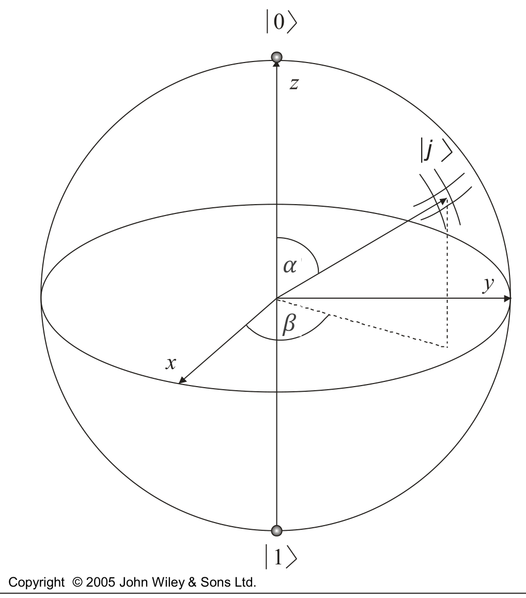
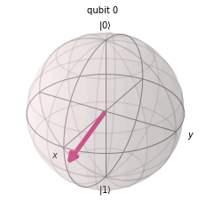

# A Bloch-gömb

## Egy kvantumbit a gömbön

A Bloch-gömb egy kvantumbit állapotát jeleníti meg egy egységgömb egy pontjaként. Ehhez az $\ket{\varphi} = a\ket{0} + b\ket{1}$ állapotot három valós paraméterrel írjuk fel:

$$\ket{\varphi} = e^{j\gamma}\left[\cos\left(\frac{\alpha}{2}\right)\ket{0} + e^{j\beta}\sin\left(\frac{\alpha}{2}\right)\ket{1}\right], \qquad \alpha, \beta, \gamma \in \mathbb{R}$$

Itt $j$ a képzetes egység. Az $e^{j\gamma}$ tényező a **globális fázis**: az egész állapotvektort ugyanazzal az egységnyi abszolút értékű számmal szorozza, ezért egyik bázisállapot megtalálási valószínűségét sem változtatja meg ($|e^{j\gamma}a|^2 = |a|^2$). A gömbön csak az $\alpha$ és a $\beta$ szög jelenik meg: $\alpha$ a $z$ tengellyel, $\beta$ az $x$ tengellyel bezárt szög. A $\ket{\varphi}$ állapotnak a Bloch-gömb

$$[x, y, z]^T = [\cos(\beta)\sin(\alpha),\ \sin(\beta)\sin(\alpha),\ \cos(\alpha)]^T$$

pontja felel meg.



Az északi pólus a $\ket{0}$ ($\alpha = 0$), a déli pólus az $\ket{1}$ ($\alpha = \pi$) állapot. Az egyenlítőn az 50–50%-os szuperpozíciók vannak, például az $x$ tengely két végén a $\ket{+}$ és a $\ket{-}$.

Ugyanez a felírás más betűkkel is gyakori (például online Bloch-gömb szimulátorokban), a globális fázis elhagyásával:

$$\ket{\psi} = \cos\frac{\theta}{2}\ket{0} + e^{j\phi}\sin\frac{\theta}{2}\ket{1}$$

## Bloch-gömb rajzolása Qiskittel

A Qiskit `plot_bloch_multivector` függvénye egy állapotvektort a Bloch-gömbön rajzol ki. A `Statevector` osztály az amplitúdók listájából hoz létre állapotot; itt a $0{,}6\ket{0} + 0{,}8\ket{1}$ állapotot:

```python
from qiskit import QuantumCircuit
from qiskit.quantum_info import Statevector
from qiskit.visualization import plot_bloch_multivector
import numpy as np

#state = Statevector([1/np.sqrt(2), 1/np.sqrt(2)])
state = Statevector([0.6, 0.8])
plot_bloch_multivector(state)
```

Az amplitúdók valósak, így $\beta = 0$, és $\cos(\alpha/2) = 0{,}6$ miatt $\alpha \approx 106°$: az állapot az $x$ tengely felé, az egyenlítő alá mutat. A kikommentezett sor a $\ket{+}$ állapotot rajzolná ki.



A Qiskit további használatát a [Kvantumáramkörök Qiskitben](../qiskit.md) fejezet mutatja be.

## Gyakorló feladatok

1. Vizsgáljuk meg, hol helyezkednek el az egyes bázisállapotok a gömbön!
2. Milyen régió tartozik a gömbön egy mérési eloszláshoz?
3. Két kvantumbitgyártó doboz közül az egyik más globális fázissal állít elő kvantumbiteket, mint a másik. Különböztessük meg a kettőt méréssel! A globális fáziskülönbség egy $\ket{\psi}$ és egy $\ket{\psi'}$ kvantumbit között a következőt jelenti:

   $$\ket{\psi} = x\ket{0} + y\ket{1}, \qquad \ket{\psi'} = e^{j\theta}x\ket{0} + e^{j\theta}y\ket{1}$$

   ahol $|x|^2 + |y|^2 = 1$, $x, y \in \mathbb{C}$. A kettőt akkor tudjuk megkülönböztetni, ha a $\ket{0}$ és az $\ket{1}$ állapot megtalálási valószínűsége eltérő. $\ket{\psi}$ esetén a $\ket{0}$ állapot megtalálási valószínűsége $P(0) = |x|^2$, az $\ket{1}$ állapoté $P(1) = |y|^2$. Mi lesz ez $\ket{\psi'}$ esetén?
4. Keressünk olyan $U$ kaput, amely után az eredmény a globális fázis függvényében különbözik, és amellyel egy globális fázis kimutatható! Lehetséges-e ez? A globális fázis akkor mutatható ki, ha méréssel különbséget tudunk tenni az előző feladat $\ket{\psi}$ és $\ket{\psi'}$ állapota között. Ezt akkor tudjuk megtenni, ha $U\ket{\psi} = x'\ket{0} + y'\ket{1}$ és $U\ket{\psi'} = x''\ket{0} + y''\ket{1}$ esetén $|x'|^2 \neq |x''|^2$ (vagy $|y'|^2 \neq |y''|^2$). Minek kell $U$-ra teljesülnie ahhoz, hogy ezt meg tudjuk tenni?

<p class="sources">Forrás: 03_osszefonodasalapjai_20260923.pdf (10–11. dia), bloch_gyak.pdf (5–6., 14. dia), Kvantuminformatikai alkalmazások_posztulátumok.pdf (13. dia), 2_bloch.ipynb, Kvantuminformatikai áramkörök tervezése.pdf (1., 3. feladat)</p>
