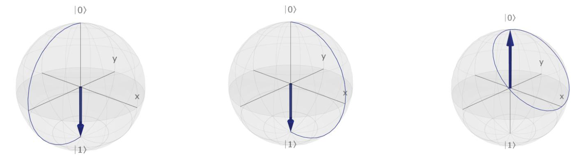
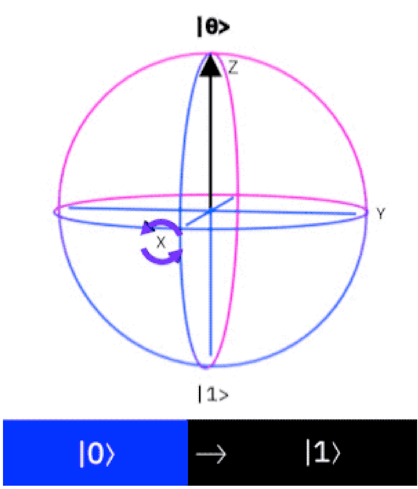
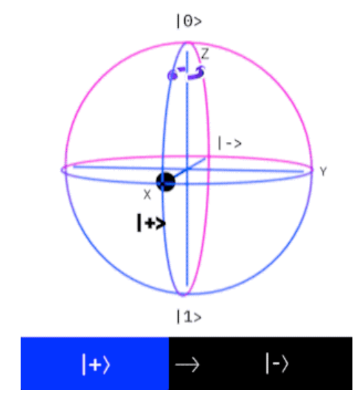
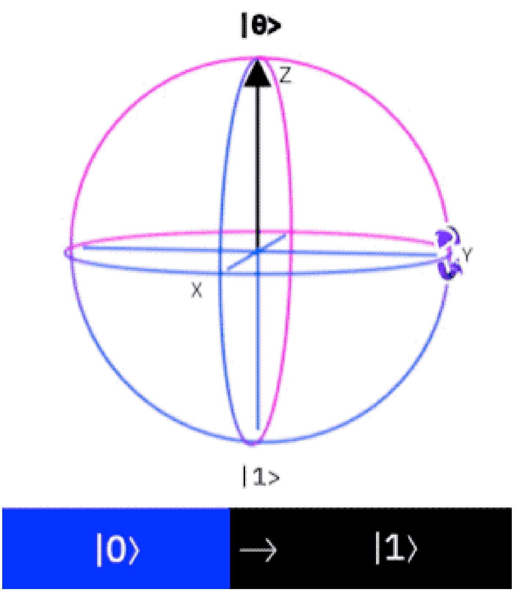
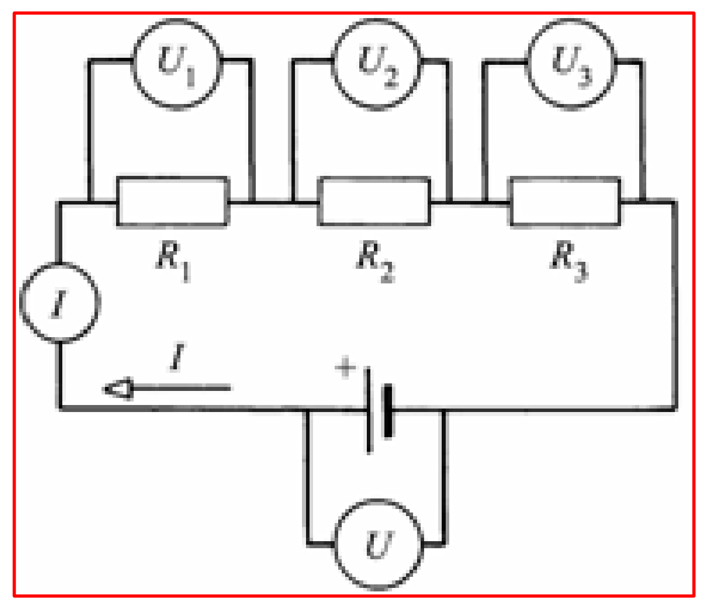
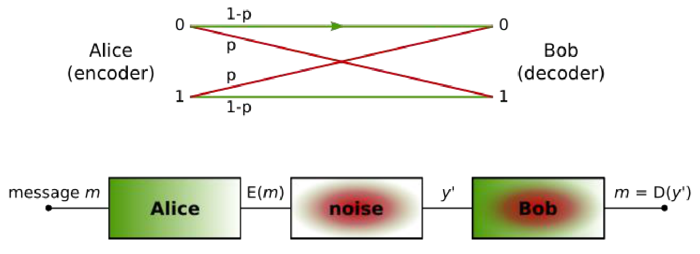

# Unitér transzformációk és kvantumkapuk

## A 2. posztulátum: unitér transzformáció

A 2. posztulátum szerint zárt rendszer időbeli fejlődése **unitér** transzformációval írható le, amely csak a kezdő- és a végállapottól függ. Egy invertálható komplex négyzetes $U$ mátrix akkor unitér, ha az inverze megegyezik az adjungáltjával (komplex konjugált transzponáltjával):

$$U^\dagger \equiv U^{-1}$$

Az unitér transzformációk tulajdonságai:

- $UU^\dagger = U^\dagger U = U^{-1}U = I$, ahol $I$ az identitás.
- Soraik és oszlopaik ortonormált bázist alkotnak.
- Kölcsönösen egyértelmű, hossztartó leképezések: megőrzik a belső szorzatot. Két komplex $x$ és $y$ vektorra $\braket{x|y} = \bra{x} U^\dagger U \ket{y}$.
- $|\det U| = 1$.
- Sajátaltereik ortogonálisak.
- Ha egy kvantumállapotot egy másik bázisban akarunk kifejezni, az átalakítás is unitér operátorral történik.

Egy általános $2 \times 2$-es unitér mátrix elemei így írhatók fel:

$$U = \begin{bmatrix} a & b \\ -e^{j\phi}b^* & e^{j\phi}a^* \end{bmatrix}, \qquad |a|^2 + |b|^2 = 1$$

Egy kvantumbiten végzett unitér transzformáció a Bloch-gömbön egy forgatás: az állapotot jelölő pont a gömb felszínén mozog, a $\ket{0}$-ból például különböző utakon juthat el az $\ket{1}$-be.



A kvantumkapuk ilyen unitér transzformációk. Az alábbiakban az elemi egybites kapuk hatását mindig az

$$\ket{\varphi} = a\ket{0} + b\ket{1} = \begin{bmatrix} a \\ b \end{bmatrix}$$

általános állapoton nézzük: a kapu mátrixát megszorozzuk a bemenő állapot vektorával, és az eredmény a kimenő állapot $\ket{\psi}$ vektora. A műveletet és az eredményt mindig külön lépésben írjuk ki. A tárgyhoz ajánlott angol nyelvű könyvben a kapuk egyenletei ebből a szempontból matematikailag helytelenek: a műveletet és az eredményét egyetlen helyre, az egyenlőségjel elé írják.

Áramköri rajzon az egybites kapu egy négyzet a kapu betűjével, amelyen balról jobbra halad át a kvantumbit vezetéke:

```text
──┤ X ├──   ──┤ Y ├──   ──┤ Z ├──   ──┤ P(α) ├──   ──┤ H ├──
```

## Pauli-X kapu (bit-flip)

$$X = \begin{bmatrix} 0 & 1 \\ 1 & 0 \end{bmatrix}, \qquad \ket{\psi} = X\ket{\varphi} = \begin{bmatrix} 0 & 1 \\ 1 & 0 \end{bmatrix} \begin{bmatrix} a \\ b \end{bmatrix} = \begin{bmatrix} b \\ a \end{bmatrix} = b\ket{0} + a\ket{1}$$

Az X kapu felcseréli a két amplitúdót, a klasszikus bemeneteket negálja: $X\ket{0} = \ket{1}$, $X\ket{1} = \ket{0}$. Ezért bit-flip kapu a neve. A Bloch-gömbön az $x$ tengely körül forgat 180°-kal, így a $\ket{0}$-ból $\ket{1}$ lesz.



Tetszőleges $\alpha$ szögű forgatás az $x$ tengely körül:

$$e^{-j\frac{\alpha}{2}X} = \cos\left(\frac{\alpha}{2}\right)I - j\sin\left(\frac{\alpha}{2}\right)X$$

## Pauli-Z kapu (fázis-flip)

$$Z = \begin{bmatrix} 1 & 0 \\ 0 & -1 \end{bmatrix}, \qquad \ket{\psi} = Z\ket{\varphi} = \begin{bmatrix} 1 & 0 \\ 0 & -1 \end{bmatrix} \begin{bmatrix} a \\ b \end{bmatrix} = \begin{bmatrix} a \\ -b \end{bmatrix} = a\ket{0} - b\ket{1}$$

A Z kapu az $\ket{1}$ amplitúdójának előjelét fordítja meg (fázis-flip, *phase-flip*): a $\ket{0}$-t változatlanul hagyja, az $\ket{1}$-ből $-\ket{1}$ lesz, ami önmagában csak globális fázis, de szuperpozícióban megváltoztatja az állapotot. A Bloch-gömbön a $z$ tengely körül forgat 180°-kal, így a $\ket{+}$-ból $\ket{-}$ lesz.



## Pauli-Y kapu

$$Y = \begin{bmatrix} 0 & -j \\ j & 0 \end{bmatrix}, \qquad \ket{\psi} = Y\ket{\varphi} = \begin{bmatrix} 0 & -j \\ j & 0 \end{bmatrix} \begin{bmatrix} a \\ b \end{bmatrix} = \begin{bmatrix} -jb \\ ja \end{bmatrix} = -jb\ket{0} + ja\ket{1}$$

Az Y kapu felcseréli az amplitúdókat, és közben fázisukat is megváltoztatja. A Bloch-gömbön az $y$ tengely körül forgat 180°-kal, így a $\ket{0}$-ból (globális fázistól eltekintve) $\ket{1}$ lesz.



## Fázisforgató kapu

$$P(\alpha) = \begin{bmatrix} 1 & 0 \\ 0 & e^{j\alpha} \end{bmatrix}, \qquad \ket{\psi} = P(\alpha)\ket{\varphi} = \begin{bmatrix} 1 & 0 \\ 0 & e^{j\alpha} \end{bmatrix} \begin{bmatrix} a \\ b \end{bmatrix} = \begin{bmatrix} a \\ e^{j\alpha}b \end{bmatrix} = a\ket{0} + e^{j\alpha}b\ket{1}$$

A fázisforgató kapu (fáziskapu) az $\ket{1}$ amplitúdóját $e^{j\alpha}$-val szorozza, vagyis a két amplitúdó közötti relatív fázist $\alpha$-val változtatja. A Bloch-gömbön ez a $z$ tengely körüli $\alpha$ szögű forgatás. A Z kapu ennek $\alpha = \pi$ esete.

## Hadamard-kapu

$$H = \frac{1}{\sqrt{2}}\begin{bmatrix} 1 & 1 \\ 1 & -1 \end{bmatrix}, \qquad \ket{\psi} = H\ket{\varphi} = \frac{1}{\sqrt{2}}\begin{bmatrix} 1 & 1 \\ 1 & -1 \end{bmatrix} \begin{bmatrix} a \\ b \end{bmatrix} = \begin{bmatrix} \frac{a+b}{\sqrt{2}} \\ \frac{a-b}{\sqrt{2}} \end{bmatrix} = \frac{a+b}{\sqrt{2}}\ket{0} + \frac{a-b}{\sqrt{2}}\ket{1}$$

A Hadamard-kapu (H-kapu) a bázisállapotokból egyenlő súlyú szuperpozíciót készít. A két bázisállapotra gyakorolt hatását fejből kell tudni:

$$\begin{aligned} H\ket{0} &= \frac{\ket{0} + \ket{1}}{\sqrt{2}} = \ket{+}, \\ H\ket{1} &= \frac{\ket{0} - \ket{1}}{\sqrt{2}} = \ket{-}. \end{aligned}$$

A mérés pillanatáig a kvantumbit így 50–50%-os valószínűséggel van egyik, illetve másik állapotban.

A Hadamard-kapu unitér transzformáció és **hermitikus** is (önadjungált), ezért

$$H^\dagger = H, \qquad H^{-1} = H, \qquad H^\dagger H = HH = I.$$

Kétszer egymás után alkalmazva tehát visszakapjuk a kiinduló állapotot.

### A Hadamard-kapu és a szuperpozíció elve

A kapuk lineáris műveletek, ezért egy szuperpozícióra gyakorolt hatásuk a tagokra gyakorolt hatások összege. Ez a szuperpozíció elve, ugyanaz, mint a lineáris villamos hálózatoké: ott is az egyes források hatásának összegéből kapjuk a teljes választ.



A $H\ket{0}$ és a $H\ket{1}$ ismeretében így a mátrixszorzás nélkül is megkapjuk a $H\ket{\varphi}$ eredményt:

$$\ket{\psi} = H\ket{\varphi} = a\frac{\ket{0} + \ket{1}}{\sqrt{2}} + b\frac{\ket{0} - \ket{1}}{\sqrt{2}} = \frac{a+b}{\sqrt{2}}\ket{0} + \frac{a-b}{\sqrt{2}}\ket{1}$$

## Gyakorló feladatok

1. Milyen operációnak feleltethetőek meg a gömbön az egyes Pauli-kapuk?
2. Vizsgáljuk meg, és lássuk be a következő egyenlőségeket: $HH = I$, $XX = I$, $ZZ = I$, $HXH = Z$, $HZH = X$.
3. Keressünk olyan $U$ kaput, amely az állapotvektor hosszát a duplájára növeli! Lehetséges-e ez? Induljunk ki az általános $2 \times 2$-es unitér mátrixból,

   $$U = \begin{bmatrix} a & b \\ -e^{j\varphi}b^* & e^{j\varphi}a^* \end{bmatrix}, \qquad |a|^2 + |b|^2 = 1,$$

   és a $\ket{\psi} = x\ket{0} + y\ket{1}$, $|x|^2 + |y|^2 = 1$ állapotvektorból. Mi lesz az állapotvektor hossza az $U$ művelet elvégzése után, azaz ha $U\ket{\psi} = x'\ket{0} + y'\ket{1}$, mennyi $|x'|^2 + |y'|^2$? Bizonyítsuk be a választ!
4. Bináris szimmetrikus csatorna esetén a $H$ kapuval kódolt klasszikus bitek érzéketlenek a csatornában előforduló negálásra. Tervezzünk olyan kódoló és dekódoló dobozt, amellyel egy kvantumcsatornán klasszikus adat hibamentesen továbbítható! Igazoljuk az állítást! A bináris szimmetrikus csatornán a bit $1-p$ valószínűséggel változatlanul, $p$ valószínűséggel negálva érkezik meg; a kódoló Alice $m$ üzenetéből $E(m)$-et küld, a zajos csatorna kimenete $y'$, amelyből Bob dekódolja az $m = D(y')$ üzenetet. A Hadamard-kapu mátrixa:

   $$H_1 = \frac{1}{\sqrt{2}}\begin{pmatrix} 1 & 1 \\ 1 & -1 \end{pmatrix}$$

   

<p class="sources">Forrás: Kvantuminformatikai alkalmazások_posztulátumok.pdf (9–12. dia), 03_osszefonodasalapjai_20260923.pdf (12–15. dia), 04_Meresek20260930.pdf (14–15. dia), bloch_gyak.pdf (7–14. dia), gyak1.pdf (5., 12–16. dia), Kvantuminformatikai áramkörök tervezése.pdf (2., 5. feladat), Kvantuminformatikai alkalmazások jegyzet 2026 ősz.md</p>
