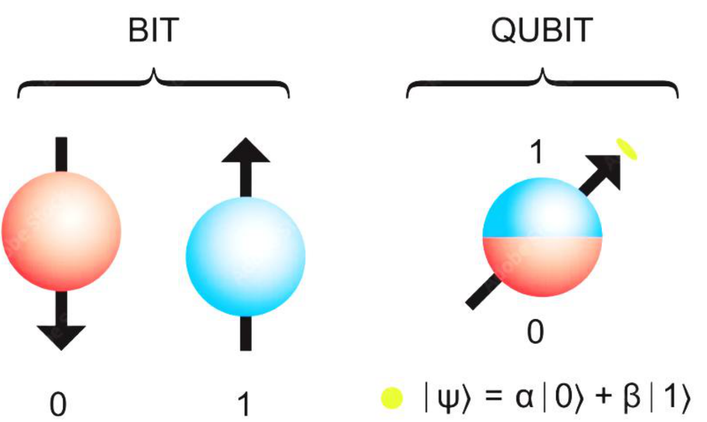
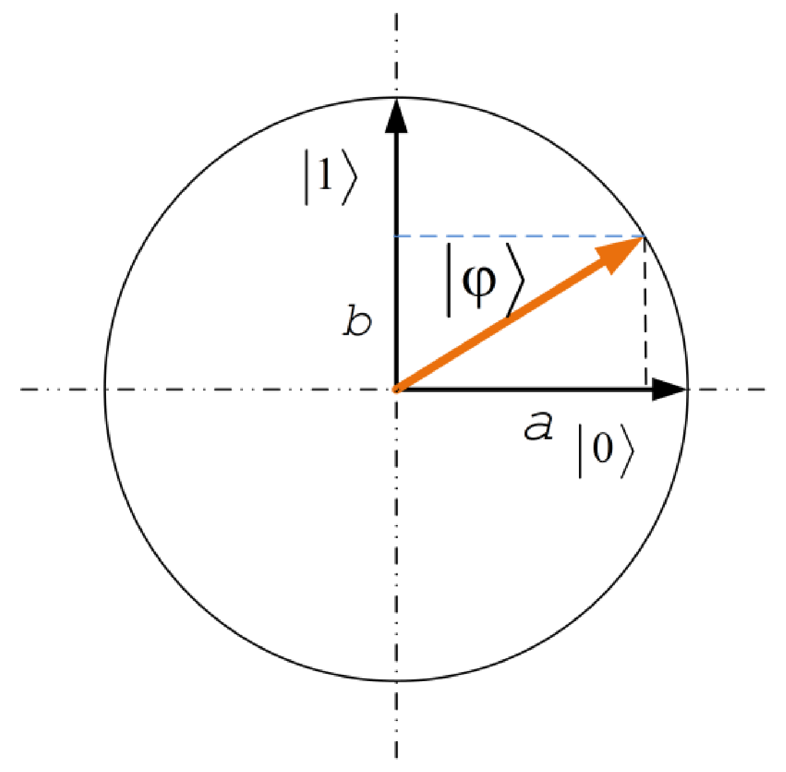
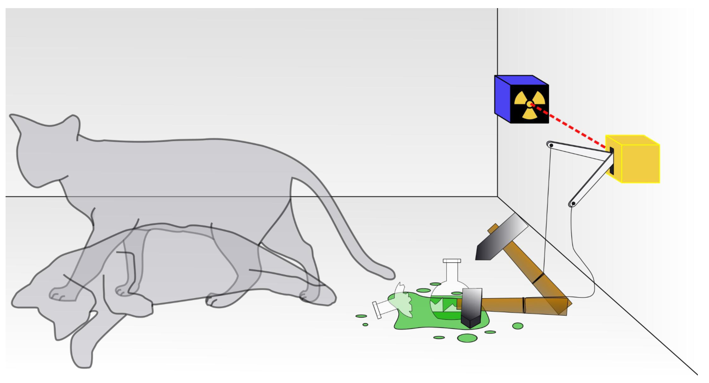
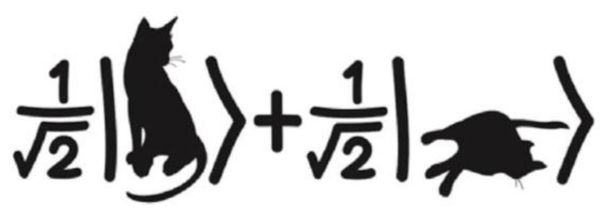

# A kvantumbit

## Bit és kvantumbit

A kvantuminformatika alapköve a **kvantumbit** (*qubit*), egy kétállapotú kvantumrendszer. Fizikailag bármilyen zárt rendszer lehet kvantumbit, amelynek két megkülönböztethető állapota van: például egy foton polarizációja (vízszintes, függőleges), egy elektron spinje vagy egy atommag spinje. A klasszikus bit vagy az egyik, vagy a másik állapotában van. A kvantumbit mindkét klasszikus állapotot (bázisállapotot) tartalmazza egyidőben: **szuperpozícióban** van.

Az 1. posztulátum szerint a kvantumbit állapota egy egységnyi hosszú, komplex együtthatós vektor a Hilbert-térben. Kvantumbitre ez a vektor kétdimenziós:

$$\ket{\varphi} = a\ket{0} + b\ket{1} = a\begin{bmatrix} 1 \\ 0 \end{bmatrix} + b\begin{bmatrix} 0 \\ 1 \end{bmatrix} = \begin{bmatrix} a \\ b \end{bmatrix}$$

Itt $a$ és $b$ **komplex valószínűségi amplitúdók**. Abszolútérték-négyzetük adja meg a mérés eredményének valószínűségét a klasszikus bázisban: $\ket{0}$-t $|a|^2$, $\ket{1}$-et $|b|^2$ valószínűséggel mérünk. Mivel más eredmény nincs, és az állapotvektor egységnyi hosszú:

$$|a|^2 + |b|^2 = 1, \qquad a, b \in \mathbb{C}$$

Valós amplitúdók esetén a kvantumbit egy egységkörön ábrázolható: $\ket{0}$ és $\ket{1}$ a két merőleges tengely, $\ket{\varphi}$ egy egységvektor, amelynek a két tengelyre eső vetülete $a$ és $b$.

Általános esetben $n$ kvantumbit állapota $2^n$ bázisállapot szuperpozíciója (lásd [Kvantumregiszterek](regiszterek.md)):

$$\ket{\varphi} = \sum_{i=0}^{2^n-1} \varphi_i \ket{i}$$

## Schrödinger macskája

A szuperpozíció „mágikus” létét Schrödinger macskájának gondolatkísérlete szemlélteti. A kísérletet valós fizikai rendszeren nem végezték el. Egy zárt dobozban van egy macska és egy radioaktív atom, amely véletlenszerűen elbomolhat; ha elbomlik, egy detektor működésbe hoz egy kalapácsot, amely összetöri a méregfiolát, és a macska elpusztul. Az atom kvantummechanikai viselkedése miatt egyszerre van bomlott és el nem bomlott állapotban, így a macska is egyszerre él és halott. Ha kinyitjuk a dobozt, abban a pillanatban eldől, hogy a macska túlélte-e: kvantummechanikai nyelven a hullámfüggvény összeomlik, és az eredmény számunkra már csak klasszikus információ.

## Dirac-jelölés: ket és bra

A kvantumállapotokat Dirac-jelöléssel írjuk. A $\ket{\varphi}$ (**ket**) oszlopvektor, a $\bra{\varphi}$ (**bra**) a hozzá tartozó sorvektor, a ket adjungáltja (komplex konjugált transzponáltja):

$$\ket{\varphi} = (\bra{\varphi})^\dagger, \qquad \ket{\psi} = \begin{bmatrix} \alpha \\ \beta \end{bmatrix}, \quad \bra{\psi} = \begin{bmatrix} \alpha^* & \beta^* \end{bmatrix}$$

A tárgyban ezt az egyszerűbb, vektoros leírást használjuk; a sűrűségoperátoros leírás nem része a tárgynak.

A kétféle vektorral három műveletet végzünk.

**Belső szorzat** (skalárszorzat): bra és ket szorzata, eredménye egy komplex szám.

$$\braket{A|B} \doteq A_1^*B_1 + A_2^*B_2 + \cdots + A_N^*B_N = \begin{pmatrix} A_1^* & A_2^* & \cdots & A_N^* \end{pmatrix} \begin{pmatrix} B_1 \\ B_2 \\ \vdots \\ B_N \end{pmatrix}$$

**Külső szorzat**: ket és bra szorzata, eredménye egy mátrix (operátor).

$$\ket{\phi}\bra{\psi} \doteq \begin{pmatrix} \phi_1 \\ \phi_2 \\ \vdots \\ \phi_N \end{pmatrix} \begin{pmatrix} \psi_1^* & \psi_2^* & \cdots & \psi_N^* \end{pmatrix} = \begin{pmatrix} \phi_1\psi_1^* & \phi_1\psi_2^* & \cdots & \phi_1\psi_N^* \\ \phi_2\psi_1^* & \phi_2\psi_2^* & \cdots & \phi_2\psi_N^* \\ \vdots & \vdots & \ddots & \vdots \\ \phi_N\psi_1^* & \phi_N\psi_2^* & \cdots & \phi_N\psi_N^* \end{pmatrix}$$

**Tenzorszorzat**: két ket szorzata, eredménye egy hosszabb ket. Az első vektor minden eleme megszorozza a teljes második vektort:

$$\ket{\psi} \otimes \ket{\phi} = \ket{\psi}\ket{\phi} = \begin{bmatrix} \psi_1 \cdot \begin{bmatrix} \phi_1 \\ \phi_2 \end{bmatrix} \\ \psi_2 \cdot \begin{bmatrix} \phi_1 \\ \phi_2 \end{bmatrix} \end{bmatrix} = \begin{bmatrix} \psi_1\phi_1 \\ \psi_1\phi_2 \\ \psi_2\phi_1 \\ \psi_2\phi_2 \end{bmatrix}$$

A tenzorszorzattal több kvantumbitből kvantumregisztert építünk; ezt a [Kvantumregiszterek](regiszterek.md) fejezet tárgyalja.

## A |+⟩, |−⟩ bázis

A $\ket{0}, \ket{1}$ klasszikus bázis mellett gyakran használjuk a

$$\ket{+} = \frac{1}{\sqrt{2}}\ket{0} + \frac{1}{\sqrt{2}}\ket{1} = \begin{bmatrix} \frac{1}{\sqrt{2}} \\ \frac{1}{\sqrt{2}} \end{bmatrix}, \qquad \ket{-} = \frac{1}{\sqrt{2}}\ket{0} - \frac{1}{\sqrt{2}}\ket{1} = \begin{bmatrix} \frac{1}{\sqrt{2}} \\ \frac{-1}{\sqrt{2}} \end{bmatrix}$$

állapotokat („ket plusz”, „ket mínusz”). Bázist alkothatnak-e? Két állapot akkor alkot bázist, ha ortogonálisak, azaz belső szorzatuk 0:

$$\braket{+|-} = \begin{bmatrix} \frac{1}{\sqrt{2}} & \frac{1}{\sqrt{2}} \end{bmatrix} \begin{bmatrix} \frac{1}{\sqrt{2}} \\ \frac{-1}{\sqrt{2}} \end{bmatrix} = \frac{1}{\sqrt{2}}\cdot\frac{1}{\sqrt{2}} + \frac{1}{\sqrt{2}}\cdot\frac{-1}{\sqrt{2}} = 0$$

Az eredmény 0, tehát ortogonálisak, és érvényes bázist alkotnak. A $\ket{+}$ és a $\ket{-}$ állapot egyaránt 50–50%-os szuperpozíció: a klasszikus bázisban mérve 50% eséllyel 0-t, 50% eséllyel 1-et kapunk, így mindkettő tökéletes véletlenszám-generátor. Mindkettő a Hadamard-kapuval állítható elő a $\ket{0}$, illetve az $\ket{1}$ állapotból (lásd [Unitér transzformációk és kvantumkapuk](kapuk.md#hadamard-kapu)).

## Gyakorló feladatok

1. Adjunk meg egy kvantumbitet, amely a $\ket{0}, \ket{1}$ bázisban mérve mindig „1” eredményt ad!
2. Adjunk meg egy kvantumbitet, amely 50% valószínűséggel ad 0-t!
3. Oldjuk meg ugyanezt a $\ket{+}, \ket{-}$ bázisbeli mérésre is!

Forrás: Kvantuminformatikai alkalmazások_posztulátumok.pdf (6–7. dia), 03_osszefonodasalapjai_20260923.pdf (9., 19–20. dia), bloch_gyak.pdf (4. dia), gyak1.pdf (3–4., 9–11. dia), Kvantuminformatikai alkalmazások jegyzet 2026 ősz.md

