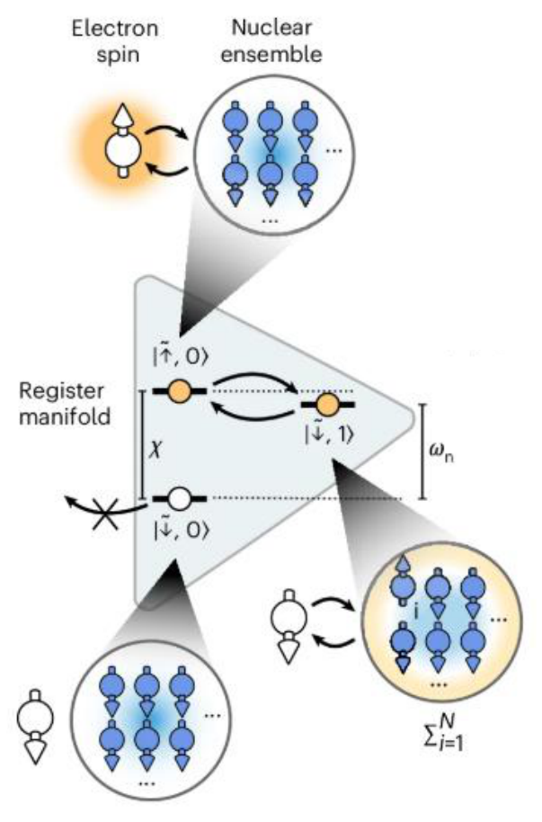

# Kvantumregiszterek

## A 4. posztulátum: összetett rendszer

Ha $V$ és $Y$ a két kvantumrendszerhez rendelt Hilbert-tér, akkor az ebből a két rendszerből álló összetett rendszerhez a $W = V \otimes Y$ Hilbert-tér rendelhető, ahol $\otimes$ a tenzorszorzás. Ezzel a posztulátummal több kvantumbitből **kvantumregisztert** építhetünk; a későbbi algoritmusok és protokollok (például a Shor- és a Grover-algoritmus, a kvantumos hibajavítás) mind kvantumregisztereken dolgoznak, és a skálázhatóság a kvantumszámítástechnika egyik kulcskérdése.

Példa két kvantumbitből álló regiszterre: legyen az első kvantumbit $\ket{\varphi_1} = \ket{0}$, a második $\ket{\varphi_2} = \frac{\ket{0} + \ket{1}}{\sqrt{2}}$. A regiszter állapota a kettő tenzorszorzata:

$$\ket{\varphi} = \ket{0} \otimes \frac{\ket{0} + \ket{1}}{\sqrt{2}} = \frac{\ket{00} + \ket{01}}{\sqrt{2}}$$

A $\ket{00}$ a $\ket{0} \otimes \ket{0}$ rövid írásmódja: a ketben balról jobbra az első, majd a második kvantumbit értéke áll. A tenzorszorzat vektoros alakban (lásd [A kvantumbit](kvantumbit.md#dirac-jelölés-ket-és-bra)):

$$\ket{\psi}\ket{\phi} = \begin{bmatrix} 1 \\ 0 \end{bmatrix} \otimes \begin{bmatrix} \frac{1}{\sqrt{2}} \\ \frac{1}{\sqrt{2}} \end{bmatrix} = \begin{bmatrix} 1 \cdot \begin{bmatrix} \frac{1}{\sqrt{2}} \\ \frac{1}{\sqrt{2}} \end{bmatrix} \\ 0 \cdot \begin{bmatrix} \frac{1}{\sqrt{2}} \\ \frac{1}{\sqrt{2}} \end{bmatrix} \end{bmatrix} = \begin{bmatrix} \frac{1}{\sqrt{2}} \\ \frac{1}{\sqrt{2}} \\ 0 \\ 0 \end{bmatrix} = \frac{1}{\sqrt{2}}(\ket{00} + \ket{01})$$

## Az általános regiszterállapot

Egy kétbites regiszter általános állapota a négy bázisállapot szuperpozíciója, egy négybites regiszteré a tizenhat bázisállapoté:

$$\ket{\varphi} = a\ket{00} + b\ket{01} + c\ket{10} + d\ket{11}$$

$$\ket{\varphi} = a\ket{0000} + b\ket{0001} + \ldots + o\ket{1110} + p\ket{1111}$$

Általában egy $n$ kvantumbites regiszter együttes állapotát $2^n$ dimenziós vektortér írja le:

$$\ket{\varphi} = \sum_{i=0}^{2^n-1} \varphi_i \ket{i}$$

Nem minden regiszterállapot bontható fel kvantumbitek tenzorszorzatára; a fel nem bontható állapotok az [összefonódott](../osszefonodas.md) állapotok.

## Mire elég 500 kvantumbit?

A legenda szerint a sakk feltalálója annyi búzaszemet kért jutalmul, hogy a sakktábla első mezőjére egy, minden további mezőre az előző kétszerese kerüljön. A 64 mezőn összesen $2^{64} - 1 = 18\,446\,744\,073\,709\,551\,615$ búzaszem van, ez 70 097 624 700 tonna búza; az EU éves termése 210 624 700 tonna. A kvantumregiszter mérete ugyanígy, exponenciálisan nő: egy $n = 500$ hosszú regiszter több állapotot tartalmaz, mint ahány atom a világegyetemben van, és ennyi számmal egyszerre is lehet számolni.

A gyakorlatban egy kvantumregisztert például egy atommag-sokaság (*nuclear ensemble*) spinjei valósíthatnak meg, amelyekkel egy elektronspin lép kölcsönhatásba.

## Gyakorló feladatok

Számítsuk ki a következő tenzorszorzatokat!

1. $\ket{0} \otimes \frac{\ket{0} + \ket{1}}{\sqrt{2}}$
2. $\ket{0} \otimes \frac{\ket{1} + \ket{0}}{\sqrt{2}}$
3. $\frac{\ket{0} + \ket{1}}{\sqrt{2}} \otimes \ket{0}$
4. $\ket{1} \otimes \frac{\ket{0} + \ket{1}}{\sqrt{2}}$
5. $\frac{\ket{0} + \ket{1}}{\sqrt{2}} \otimes \ket{1}$
6. $\frac{\ket{0} + \ket{1}}{\sqrt{2}} \otimes \frac{\ket{0} + \ket{1}}{\sqrt{2}}$
7. $(a\ket{0} + b\ket{1}) \otimes \ket{0}$
8. $\ket{0} \otimes (a\ket{0} + b\ket{1})$

Megoldás

1. $\frac{1}{\sqrt{2}}(\ket{00} + \ket{01})$
2. $\frac{1}{\sqrt{2}}(\ket{00} + \ket{01})$
3. $\frac{1}{\sqrt{2}}(\ket{00} + \ket{10})$
4. $\frac{1}{\sqrt{2}}(\ket{10} + \ket{11})$
5. $\frac{1}{\sqrt{2}}(\ket{01} + \ket{11})$
6. $\frac{1}{2}(\ket{00} + \ket{01} + \ket{10} + \ket{11})$
7. $a\ket{00} + b\ket{10}$
8. $a\ket{00} + b\ket{01}$

Az első feladat vektoros kiszámítása a fejezet elején látható.

Forrás: Kvantuminformatikai alkalmazások_posztulátumok.pdf (15–17. dia), gyak1.pdf (6–8. dia), 04_Meresek20260930.pdf (11. dia), Kvantuminformatikai alkalmazások jegyzet 2026 ősz.md

