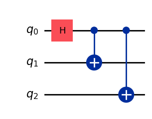
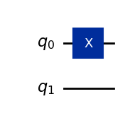
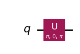
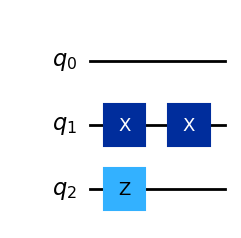
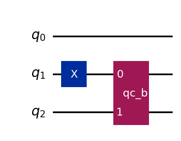
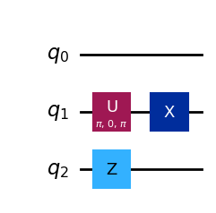
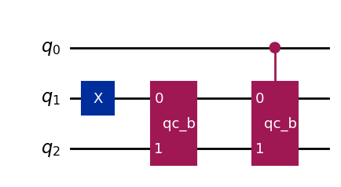
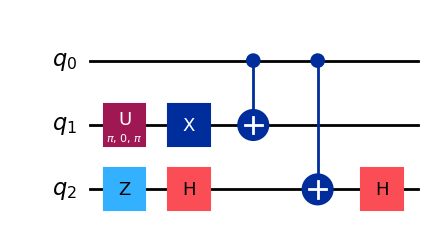

# Kvantumáramkörök Qiskitben

A gyakorlatokon a Qiskit Python-könyvtárral és a Jupyter Notebook környezettel írunk kvantumáramköröket. Az algoritmusokat áramköri rajz segítségével implementáljuk: az áramkör kvantumbitekből (vezetékekből) és rajtuk elhelyezett kapukból áll, ahogy a [kvantumkapuk](posztulatumok/kapuk.md) és a [CNOT-kapu](osszefonodas/cnot.md) fejezetekben.

## Áramkör létrehozása

Egy áramkört a `QuantumCircuit` osztály példányosításával hozunk létre. A konstruktor paraméterében adjuk meg, hány kvantumbit legyen az áramkörben. A kvantumbitekhez indexek tartoznak, amelyek számozása 0-tól indul.

```python
from qiskit import QuantumCircuit #importáljuk a megfelelő qiskit könyvtárat
qc = QuantumCircuit(3)            #létrehozunk egy QuantumCircuit példányt
```

## Kapuk hozzáadása

Egy kaput az áramkör objektum megfelelő függvényével adunk az áramkörhöz; a paraméter annak a kvantumbitnek az indexe, amelyre a kapu hat. Itt a 0. kvantumbitre egy Hadamard-kaput teszünk:

```python
qc.h(0)
```

Irányított (vezérelt) kapukat is elhelyezhetünk. Ekkor az első paraméter a kontrollbit, a második a célbit indexe. Két CNOT-kapu a 0. kvantumbit vezérlésével, célbitjük az 1. és a 2. kvantumbit:

```python
qc.cx(0,1)
qc.cx(0,2)
```

A kapufüggvények egy `InstructionSet` objektumot adnak vissza; a notebook ezt ki is írja, de nincs jelentősége.

## Áramkör megjelenítése

Az áramkör a `draw()` függvénnyel jeleníthető meg. A függvény paramétere egy string, amellyel a kimenet formátuma adható meg, például `"text"`, `"latex"` és `"mpl"` (matplotlib-rajz):

```python
qc.draw("mpl")
```



## Hogyan kezeli a Qiskit az áramköröket?

Vizsgáljuk meg az egyszerű X kaput! Az alábbi áramkörnek két kvantumbitje és nulla klasszikus bitje van (a `QuantumCircuit` második paramétere a klasszikus bitek száma):

```python
qc_x = QuantumCircuit(2,0)
qc_x.x(0)
qc_x.draw("mpl")
```



Az áramkör a kapukat a `data` attribútumában tárolja, `CircuitInstruction` objektumok listájaként. Minden elem megadja a műveletet (nevét, a kvantum- és klasszikus bitek számát, a paramétereit) és azt, hogy mely kvantumbiteken hat:

```python
qc_x.data
```

```text
[CircuitInstruction(operation=Instruction(name='x', num_qubits=1, num_clbits=0, params=[]), qubits=(<Qubit register=(2, "q"), index=0>,), clbits=())]
```

Egy művelet definíciója maga is áramkör. Az X kapu definíciója egyetlen általános $U$ kapu a $(\pi, 0, \pi)$ paraméterekkel:

```python
qc_x.data[0].operation.definition.draw('mpl')
```



Fontos, hogy a `CircuitInstruction` és a `QuantumCircuit` különbözik, pedig mindkettő egy kvantumbit vagy kvantumbitek módosítását írja le.

## Áramkörök összekapcsolása

Két külön elkészített áramkör a `compose` függvénnyel kapcsolható össze. Első paramétere az áramkör, amelyet hozzá szeretnénk adni a saját áramkörünkhöz, a második azoknak a kvantumbiteknek a listája, amelyeken hatni fog:

```python
qc_a = QuantumCircuit(3) #Első áramkör
qc_a.x(1) 
qc_b = QuantumCircuit(2, name="qc_b") #Második áramkör
qc_b.x(0)
qc_b.z(1)
combined = qc_a.compose(qc_b, qubits=[1, 2]) #Összekapcsolás
combined.draw("mpl")
```

A `qc_b` két kvantumbitje a `qc_a` 1. és 2. kvantumbitjére kerül: az X kapu a $q_1$-re, a Z kapu a $q_2$-re.



Egy másik megoldás, ha az áramkört a `to_instruction()` függvénnyel instrukcióvá alakítjuk. Ezután elég úgy kezelni, mint például egy kaput: az `append` függvénnyel fűzzük a meglévő áramkörhöz, és itt is meg kell adni, mely kvantumbitekre hasson.

```python
qc_a = QuantumCircuit(3)
qc_a.x(1)
qc_b = QuantumCircuit(2, name="qc_b")
qc_b.x(0)
qc_b.z(1)
inst = qc_b.to_instruction()
qc_a.append(inst, [1, 2])
qc_a.draw("mpl")
```



Az áramkörben most a `qc_b` egyetlen dobozként jelenik meg. A `decompose` függvénnyel láthatjuk minden instrukció megvalósítását:

```python
qc_a.decompose().draw("mpl")
```



## Vezérelt kapu készítése

Ha az áramkör, amelyet instrukcióként akarunk használni, unitér, akkor úgy kezelhetjük, mint bármely más kaput, például vezérelt változatot is készíthetünk belőle. A `to_gate()` kapuvá alakítja az áramkört, a `control()` a vezérelt változatát adja:

```python
gate = qc_b.to_gate().control()
# Mivel ez egy vezérelt kapu, ezért 3 indexet kell megadni.
qc_a.append(gate, [0, 1, 2])
qc_a.draw("mpl")
```



Az áramkör dekompozíciója:

```python
qc_a.decompose().draw("mpl")
```

A vezérelt `qc_b`-ből egy CNOT (vezérelt X) és egy H–CNOT–H sorozat (vezérelt Z) lesz:



## Áramkörök inicializálása állapotvektorral

Az áramkört regiszterekkel is felépíthetjük: egy kvantumbiteket tartalmazó `QuantumRegister`-rel és egy klasszikus biteket tartalmazó `ClassicalRegister`-rel.

```python
from qiskit import QuantumRegister, ClassicalRegister, QuantumCircuit
q = QuantumRegister(2,'q') #kvantumbiteket tartalmazó regiszter létrehozása
c = ClassicalRegister(2,'c') #klasszikus biteket tartalmazó regiszter
qc = QuantumCircuit(q,c) #kvantumhálózat készítése a regiszterekból
```

Megadunk egy állapotvektort, és ezzel inicializáljuk a 0. kvantumbitet:

```python
from qiskit.quantum_info import Statevector
state1 = Statevector([0.6,0.8])
qc.initialize(state1,qubits=q[0], normalize=True)
qc.draw("mpl")
```

![Két kvantumbites áramkör a 2 bites c klasszikus regiszterrel; a q₀-on egy |ψ⟩ inicializáló doboz [0.6, 0.8] értékkel](img/qiskit-bev-cell042.png)

Az áramkör állapotvektora a `Statevector` osztállyal nyerhető ki:

```python
state_qc = Statevector(qc)
print(state_qc)
```

```text
Statevector([0.6+0.j, 0.8+0.j, 0. +0.j, 0. +0.j],
            dims=(2, 2))
```

A Qiskit a kvantumbiteket jobbról balra számozza: a vektor elemei a $\ket{q_1 q_0} = \ket{00}, \ket{01}, \ket{10}, \ket{11}$ bázisállapotokhoz tartoznak, így az állapot $0{,}6\ket{00} + 0{,}8\ket{01}$. Ismerős LaTeX-formában is kiíratható az `array_to_latex` függvénnyel:

<!-- verify: skip (array_to_latex needs IPython, which is not installed in the Qiskit venv) -->
```python
from qiskit.visualization import array_to_latex
array_to_latex(state_qc) # Latex-es kiírás
```

$$\begin{bmatrix} \frac{3}{5} & \frac{4}{5} & 0 & 0 \end{bmatrix}$$

Az áramkörök futtatását és mérését a [Futtatás és mérés](qiskit/futtatas.md) fejezet mutatja be.

<p class="sources">Forrás: gyak_qiskit_bev.ipynb</p>
