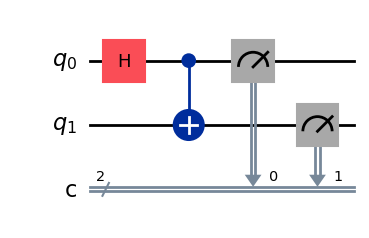
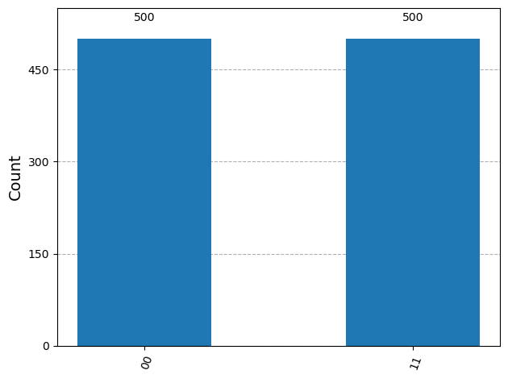
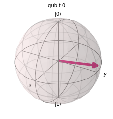
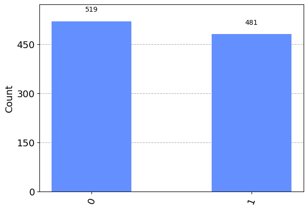

# Futtatás és mérés

## Áramkörök futtatása szimulátoron

Az áramkörök futtatásához jellemzően valamilyen szimulátort használunk. Lehetőség van a felhőben elérhető kvantumszámítógépek használatára is tokenek fejében, csak ott ki kell várni a várakozási sort.

Legtöbbször úgy szeretnénk szimulálni az áramkört, hogy a végén klasszikus információt kapjunk. Ehhez elengedhetetlen a mérés, amely egy kvantumos regiszteren végrehajtja az előírt mérési operátort, és egy klasszikus regiszterbe írja a mérési eredményt. Hozzunk létre egy kvantumos és klasszikus regisztereket is tartalmazó áramkört! Ez a [Bell-állapotok](../osszefonodas/bell.md) H + CNOT áramköre:

```python
from qiskit import QuantumCircuit
qc = QuantumCircuit(2,2) # a második paraméter a klasszikus bitek száma
qc.h(0)
qc.cx(0,1)
qc.draw()
```

A paraméter nélküli `draw()` szöveges rajzot ad:

```text
     ┌───┐     
q_0: ┤ H ├──■──
     └───┘┌─┴─┐
q_1: ─────┤ X ├
          └───┘
c: 2/══════════
               
```

Az állapotvektor-szimulátor (`statevector_simulator`) a mérés előtti állapotvektort adja vissza. A `job.result()` blokkoló hívás: megvárja, amíg a futtatás befejeződik.

<!-- verify: skip (array_to_latex needs IPython, which is not installed in the Qiskit venv) -->
```python
from qiskit_aer import Aer
from qiskit.visualization import array_to_latex
backend = Aer.get_backend("statevector_simulator")
job = backend.run(qc)
result = job.result() # Blokkoló hívás!
outputstate = result.get_statevector(qc)
array_to_latex(outputstate)
```

$$\begin{bmatrix} \frac{\sqrt{2}}{2} & 0 & 0 & \frac{\sqrt{2}}{2} \end{bmatrix}$$

Ez a $\ket{\beta_{00}} = \frac{\ket{00} + \ket{11}}{\sqrt{2}}$ Bell-állapot.

## Mérés

A `measure` függvény helyezi el a méréseket. Első paramétere a mérni kívánt kvantumbitek listája, a második a mérési eredményeket tároló klasszikus bitek listája. A méréshez az Aer szimulátort (`aer_simulator`) használjuk; a `shots` paraméter adja meg, hányszor ismételjük meg a kísérletet. A mérési eredményeket a `result.get_counts` függvénnyel érjük el.

```python
qc.measure(range(2), range(2))
qc.draw("mpl")
```



<!-- verify: prelude from qiskit_aer import Aer -->
```python
backend = Aer.get_backend("aer_simulator")
result = backend.run(qc, shots=1000).result()
# A mérési eredményeket a result.get_counts függvénnyel tudjuk elérni.
counts = result.get_counts()
print(counts)
```

```text
{'11': 500, '00': 500}
```

A pontos számok futtatásról futtatásra változnak, de mindig csak `00` és `11` jön ki, nagyjából fele-fele arányban: a két kvantumbit mérési eredménye összefonódásuk miatt mindig megegyezik. A mérési eredményeket hisztogrammal is szemléltethetjük:

```python
from qiskit.visualization import plot_histogram
plot_histogram(counts)
```



## Állapotvektorok kinyerése a szimulációból

A `save_statevector` függvénnyel az áramkör egy adott pontján elmenthetjük az állapotvektort egy címke alatt; `pershot = True` esetén minden egyes futtatásnál (shot) külön. Az alábbi áramkörben a két mérés előtt és között mentjük az állapotot. A regiszterekben a kvantumbiteket `q[index]`-szel, a klasszikus biteket `c[index]`-szel indexeljük.

```python
from qiskit import QuantumRegister, ClassicalRegister
q = QuantumRegister(2,'q') #kvantumbiteket tartalmazó regiszter létrehozása (q[index]-el indexelhetőek az egyes bitek)
c = ClassicalRegister(2,'c') #klasszikus biteket tartalmazó regiszter (c[index]-el indexelhetőek az egyes bitek)
qc = QuantumCircuit(q,c) #kvantumhálózat készítése a regiszterekból
qc.h(q[0]) #H kapu
qc.cx(q[0],q[1]) #CNOT kapu
qc.save_statevector(label = 'mereselott', pershot = True)
qc.measure(q[0],c[0])
qc.save_statevector(label = 'meresutan', pershot = True)
qc.measure(q[1],c[1])
qc.draw()
```

```text
     ┌───┐      mereselott ┌─┐ meresutan    
q_0: ┤ H ├──■───────░──────┤M├─────░────────
     └───┘┌─┴─┐     ░      └╥┘     ░     ┌─┐
q_1: ─────┤ X ├─────░───────╫──────░─────┤M├
          └───┘     ░       ║      ░     └╥┘
c: 2/═══════════════════════╩═════════════╩═
                            0             1 
```

Négyszer futtatjuk a szimulációt; a `memory=True` minden egyes futtatás eredményét megőrzi:

```python
from qiskit import transpile
backend = Aer.get_backend('qasm_simulator')
job_sim = backend.run(transpile(qc, backend), shots=4,memory=True) # 4-szer ismételjük meg a kísérletet, hogy statisztikát kapjunk és elvégezzük a mérést
#mérési eredmény kinyerése
result_sim = job_sim.result()
print(result_sim.data(0)['mereselott'])
print(result_sim.data(0)['meresutan'])
```

```text
[Statevector([0.70710678+0.j, 0.        +0.j, 0.        +0.j,
             0.70710678+0.j],
            dims=(2, 2)), Statevector([0.70710678+0.j, 0.        +0.j, 0.        +0.j,
             0.70710678+0.j],
            dims=(2, 2)), Statevector([0.70710678+0.j, 0.        +0.j, 0.        +0.j,
             0.70710678+0.j],
            dims=(2, 2)), Statevector([0.70710678+0.j, 0.        +0.j, 0.        +0.j,
             0.70710678+0.j],
            dims=(2, 2))]
[Statevector([1.+0.j, 0.+0.j, 0.+0.j, 0.+0.j],
            dims=(2, 2)), Statevector([1.+0.j, 0.+0.j, 0.+0.j, 0.+0.j],
            dims=(2, 2)), Statevector([0.+0.j, 0.+0.j, 0.+0.j, 1.+0.j],
            dims=(2, 2)), Statevector([0.+0.j, 0.+0.j, 0.+0.j, 1.+0.j],
            dims=(2, 2))]
```

A mérés előtt mind a négy futtatásban a $\frac{\ket{00} + \ket{11}}{\sqrt{2}}$ összefonódott állapot van. Az első kvantumbit mérése után viszont az állapot vagy $\ket{00}$, vagy $\ket{11}$: a második kvantumbit állapota is eldőlt, pedig azt még nem mértük meg. Hogy melyik futtatásban melyik, az véletlenszerű.

## Egybites kapuk egy állapoton

Az `initialize` függvénnyel egy kvantumbit kezdeti állapota is beállítható. Az alábbi áramkör $0{,}8\ket{0} + 0{,}6j\ket{1}$-ből indul, és egymás után alkalmazza a Pauli-X, -Y, -Z, a Hadamard- és a $\theta = \pi$ szögű fázisforgató kaput; az eredményt a Bloch-gömbön rajzolja ki. Az áramkörnek egy kvantumbitje és egy klasszikus bitje van; a klasszikus bit a későbbi mérési eredmény tárolására kell.

```python
from qiskit.quantum_info import Statevector
from qiskit.visualization import plot_bloch_multivector
import numpy as np

qc = QuantumCircuit(1,1) # 1 kvantum és 1 klasszikus bit (1 klasszikus bit a későbbi mérési eredmények tárolására kell)
qc.initialize([0.8, 0.6j], 0) #kezdeti állapot beállítása

#kvantumkapuk alkalmazása ()
qc.x(0) # Pauli X kapu
qc.y(0) # Pauli Y kapu
qc.z(0) # Pauli Z kapu
qc.h(0) # H kapu
#fázisforgató kapu
theta = np.pi
qc.p(theta, 0)
state = Statevector(qc)
plot_bloch_multivector(state)
```

Az eredmény $\frac{0{,}6 - 0{,}8j}{\sqrt{2}}\ket{0} + \frac{0{,}6 + 0{,}8j}{\sqrt{2}}\ket{1}$: a két amplitúdó abszolút értéke egyenlő, ezért az állapot a Bloch-gömb egyenlítőjén van.



A `measure` első paramétere megadja, mely kvantumbiteken végezzük a mérést, a második, hogy azok eredményét hová írjuk. Ellenőrzésként a hálózat lerajzoltatható:

```python
qc.measure(range(1),range(1)) #mely qubiteken végezzünk mérést és azok eredményeit hova írjuk
qc.draw() #ellenőrzésként a hálózat lerajzoltatható
```

```text
     ┌──────────────────────┐┌───┐┌───┐┌───┐┌───┐┌──────┐┌─┐
  q: ┤ Initialize(0.8,0.6j) ├┤ X ├┤ Y ├┤ Z ├┤ H ├┤ P(π) ├┤M├
     └──────────────────────┘└───┘└───┘└───┘└───┘└──────┘└╥┘
c: 1/═════════════════════════════════════════════════════╩═
                                                          0 
```

A mérési eredmények szimulációja: 1000-szer ismételjük meg a kísérletet, hogy statisztikát kapjunk.

```python
from qiskit_aer import Aer
from qiskit import transpile

#szimulátor kijelölése
backend = Aer.get_backend('qasm_simulator')
job_sim = backend.run(transpile(qc, backend), shots=1000) # 1000-szer ismételjük meg a kísérletet, hogy statisztikát kapjunk és elvégezzük a mérést

result_sim = job_sim.result() 

counts = result_sim.get_counts()
print(counts) #mérési eredmények kiírása
```

```text
{'1': 481, '0': 519}
```

A mérési eredmények vizualizációja hisztogramon:

```python
from qiskit.visualization import plot_histogram

#hisztogram a mérési eredményekből
plot_histogram(counts)
```



## Gyakorló feladatok

1. Tetszőleges $\alpha\ket{0} + \beta\ket{1}$ állapotot szeretnénk a $-\alpha\ket{0} + \beta\ket{1}$ állapotba alakítani ($\ket{0}$ előjelváltása). Hogyan tudjuk ezt elérni Pauli-kapukkal?

   <details>
   <summary>Megoldás</summary>

   ```python
   from qiskit_aer import Aer

   qc = QuantumCircuit(1) 
   qc.initialize([0.6, 0.8], 0)
   qc.x(0)
   qc.z(0)
   qc.x(0)
   sim = Aer.get_backend("statevector_simulator")
   output_state = sim.run(qc).result().get_statevector(qc)
   print(output_state)
   ```

   ```text
   Statevector([-0.6+0.j,  0.8+0.j],
               dims=(2,))
   ```

   </details>

2. Az $\alpha\ket{0} + \beta\ket{1}$ állapotból indulva jussunk el az $e^{j\pi/4}\alpha\ket{0} + e^{j\pi/4}\beta\ket{1}$ állapotba (globális fázis állítása)!

   <details>
   <summary>Megoldás</summary>

   ```python
   from qiskit_aer import Aer
   import numpy as np
   qc = QuantumCircuit(1) 
   qc.initialize([0.6, 0.8], 0)
   angle = np.pi/4
   qc.x(0)
   qc.p(angle,0) # fázisforgató kapu - 1. paraméter: szög, 2. paraméter: qubit index
   qc.x(0)
   qc.p(angle,0)
   sim = Aer.get_backend("statevector_simulator")
   output_state = sim.run(qc).result().get_statevector(qc)
   print(output_state)
   ```

   ```text
   Statevector([0.42426407+0.42426407j, 0.56568542+0.56568542j],
               dims=(2,))
   ```

   </details>

3. Építsünk tetszőleges egybites kvantumállapot létrehozására alkalmas kvantumáramkört! Cél: az $a\ket{0} + b\ket{1}$ állapot előkészítése egy kvantumregiszterben. Kiindulásnak:

   ```python
   import numpy as np
   a = 0.6
   b = 0.8 
   param1 = 0
   param2 = 0
   param3 = 0
   qc = QuantumCircuit(1)
   # Készített hálózat itt....


   print(Statevector(qc))
   qc.draw()
   ```

   ```text
   Statevector([1.+0.j, 0.+0.j],
               dims=(2,))
      
   q: 
      
   ```

   <details>
   <summary>Megoldás</summary>

   ```python
   import numpy as np
   a = -0.8
   b = 0.6
   alpha = 2* np.arccos(np.absolute(a))
   beta= np.angle(b) - np.angle(a)
   gamma = -0.5 * alpha + np.angle(a) 
   qc = QuantumCircuit(1)
   qc.h(0)
   qc.p(alpha,0)
   qc.h(0)
   qc.p(beta + 0.5* np.pi,0)
   qc.x(0)
   qc.p(gamma,0)
   qc.x(0)
   qc.p(gamma,0)
   print(Statevector(qc))
   qc.draw()
   ```

   ```text
   Statevector([-0.8+4.13002965e-17j,  0.6-7.81597009e-17j],
               dims=(2,))
      ┌───┐┌──────────┐┌───┐┌─────────┐┌───┐┌───────────┐┌───┐┌───────────┐
   q: ┤ H ├┤ P(1.287) ├┤ H ├┤ P(-π/2) ├┤ X ├┤ P(2.4981) ├┤ X ├┤ P(2.4981) ├
      └───┘└──────────┘└───┘└─────────┘└───┘└───────────┘└───┘└───────────┘
   ```

   A $10^{-17}$ nagyságrendű képzetes részek kerekítési hibák.

   </details>

<p class="sources">Forrás: gyak_qiskit_bev.ipynb, 2_bloch.ipynb</p>
